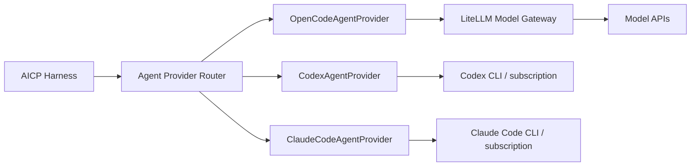
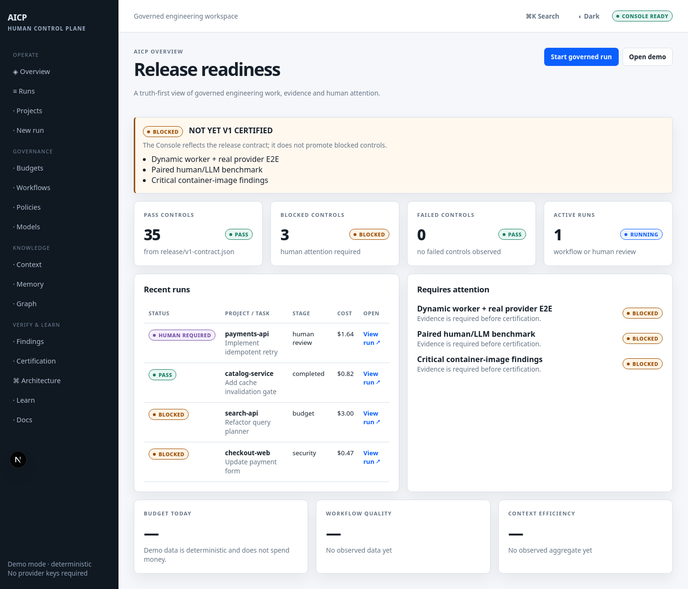

# AI Engineering Control Plane

Governed, reproducible engineering environment for bounded AI-assisted work.

## AICP Console

The repository now includes a human-facing Control Plane for understanding governed work:

```text
RUN          start and inspect bounded work
UNDERSTAND  follow stages, budget and context provenance
VERIFY      inspect gates, findings and release evidence
LEARN       use Demo Mode, Academy and architecture explorer
```

The Console is a presentation layer, never a new authority. The browser talks to a server-side BFF; the BFF talks to Harness. It does not expose provider credentials, worker-manager credentials, databases, Docker or raw source by default.

## Agent Providers

LiteLLM providers and Agent Providers are different extension points. LiteLLM
continues as the Model Gateway for OpenCode and API-metered models; the Harness
can optionally route to separate agent runtimes:



The safe default is `AICP_AGENT_PROVIDER_LAYER_ENABLED=false`, preserving
`Harness → OpenCode → LiteLLM`. Codex and Claude Code are opt-in, local-personal
subscription adapters in a separate Agent Provider Host; they are never added
to `models/catalog.json` or `litellm/config.template.yaml`, never exposed as a
shared OAuth service, and remain blocked from shared production. See
`docs/architecture/current.md` and `docs/governance/provider-usage-policy.md`.

Run the deterministic experience without provider credentials:

```bash
npm run dev:console
# http://localhost:3000
```

Build it with strict TypeScript:

```bash
npm run build:console
npm run generate:api
npm run validate:api-drift
npm run validate:architecture-catalog
npm run validate:docs
```

The release view intentionally shows the current contract as `35 PASS · 3 BLOCKED · 0 FAILED`. The blocked controls are not promoted because a UI exists.

### Console screenshots



Generated views for the run detail, architecture explorer and release
certification are available in [docs/assets/screenshots](docs/assets/screenshots/).

## Current status

Pre-v1 Control Plane evolved to the v1 review contract. The environment includes
model-aware transactional budget envelopes, typed capability probes and
polyglot profiles, immutable OCI supply-chain references, operational API,
Context Compiler v2, bounded graph retrieval, memory reconciliation, hierarchical
OTel traces and RBAC/workload contracts. Human and CI review remain final authority.

## Prerequisites

- Linux or Docker Desktop host with Docker and Compose v2
- Git and OpenSSL
- At least 4 CPU, 8 GiB RAM and 80 GB free disk for the minimum core
- Provider credentials and valid LiteLLM model identifiers

## Quick Start

```bash
cp .env.example .env.runtime
chmod 600 .env.runtime
# Add one provider credential. The helper preserves it while generating local
# Control Plane secrets and OpenAI-only model defaults.
./scripts/configure-local.sh
./scripts/bootstrap.sh
```

Validate an existing environment:

```bash
./scripts/doctor.sh
./scripts/smoke.sh
./scripts/memory-smoke.sh
./scripts/context-smoke.sh
./scripts/telemetry-smoke.sh
./scripts/fallback-smoke.sh
```

Index a repository after granting its exact `REPOSITORY:<id>` scope:

```bash
./scripts/index.sh projects/<repository> <repository-id>
```

The first run parses changed JavaScript files and embeds stable symbol chunks;
an unchanged second run parses and embeds zero artifacts. Add `--rebuild` to
recreate PostgreSQL index rows and the Neo4j projection from Git.

`context-smoke.sh` compiles through the authenticated API, delivers the package
to a Harness stage and verifies that persisted stage evidence contains only the
context ID, usage, retrieval reasons and provenance, never raw source content.

`telemetry-smoke.sh` requires the collector started by bootstrap and verifies
cross-service task correlation plus rejection of prompt, source and credential
fields. LiteLLM OTel v2 exports model aliases, resolved models, token usage and
cost with message-content capture disabled.
`fallback-smoke.sh` invokes an isolated invalid primary alias and proves that
LiteLLM routes to `coding-fast`, reports one attempted fallback and exports the
correlated failure/success spans with tokens and cost.

Start a governed workflow through the authenticated Harness API:

```bash
curl --fail --request POST http://127.0.0.1:18081/v1/runs \
  --header "Authorization: Bearer $(cat secrets/harness_service_token)" \
  --header 'Content-Type: application/json' \
  --data '{
    "project": "<repository>",
    "query": "Describe the bounded engineering change",
    "idempotencyKey": "issue-or-request-id"
  }'
```

Resume an interrupted run with `POST /v1/runs/<run-id>:resume`. The Harness
persists every declared transition in PostgreSQL, starts OpenCode internally,
delivers stage-scoped Context packages and records redacted agent/gate evidence.
Provider credentials are not present in either the Harness or workspace
environment. For manual Compose recreation, always pass
`docker compose --env-file .env.runtime ...`; the bootstrap does this by
exporting the same values without exposing the file to agent containers.

Operational endpoints include `/ready`, filtered `GET /v1/runs`, run audit,
gates/findings, task/budget ledgers, capabilities, workflows, policies, model
aliases and redacted context provenance. The synchronized contract is
`docs/api/control-plane-v1.openapi.yaml`; errors use a request-correlated envelope.

Optional Langfuse observability runs as an independent low-scale profile:

```bash
./scripts/configure-observability.sh
./scripts/observability.sh up
# UI: http://127.0.0.1:3000
./scripts/observability.sh down
```

See `observability/langfuse/README.md` for pinned provenance, upgrades and the
separate PostgreSQL/ClickHouse/MinIO backup boundary.

Reproduce the initial evaluation observation and dashboard contracts with:

```bash
npm run evaluate:baseline
npm run validate:benchmark
```

The generated `.aicp/evaluations/baseline.report.json` covers cost per accepted
task, first-pass rate, repair loops, deterministic retrieval, context reuse and
model fallback. These values are a fixture baseline, not invented SLOs.
The paired benchmark catalog defines E01–E20 with three repetitions and explicit
quality/security acceptance; it does not claim improvements before real runs exist.

Open the workspace:

```bash
docker compose exec workspace bash
cd /workspace/projects
opencode
```

## Local validation

```bash
npm run validate
npm run validate:supply-chain
npm run test:architecture
```

The controlled vulnerable project is expected to return a non-zero status and
emit a redacted JSON report:

```bash
node harness/src/cli/audit-project.mjs \
  --project tests/fixtures/vulnerable-project
```

Security suppressions are empty by default and fail closed when malformed or
expired. Validate exact, independently approved records with:

```bash
npm run validate:suppressions
```

See `security/README.md` for the audited record format.

Execute the threat-control abuse matrix with:

```bash
npm run test:security
```

The machine-readable result is written to `.aicp/security/abuse-report.json`;
open residual risks remain visible even when implemented controls pass.

For a real repository, point `--project` to a Node.js checkout containing a
`package.json`, lockfile and Dockerfile. The baseline auditor is a deterministic
pre-check; official Semgrep, Gitleaks, Trivy, Snyk and Sonar JSON outputs are
handled by the dedicated adapters when those tools are configured.

Run native project gates detected from a Node.js manifest or supported static
site scripts with:

```bash
npm run validate:project -- --project projects/<repository>
```

Project checkouts under `projects/` and generated reports under `.aicp/` are
local-only and ignored by Git.

## Architecture

- OpenCode executes bounded agent work.
- Harness owns workflow state, gates, budgets and termination.
- LiteLLM isolates providers and aliases.
- PostgreSQL is canonical; Neo4j and Redis are derived/ephemeral.
- Context Compiler v2 fuses exact, Git, lexical, vector, bounded graph and
  authority-ordered memory evidence inside a model-aware token envelope.
- CI and human review retain final authority.

See [the OpenSpec change](openspec/changes/build-aicp-console-and-documentation-experience/proposal.md),
[the detailed design](openspec/changes/bootstrap-ai-engineering-control-plane/design.md),
[compatibility evidence](docs/compatibility.md) and [documentation index](docs/README.md).

The authenticated Memory API contract is documented in
[docs/api/memory-v1.md](docs/api/memory-v1.md). Configure exact local scope
grants through `MEMORY_AUTHORIZED_SCOPES`; do not grant wildcard scopes.

## Security boundaries

- Never mount `/var/run/docker.sock` into an agent workspace.
- Never expose provider credentials to OpenCode; use a limited LiteLLM key.
- Agents cannot commit, push, merge or deploy in the baseline.
- Repository content is untrusted data and cannot override policy.
- `.env.runtime`, `secrets/`, state and backups are not versioned.

## Backup and restore

```bash
./scripts/backup.sh
./scripts/restore.sh ./backups/aicp-backup-<timestamp>.tar.zst.gpg \
  projects/<repository> <repository-id>
```

Bootstrap generates `secrets/backup_passphrase`. Backups are AES256-encrypted
before reaching the destination and include layered checksums plus gateway
recovery keys for salt validation. Move them according to an approved policy.
Langfuse requires its own PostgreSQL, ClickHouse and object-storage procedure.
