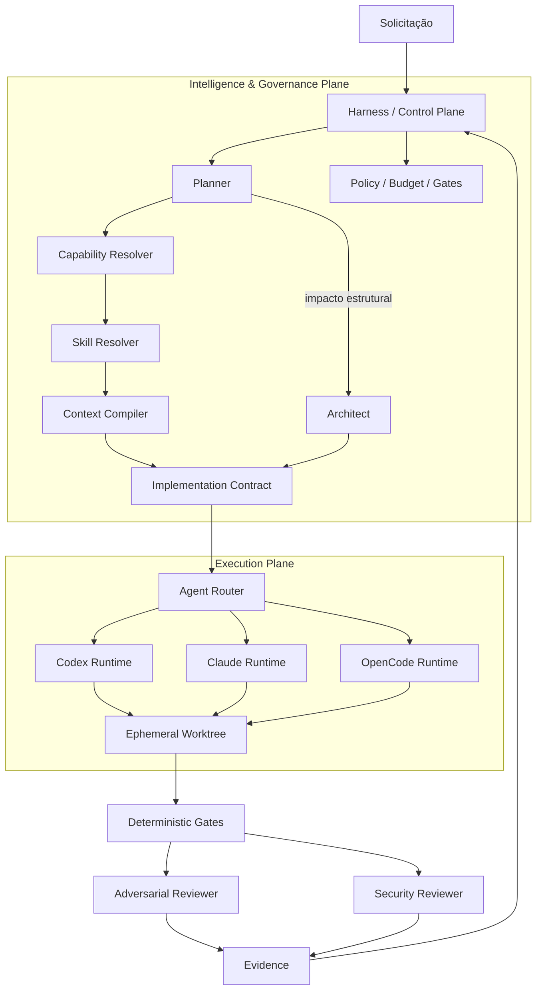
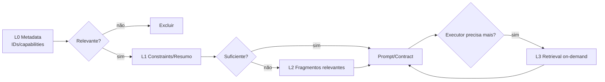
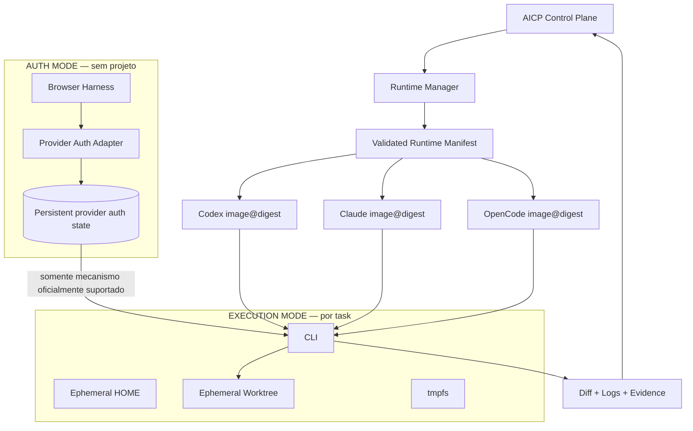
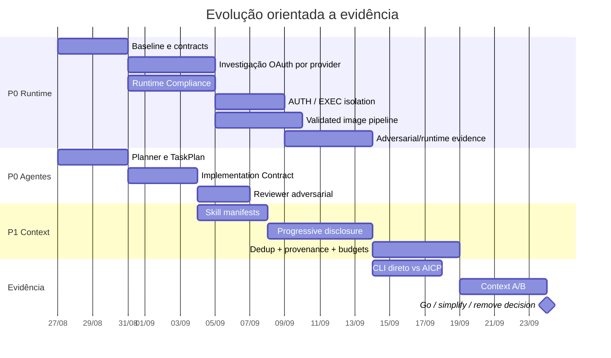

# Guia de evolução do AI Engineering Control Plane

## Resumo executivo

O estado de referência desta revisão é o `main` no commit **`47ea973c4fffcfba86fd145e2b70b141f2a04396`**, indicado como o último merge consolidado. A direção arquitetural recomendada é **parar de aumentar o número de subsistemas do Control Plane e evoluir a qualidade das fronteiras já existentes**: inteligência e governança acima; execução hermética e substituível abaixo. O commit deve ser tratado como baseline imutável para os experimentos que seguem. [Repositório](https://github.com/leandroclf/ai-engineering-control-plane) · [commit 47ea973c](https://github.com/leandroclf/ai-engineering-control-plane/commit/47ea973c4fffcfba86fd145e2b70b141f2a04396)

A principal recomendação é esta:

> **O AICP deve decidir o que o agente precisa saber, quais regras deve obedecer, qual executor pode usar e como o resultado será validado. Codex, Claude Code e OpenCode devem executar em runtimes limpos; não devem possuir uma segunda camada autônoma de Skills, plugins, MCPs ou configuração pessoal concorrendo com o AICP.**

Isso preserva o valor dos CLIs — ferramentas, edição, execução e capacidades nativas necessárias — sem permitir que cada runtime se transforme em um segundo Control Plane. É também a melhor defesa contra o problema identificado durante a discussão: carregar simultaneamente `AGENTS.md`, Skills AICP, Skills nativas, plugins, MCPs e documentação recuperada pode aumentar tokens, produzir instruções duplicadas e criar conflitos de precedência.

A evolução deve ocorrer em três ondas:

| Prioridade | Objetivo | Resultado esperado |
|---|---|---|
| **P0 — tornar a execução comprovadamente controlada** | Runtime Contract, Docker hermético, OAuth por provider, Compliance Checks, imagens validadas, Planner/Implementation Contract | Segurança e reprodutibilidade antes de mais abstrações |
| **P1 — provar qualidade da inteligência** | Progressive disclosure, deduplicação, provenance, budgets, evals e comparação Control Plane × CLI direto | Demonstrar que a inteligência centralizada realmente melhora resultado/custo |
| **P2 — otimizar apenas com evidência** | Headroom A/B, routing adaptativo, memória/graph, cross-model review | Só promover complexidade quando métricas justificarem |

A arquitetura-alvo pode permanecer compacta:



A linha arquitetural importante é que **Skill não atravessa necessariamente essa fronteira como um arquivo ou prompt completo**. Ela alimenta o `Context Compiler`; o executor recebe apenas conhecimento selecionado e compilado.

As práticas propostas de containers — usuário não-root, filesystem restrito, mínimo de mounts, imagens reproduzíveis e dependências fixadas — seguem os princípios publicados pelo Docker para construção e segurança de imagens e containers. A estratégia de OAuth, entretanto, precisa ser verificada individualmente contra as interfaces oficialmente suportadas por Codex, Claude Code e OpenCode; **não se deve assumir caminhos de arquivos ou copiar tokens com base em comportamento interno não documentado**. [Docker Build Best Practices](https://docs.docker.com/build/building/best-practices/) · [Docker Engine Security](https://docs.docker.com/engine/security/) · [OpenAI Codex](https://developers.openai.com/codex/) · [Claude Code](https://code.claude.com/docs/) · [OpenCode Docs](https://opencode.ai/docs/)

## Estado atual e fronteira arquitetural

### Diagnóstico sobre o baseline

O projeto já passou da fase em que o maior problema é “como chamar um agente”. A questão agora é **quem possui autoridade sobre cada decisão**. O baseline contém a estrutura de Harness, agentes/roles, skills, adapters/providers, worker lifecycle e mecanismos de avaliação suficientes para que a próxima evolução seja incremental em vez de uma substituição arquitetural. [Árvore do projeto no baseline](https://github.com/leandroclf/ai-engineering-control-plane/tree/47ea973c4fffcfba86fd145e2b70b141f2a04396)

A regra de ownership recomendada é:

| Responsabilidade | Autoridade recomendada | Não deve pertencer a |
|---|---|---|
| Workflow | Harness | CLI/modelo |
| Policy e quality gates | Harness | prompt autodeclarado pelo agente |
| Budget | Harness | provider adapter |
| Seleção de Skills | Skill Resolver | CLI |
| Seleção de contexto | Context Compiler | plugin do CLI |
| Planejamento | Planner | Worker Manager |
| Arquitetura | Architect, quando necessário | todo request indiscriminadamente |
| Implementação | Implementer | Planner |
| Execução de ferramentas | CLI/runtime | Harness reimplementando editor/shell |
| Finding determinístico | scanners/gates | Security Reviewer |
| Interpretação do finding | Security Reviewer | scanner isoladamente |
| Estado de conclusão | Harness/gates | agente dizendo “done” |
| OAuth | mecanismo oficial do provider | banco próprio de tokens AICP |

Essa divisão também é a principal defesa contra overengineering. O AICP não deve evoluir para um “CLI sobre os CLIs”; deve continuar sendo uma **camada de governança, inteligência contextual e evidência**.

### Papéis agênticos

Eu manteria **cinco papéis cognitivos**, sem transformá-los em cinco microserviços ou cinco modelos fixos.

| Papel | Racional | Implementação concreta | Testes obrigatórios | Risco | Critério de aceite |
|---|---|---|---|---|---|
| **Planner** | Separar entendimento/planejamento de decisões arquiteturais | `Task → TaskPlan`, contendo objetivo, escopo, non-goals, risco, capabilities, critérios de aceite e `architectureImpact` | tarefas triviais, bugs, feature estrutural, pedido ambíguo, mudança de segurança | virar outro orquestrador | Não executa ferramentas nem altera workflow; apenas propõe plano |
| **Architect** | Arquitetura não deve ser invocada para toda mudança | Executar apenas em `architectureImpact=structural` ou risco elevado | trivial deve pular Architect; estrutural deve acioná-lo | inventar abstrações desnecessárias | saída restrita a decisões, constraints e trade-offs |
| **Implementer** | Precisão melhora quando recebe contrato e não conversação aberta | Consumir `ImplementationContract` compilado pelo Harness | mudança dentro/fora de escopo; required tests; non-goals | contexto insuficiente ou excessivo | implementação rastreável aos acceptance criteria |
| **Reviewer** | Review deve procurar falsificação da solução, não confirmar o autor | comparar `requirements → diff → tests → evidence` | missing requirement, teste falso-positivo, boundary, compatibilidade, alteração extra | gerar findings opinativos | cada finding referencia requisito/diff/evidência |
| **Security Reviewer** | LLM é bom para interpretação, não para substituir SAST/secrets/dependency scanning | receber findings normalizados dos gates determinísticos | real positive, false positive, ausência de evidence, severity | segurança “por opinião” | nunca transforma ausência de scanner em PASS |

O router deve poder executar um papel em Codex, Claude ou OpenCode. Logo:

```text
ROLE != PROVIDER != MODEL
```

Um `Reviewer` não é “Claude”; um `Implementer` não é “Codex”. Essa separação permite evals e, futuramente, cross-model review para mudanças de alto risco sem multiplicar agentes.

### O contrato entre os papéis

O Planner deveria emitir algo equivalente a:

```yaml
task_plan:
  objective: "Implementar a mudança solicitada"
  intent: feature

  scope:
    include: []
    exclude: []

  risk:
    level: medium
    reasons: []

  architecture_impact: local

  required_capabilities:
    - language.java
    - framework.spring
    - testing.integration

  security_review_required: false

  acceptance_criteria: []
```

O Harness, depois de políticas, arquitetura e resolução de conhecimento, gera:

```yaml
implementation_contract:
  objective: ...
  scope: ...
  non_goals: ...
  constraints: ...
  affected_areas: ...
  architecture_decisions: ...
  relevant_context: ...
  required_tests: ...
  acceptance_criteria: ...
  evidence_required: ...
```

O ganho não precisa ser presumido. Deve ser medido contra o baseline `47ea973c` em first-pass success, tokens e time-to-green.

## Skills e Context Compiler

### Skills devem representar conhecimento

A distinção mais importante desta evolução é:

> **Agent = responsabilidade cognitiva. Skill = conhecimento especializado reutilizável. Tool = capacidade operacional. Policy = autoridade.**

Assim, não criar:

```text
SpringAgent
PostgresAgent
DockerAgent
AWSAgent
TestAgent
```

Preferir:

```text
Implementer
   │
   └── Implementation Contract
          ↑
       Context Compiler
          ↑
       Skill Resolver
       /     |      \
   Spring PostgreSQL Testing
```

O catálogo de Skills não deveria ser injetado inteiro. O Skill Resolver deve inicialmente trabalhar com **manifestos pequenos**, por exemplo:

```yaml
id: spring.webflux
version: 1

capabilities:
  - framework.spring.webflux

applies_when:
  - "reactive Spring execution"

knowledge:
  source: skills/spring-webflux/
  disclosure: on-demand

priority: domain
```

Nenhuma Skill nova deveria virar Agent sem um experimento demonstrando que **estado/autoridade/loop independente** produz ganho que o mecanismo `Agent + Skill` não consegue produzir.

### Progressive disclosure

O Context Compiler deve trabalhar em camadas:



Isso é preferível a carregar toda documentação “porque pode ser necessária”.

Um budget inicial **experimental**, a ser calibrado pelos evals, pode ser:

```yaml
context_budget:
  max_input_tokens: provider_aware

  allocations:
    system_and_role: 0.15
    task_and_acceptance: 0.15
    repository_context: 0.30
    knowledge_skills: 0.20
    retrieved_context: 0.10
    reserve: 0.10
```

Esses percentuais não devem virar constantes dogmáticas; são parâmetros do experimento.

### Deduplicação e precedence

Deduplicar não significa simplesmente remover textos iguais. Considere:

```text
AGENTS.md:
"WebFlux paths must not block."

ADR:
"Request processing is reactive."

Skill:
"Avoid blocking operations on Netty event-loop."

Repository context:
"WebFlux non-blocking architecture."
```

O compiler deveria sintetizar:

```yaml
constraint:
  id: reactive.no-blocking-io
  statement: "Request execution paths must remain non-blocking."

provenance:
  - AGENTS.md
  - ADR-017
  - skill:spring.webflux
```

Isso reduz repetição sem apagar evidência.

A precedência precisa ser explícita. Uma política segura é:

```text
Harness policy
   >
Task / acceptance contract
   >
Repository canonical instructions / ADR
   >
Selected project context
   >
AICP knowledge skill
   >
Supplementary retrieved material
```

Knowledge Skill **não deve silenciosamente sobrescrever uma decisão específica do projeto**.

### Provenance

Cada unidade de contexto compilada deveria conservar pelo menos:

```ts
type ContextEvidence = {
  id: string;
  kind: "policy" | "task" | "repo" | "adr" | "skill" | "retrieval";
  source: string;
  revision?: string;
  contentHash: string;
  capability?: string;
  priority: number;
  estimatedTokens: number;
};
```

A saída do compilador deve produzir **prompt/contract + provenance manifest**, para que posteriormente seja possível explicar:

- de onde surgiu determinada constraint;
- qual Skill foi utilizada;
- quais documentos foram ignorados;
- quantos tokens foram consumidos por categoria;
- qual conhecimento foi expandido durante execução.

### Plano de implementação

| Item | Racional | Passos | Testes | Risco | Aceite |
|---|---|---|---|---|---|
| Capability Resolver | Não escolher Skills só por palavras-chave | TaskPlan → capabilities canônicas | precision/recall dataset | resolver sofisticado demais | melhora seleção vs baseline |
| Skill manifests | Evitar carregar conteúdo antecipadamente | metadata separado do body | discovery sem body | catálogo inconsistente | listar skills custa pouco contexto |
| Progressive disclosure | Não pagar pelo conhecimento não usado | L0→L1→L2→L3 | tarefas com/sem skill | missing context | qualidade não degrada e tokens caem |
| Token budget | impedir expansão ilimitada | budget global + categorias + reserve | overflow/provider limits | budget rígido prejudica qualidade | nunca excede limite declarado |
| Dedup | evitar contexto repetido | hash + canonical constraints + semantic dedup controlada | fontes equivalentes/conflitantes | dedup apagar nuance | provenance permanece |
| Provenance | tornar decisão auditável | manifest por compiled context | source deleted/changed/hash mismatch | armazenamento extra | todo contexto material tem origem |

O risco mais importante é tentar criar imediatamente um sistema de RAG sofisticado. **Não é necessário para P0.** Um compiler determinístico com manifests, seleção, budget e provenance já permite testar a hipótese.

## Execution Plane, OAuth e contrato de runtime

### Runtime hermético

O objetivo não deve ser “Dockerizar o CLI”; deve ser tornar propriedades de isolamento **enforceable e testáveis**.

O modelo recomendado:



Para containers, o Docker recomenda reduzir superfície de imagem e privilégios e manter builds reproduzíveis; a configuração exata deve ser validada por testes em vez de assumida apenas pelo Dockerfile. [Docker Build Best Practices](https://docs.docker.com/build/building/best-practices/) · [Docker Security](https://docs.docker.com/engine/security/) · [Docker Run](https://docs.docker.com/engine/containers/run/)

Um padrão aproximado, **não um Dockerfile final**, é:

```dockerfile
ARG BASE_IMAGE
FROM ${BASE_IMAGE}

ARG CLI_VERSION

# Instalação provider-specific, sempre com versão explicitamente resolvida.
# NÃO executar "install latest" durante cada tarefa.

RUN useradd --create-home --uid 10001 aicp

COPY runtime-compliance /usr/local/bin/runtime-compliance
COPY runtime-entrypoint /usr/local/bin/runtime-entrypoint

USER 10001
WORKDIR /workspace

ENTRYPOINT ["/usr/local/bin/runtime-entrypoint"]
```

A pipeline decide o valor concreto da imagem base, versão do CLI e digest. O runtime da task não consulta “qual é a última versão?”.

### Latest validated, não `latest`

A política correta é:

```text
upstream release
      ↓
candidate version
      ↓
build image
      ↓
SBOM / scan
      ↓
Runtime Compliance
      ↓
CLI contract tests
      ↓
auth compatibility
      ↓
agent eval suite
      ↓
adversarial suite
      ↓
quality threshold
      ↓
PROMOTE
      ↓
provider + cliVersion + imageDigest
```

O Docker documenta a diferença entre tags mutáveis e pinning de imagens/digests; uma promoção baseada em digest é mais adequada a reprodutibilidade do que instalar `latest` em cada task. [Docker Build Best Practices — pinning](https://docs.docker.com/build/building/best-practices/)

### Runtime Contract

Proponho que o `worker-manager` existente aplique um contrato semelhante a:

```yaml
runtime_contract:
  provider: codex

  image:
    version_policy: validated
    digest_required: true

  process:
    run_as_root: false

  home:
    clean: true
    ephemeral: true

  extensions:
    aicp_skills_in_worker: forbidden
    native_skills: forbidden
    native_plugins: forbidden
    mcp_auto_discovery: forbidden

  filesystem:
    root: read_only
    workspace: read_write
    tmp: tmpfs
    host_home_mount: forbidden
    docker_socket: forbidden

  credentials:
    project_visible: forbidden
    persistence: provider_specific

  network:
    default: deny
    required_egress: provider_specific

  compliance:
    preflight_required: true
```

Há uma nuance: `network: provider-only` não deve existir apenas como YAML. Se o ambiente Docker usado pelo projeto não consegue impor allowlisting de destino, a política precisa de firewall/proxy de egress externo ao worker. Docker documenta como as regras de firewall e networking interagem com containers; o AICP deve testar a política efetiva. [Docker packet filtering/firewalls](https://docs.docker.com/engine/network/packet-filtering-firewalls/)

### Skills/plugins dos CLIs

Em execução governada, a intenção é:

| Fonte | STRICT | CONTROLLED | NATIVE |
|---|---:|---:|---:|
| Skills AICP compiladas | ✓ | ✓ | opcional |
| Native CLI skills | ✗ | allowlist | ✓ |
| Plugins | ✗ | allowlist | ✓ |
| MCP auto-discovery | ✗ | ✗/allowlist | ✓ |
| Tools internas do CLI | necessárias | necessárias | ✓ |
| Configuração pessoal do host | ✗ | ✗ | opcional |

**STRICT deve ser o default de produção.** `NATIVE` é importante para benchmarks, porque precisamos descobrir se restringir extensões realmente produz melhor custo/controle.

Não é realista presumir que se remove todo contexto interno do Codex, Claude ou OpenCode. Os próprios produtos possuem runtime, tools e instruções internas. O objetivo é **ownership do contexto controlável**, não “pureza absoluta”.

### OAuth: auth-mode versus execution-mode

A autenticação deve ser provider-specific e baseada em mecanismos oficiais. A documentação do Codex deve ser a autoridade para autenticação do Codex; a documentação do Claude Code para Claude; e a do OpenCode para seus providers. Não se deve assumir que os três compartilham storage layout, refresh semantics ou headless flow. [OpenAI Codex](https://developers.openai.com/codex/) · [Claude Code](https://code.claude.com/docs/) · [OpenCode](https://opencode.ai/docs/)

A comparação arquitetural:

| Alternativa | Vantagem | Desvantagem | Veredito |
|---|---|---|---|
| **Generic Credential/OAuth Broker AICP** | worker nunca armazena identity diretamente | AICP vira custodiante/translator de tokens; enorme superfície de segurança | **Não implementar agora** |
| **AUTH MODE + persistent provider auth state + EXEC MODE efêmero** | preserva fluxo oficial e separa login de código não confiável | depende de como cada CLI suporta storage/auth | **Preferida para investigação/P0** |
| **Container autenticado persistentemente** | implementação operacional simples | maior blast radius, estado entre tasks, isolamento mais fraco | fallback apenas se necessário |
| **API key/CI credential** | non-interactive | modelo de identidade/cobrança pode diferir da assinatura OAuth | alternativa específica para automation, não substituto automático |

O **Browser Harness** deve ajudar apenas na interação:

```text
aicp auth login codex
        ↓
Auth Coordinator
        ↓
CLI/provider official login
        ↔
Browser Harness
        ↔
Provider OAuth UI
        ↓
provider-controlled auth state
```

Ele **não deve**:

```text
capturar senha
capturar MFA
capturar refresh token
serializar token em PostgreSQL
inventar callback OAuth próprio
```

Senha, passkey, MFA, CAPTCHA e consentimentos sensíveis continuam sob controle do usuário.

A propriedade de segurança desejada é forte:

> **AUTH MODE nunca monta o source tree. EXECUTION MODE nunca realiza login interativo.**

Os detalhes não especificados — caminho de credencial, possibilidade de `HOME` alternativo, device-code/headless support, refresh, logout, múltiplas contas e separação entre auth e config — devem ser **descobertos e documentados pelo @Investigar para cada provider**, sem inferir arquivos internos.

### Testes de OAuth obrigatórios

Para cada CLI:

```text
fresh container → login
restart → authStatus
new ephemeral worker → execution
token/session refresh → execution
logout → authStatus=false
re-login → execution
source tree absent during auth
forbidden config absent during execution
host HOME absent
credential inaccessible from workspace shell
```

**Aceite P0:** não basta “Codex funcionou no Docker”. Deve existir evidence bundle demonstrando exatamente as propriedades acima.

## Verificação, promoção de imagens e enforcement

### Runtime Compliance Check

A arquitetura só é hermética se houver verificação independente do prompt.

O preflight deve testar, pelo menos:

```text
✓ CLI/provider/version correspondem ao runtime manifest
✓ image digest corresponde à versão promovida
✓ UID != 0
✓ HOME operacional é o esperado e efêmero
✓ root filesystem é efetivamente read-only
✓ /workspace é o único workspace RW esperado
✓ /tmp é efêmero
✓ host HOME não está montado
✓ ~/.ssh do host não está montado
✓ Docker socket não está presente
✓ native Skills não são descobertas
✓ plugins não autorizados não são descobertos
✓ MCP config não autorizado não é descoberto
✓ auth state segue regra provider-specific
✓ network policy efetiva corresponde ao contrato
```

Um teste de compliance deve ser **behavioral**. Exemplo:

```sh
set -eu

test "$(id -u)" != "0"
test "$HOME" = "/run/aicp-home"
test ! -S /var/run/docker.sock

if touch /aicp-rootfs-write-test 2>/dev/null; then
  echo "FAIL: root filesystem is writable"
  exit 1
fi

test -w /workspace

echo "runtime-compliance=PASS"
```

Paths reais de configuração e comandos de introspecção precisam ser implementados separadamente por provider após a investigação.

### Manifesto de runtime

```json
{
  "provider": "codex",
  "cliVersion": "<validated-version>",
  "image": "ghcr.io/.../runtime-codex",
  "digest": "sha256:...",
  "validatedAt": "...",
  "contractsVersion": "1",
  "evalSuite": "<revision>",
  "authModeValidated": true,
  "executionModeValidated": true
}
```

Nenhuma execução de produção deve resolver silenciosamente uma versão mais nova que a registrada.

### Pipeline de promoção

Exemplo de estrutura de job:

```yaml
name: runtime-candidate

on:
  workflow_dispatch:
  pull_request:
    paths:
      - "runtime/**"
      - "runtime-manifests/**"

jobs:
  validate-runtime:
    strategy:
      matrix:
        provider: [codex, claude, opencode]

    steps:
      - name: Checkout
        # Pin da action deve seguir a política de supply-chain do projeto.
        uses: actions/checkout@<pinned-revision>

      - name: Build candidate image
        run: ./scripts/runtime/build-candidate.sh "${{ matrix.provider }}"

      - name: Runtime compliance
        run: ./scripts/runtime/compliance.sh "${{ matrix.provider }}"

      - name: Contract tests
        run: ./scripts/runtime/contract-tests.sh "${{ matrix.provider }}"

      - name: Adversarial tests
        run: ./scripts/runtime/adversarial.sh "${{ matrix.provider }}"

      - name: Agent evals
        run: ./scripts/evals/runtime-eval.sh "${{ matrix.provider }}"

      - name: Generate evidence bundle
        run: ./scripts/runtime/evidence.sh "${{ matrix.provider }}"
```

Promoção deve ser outro job, bloqueado pelos testes, que registra **digest**, não apenas tag.

Para workflows com secrets e publicação de imagens, também vale seguir o princípio do GitHub de reduzir permissões de `GITHUB_TOKEN`, fixar dependências/actions quando apropriado e proteger credenciais de CI. [GitHub — Security hardening for GitHub Actions](https://docs.github.com/en/actions/security-for-github-actions/security-guides/security-hardening-for-github-actions)

### Critérios de promoção

Uma imagem candidata só vira `validated` quando:

1. Compliance = PASS.
2. Contract tests = PASS.
3. Security/adversarial suite sem regressão bloqueante.
4. Auth compatibility = PASS ou `N/A` documentado para o modo usado.
5. Evals não cruzam thresholds de regressão definidos.
6. CLI version é registrada.
7. Image digest é registrado.
8. Evidence artifact é preservado.
9. Rollback para o digest anterior é possível.

Esse mecanismo elimina a necessidade de um “Runtime Image Service” complexo. Manifest + CI + registry + worker enforcement são suficientes para v1.

## Métricas, experimentos e OpenSpec

### Métricas que realmente devem orientar a arquitetura

Não recomendo `tokens/task` isoladamente. É fácil reduzir tokens e piorar a solução.

Use:

| Métrica | O que responde |
|---|---|
| **First-pass success** | a primeira implementação passa os critérios sem repair? |
| **Time-to-green** | quanto tempo até todos os gates relevantes ficarem verdes? |
| **Input/output tokens** | quanto contexto/raciocínio foi consumido? |
| **Useful-context ratio** | quanto do contexto fornecido foi realmente pertinente à decisão/alteração? |
| **Repair loops** | quantas iterações adicionais foram necessárias? |
| **Requirement coverage** | critérios solicitados estão demonstravelmente implementados/testados? |
| **Regression findings** | reviewer/gates detectaram regressões reais? |
| **Runtime overhead** | quanto o Control Plane adiciona sobre CLI direto? |
| **Context expansion count** | quantas vezes progressive disclosure precisou aprofundar contexto? |
| **Skill hit precision** | skills selecionadas realmente eram pertinentes? |
| **Adversarial pass rate** | isolamento continua válido diante de tarefa/repo hostil? |

`Useful-context ratio` deve começar como métrica experimental. Uma forma inicial:

```text
useful_context_ratio =
  tokens de itens de contexto posteriormente referenciados/usados
  --------------------------------------------------------------
  tokens totais de contexto AICP disponibilizados
```

Como “uso” não é perfeitamente observável em LLMs, a métrica deve combinar provenance, arquivos/símbolos utilizados, requests de expansão e evidência gerada. Não tratá-la como verdade absoluta.

### Experimentos mínimos

**Experimento A — inteligência centralizada**

```text
A: CLI native/default
B: clean CLI + AICP current
C: clean CLI + AICP progressive disclosure
```

Comparar first-pass success, tokens e time-to-green.

**Experimento B — arquitetura condicional**

```text
A: Architect em toda tarefa
B: Architect apenas structural/high-risk
```

A hipótese é reduzir custo/latência sem perder qualidade em tarefas locais.

**Experimento C — Skill loading**

```text
A: skill completa
B: resumo
C: progressive disclosure
D: nenhuma skill
```

Isso mostra se as Skills realmente entregam conhecimento incremental.

**Experimento D — cross-model review**

Apenas para alto risco:

```text
same-model implementation/review
versus
cross-model review
```

Não tornar cross-model obrigatório até provar benefício.

**Experimento E — Control Plane vs CLI direto**

É provavelmente o eval mais importante:

```text
CLI direto
versus
AICP
```

O projeto precisa demonstrar por que existe.

### OpenSpec priorizado

**P0 — antes de ampliar arquitetura**

| Mudança | Entrega | Testes/aceite |
|---|---|---|
| `Agentic Role Contract v1` | Planner + TaskPlan + ImplementationContract | Planner sem autoridade de workflow; Architect condicional |
| `Hermetic Runtime Contract v1` | contrato enforceable no worker existente | root readonly, HOME limpo, no host config/socket |
| `Provider Auth Investigation` | matriz Codex/Claude/OpenCode | login/restart/refresh/logout/container comprovados |
| `AUTH/EXEC separation` | auth sem repo; execution sem login | testes adversariais |
| `Runtime Compliance Check` | script/test suite integrada ao worker | execução bloqueada em FAIL |
| `Validated Runtime Image` | candidate→test→promote→digest | rollback + evidence |
| `Native Extension Policy` | STRICT/CONTROLLED/NATIVE | STRICT sem skill/plugin/MCP descoberta |
| `Credential Isolation` | provider-specific enforcement | hostile workspace não acessa auth material |
| `Evidence closure` | fechar ou justificar controles adversariais `LIMITED` do baseline | nenhum falso `PASS` |
| `Baseline experiment` | CLI direto × AICP | relatório reproduzível |

**P1 — provar inteligência**

Implementar progressive disclosure, token budgets, deduplication e provenance no Context Compiler; medir Skill selection precision; benchmark com/sem Context Compiler; avaliar memória persistente; avaliar graph retrieval/Neo4j somente contra baseline; medir first-pass success, time-to-green, repair loops, token usage e runtime overhead.

**P2 — só depois da evidência**

Headroom A/B, routing adaptativo baseado em resultados, novos providers, cross-model review automático e otimizações contextuais mais agressivas. Nenhum deve entrar no happy path apenas por vantagem teórica.

### Cronograma sugerido

O cronograma abaixo representa **sequência lógica**, não promessa de duração operacional:



A decisão ao fim não deve ser automaticamente “implementar P2”. Deve ser:

```text
KEEP
SIMPLIFY
DEFER
DELETE
```

para cada abstração medida.

## Artefatos propostos e patch OpenSpec

### Estrutura mínima recomendada

Não criar novos serviços onde módulos existentes bastam. Uma organização conceitual:

```text
harness/
  src/
    agents/
      planner.*
      architect.*
      implementer.*
      reviewer.*
      security-reviewer.*

    context/
      compiler.*
      budget.*
      dedup.*
      provenance.*

    skills/
      registry.*
      resolver.*

    runtime/
      contract.*
      compliance.*
      manifest.*
      providers/
        codex.*
        claude.*
        opencode.*

runtime/
  codex/
    Dockerfile
  claude/
    Dockerfile
  opencode/
    Dockerfile

scripts/
  runtime/
    build-candidate.*
    compliance.*
    contract-tests.*
    adversarial.*
    promote.*

runtime-manifests/
  codex.json
  claude.json
  opencode.json
```

**Essa árvore é uma proposta, não uma afirmação sobre paths atuais.** O @Investigar deve reutilizar os módulos existentes no commit `47ea973c` antes de criar diretórios paralelos.

### Exemplo de Context Compiler

```ts
interface CompileRequest {
  taskPlan: TaskPlan;
  budget: ContextBudget;
  capabilities: string[];
}

interface CompiledContext {
  instructions: string;
  evidence: ContextEvidence[];
  budget: {
    used: number;
    remaining: number;
  };
  expandable: string[];
}

async function compileContext(
  request: CompileRequest,
): Promise<CompiledContext> {
  const candidates = await resolveContextCandidates(request.capabilities);

  const deduplicated = deduplicateWithProvenance(candidates);
  const selected = selectWithinBudget(deduplicated, request.budget);

  return {
    instructions: renderSelectedContext(selected),
    evidence: selected.flatMap((item) => item.provenance),
    budget: calculateBudget(selected, request.budget),
    expandable: findDeferredSources(deduplicated, selected),
  };
}
```

O comportamento importante não está na linguagem ou nas classes, mas nos testes:

```text
irrelevant skill → não aparece
duplicate rules → uma regra + provenance múltipla
conflicting rule → precedência explícita
budget overflow → seleção/defer, nunca truncamento silencioso
additional context request → expansão controlada
```

### Exemplo de patch OpenSpec

O caminho deve ser adaptado à estrutura real encontrada no baseline; o patch abaixo mostra o **conteúdo desejado**, não um path garantido:

```diff
+## Hermetic Agent Runtime
+
+### Requirement: Runtime isolation
+Agent execution MUST run in a validated container image.
+Execution MUST NOT inherit the host HOME, CLI user configuration,
+native skills, unauthorized plugins, automatic MCP configuration,
+SSH state, or Docker socket.
+
+### Requirement: Provider authentication
+Authentication MUST use provider-supported mechanisms.
+Interactive authentication MUST occur without a project worktree.
+Execution MUST NOT initiate interactive OAuth.
+Credential persistence MUST be defined and tested per provider.
+
+### Requirement: Runtime compliance
+The Harness MUST block execution when runtime compliance fails.
+Evidence MUST include CLI version, image digest, checks and logs.
+
+## Context Intelligence
+
+### Requirement: Progressive disclosure
+The Context Compiler MUST select knowledge incrementally rather than
+injecting every matched Skill.
+
+### Requirement: Context budget
+Context selection MUST respect a provider-aware token budget.
+
+### Requirement: Deduplication and provenance
+Equivalent constraints SHOULD be deduplicated while preserving every
+material source in provenance.
+
+## Agent Roles
+
+### Requirement: Planner
+Planner MUST produce TaskPlan and MUST NOT control workflow.
+
+### Requirement: Conditional architecture
+Architect SHOULD execute only when architecture impact or risk requires it.
+
+### Requirement: Implementation contract
+Implementer MUST receive a bounded ImplementationContract.
+
+### Requirement: Adversarial review
+Reviewer MUST evaluate requirements, diff, tests and evidence.
```

### Definition of Done da evolução

A mudança só deveria ser considerada pronta quando houver um evidence bundle semelhante a:

```text
evidence/
  runtime/
    codex/
      cli-version.txt
      image-digest.txt
      compliance.log
      auth-test.log
      execution-test.log
    claude/
      ...
    opencode/
      ...

  context/
    baseline.json
    progressive-disclosure.json
    token-report.json
    provenance-report.json

  adversarial/
    hostile-repository.log
    credential-isolation.log
    forbidden-plugin.log
    forbidden-mcp.log
    filesystem-isolation.log

  evals/
    direct-cli-vs-aicp.json
    first-pass-success.json
    time-to-green.json
    repair-loops.json
```

Para cada PR, a pergunta deixa de ser “a arquitetura parece boa?” e passa a ser:

> **Qual propriedade nova foi comprovada e qual evidência demonstra que ela melhora o baseline `47ea973c` sem introduzir uma abstração maior do que o problema?**

### Limitações e pontos que não devem ser presumidos

Esta revisão usa `47ea973c` como baseline e a estrutura do repositório como referência, mas **os detalhes atuais dos mecanismos internos de armazenamento OAuth e isolamento de configuração de cada CLI precisam ser investigados contra a documentação/comportamento da versão efetivamente candidata à promoção**. Em particular, não considero seguro assumir paths de credenciais, formatos de token, flags de desativação de Skills/plugins/MCP ou compatibilidade de refresh entre Codex, Claude Code e OpenCode sem testes provider-specific. As autoridades para essa investigação devem ser as documentações oficiais do [Codex](https://developers.openai.com/codex/), [Claude Code](https://code.claude.com/docs/), [OpenCode](https://opencode.ai/docs/) e os próprios CLIs executados nas imagens candidatas.

Da mesma forma, “network provider-only” só é um requisito válido quando acompanhado de enforcement real; configuração declarativa que não impeça egress arbitrário deve ser reportada como `LIMITED`, não `PASS`. As práticas de isolamento e firewall devem ser confrontadas com o comportamento documentado do Docker. [Docker networking/firewall](https://docs.docker.com/engine/network/packet-filtering-firewalls/)

## Prompt para @Investigar

> **Prompt para @Investigar**
> Revise `main@47ea973c` do `ai-engineering-control-plane` e implemente P0 sem criar novos subsistemas quando módulos existentes puderem ser evoluídos. Investigue, nas docs oficiais e por testes em container, OAuth/autenticação de Codex, Claude Code e OpenCode: login, persistência, restart/refresh/logout, storage e separação config/auth; não assuma paths nem copie tokens. Implemente `AUTH MODE` sem source tree e `EXECUTION MODE` hermético com HOME limpo, workspace efêmero, rootfs RO, sem host HOME/Docker socket e native skills/plugins/MCP proibidos. Adicione Runtime Compliance Checks bloqueantes e pipeline candidate→compliance→contract/adversarial/evals→promote, registrando versão+image digest. Evolua Context Compiler com progressive disclosure, budget, dedup e provenance; adicione Planner/TaskPlan e ImplementationContract no OpenSpec P0. Entregue código, Dockerfiles, CI, patch OpenSpec, PRs, logs, testes, digests e comparação CLI direto×AICP. Aceite: compliance PASS; isolamento OAuth comprovado; imagem reproduzível/rollback; nenhum contexto nativo proibido; testes verdes; first-pass/time-to-green/tokens/useful-context reportados; qualquer limitação marcada `LIMITED`, nunca presumida como PASS.
