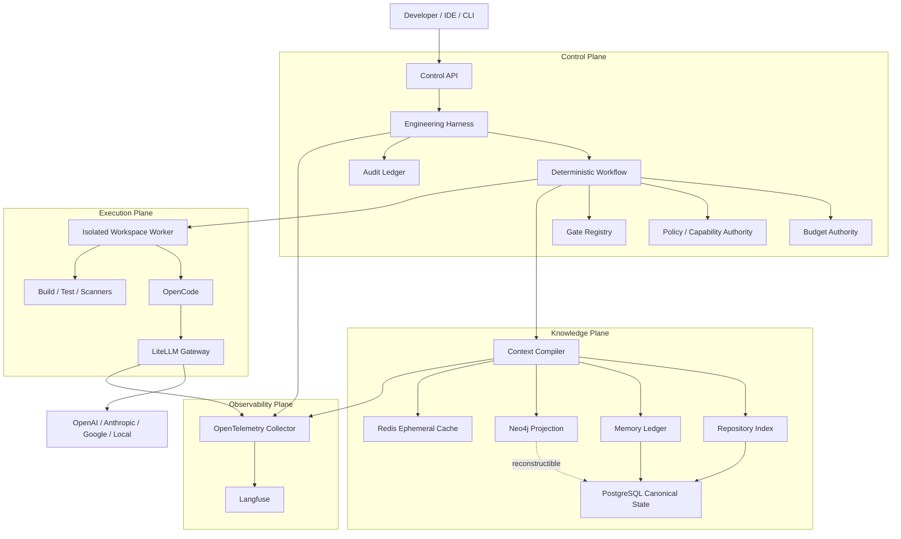
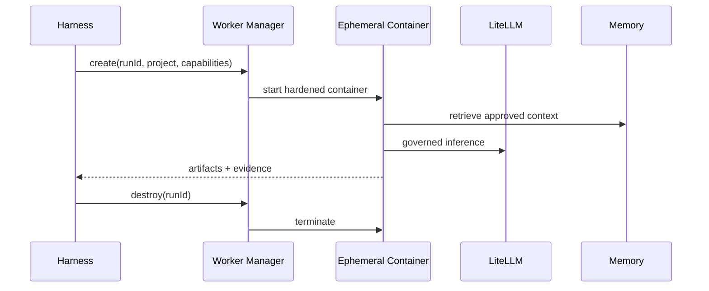
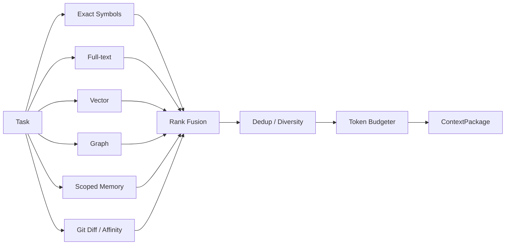

# Guia definitivo de evolução do AI Engineering Control Plane para v1

## Resumo executivo

A nova revisão do `main` muda materialmente o diagnóstico anterior. O documento `docs/07-AI Engineering Control Plane_evolution.md` ainda descreve como gaps principais a ausência de budget transacional no runtime, a falta de composição efetiva dos gates e um sandbox incompleto; porém esses pontos foram substancialmente implementados no código atual. O runtime de produção já instancia `BudgetAuthority` com `PostgresBudgetStore`, injeta-o nos handlers, faz reserva antes da chamada ao agente, contabiliza uso real depois da execução e possui cancelamento/reconciliação; o `GateRegistry` já resolve gates de projeto e scanners; e `WorkspaceAttestor` + Compose implementam `read_only`, `cap_drop: ALL`, `no-new-privileges`, limites de processo/CPU/memória, ausência de Docker socket, ausência de credenciais dos provedores e redes internas. Portanto, **não recomendo executar literalmente o antigo P0 do guia anterior**: isso duplicaria funcionalidades já existentes. fileciteturn22file0L2-L2 fileciteturn12file0L2-L2 fileciteturn13file0L2-L2 fileciteturn24file0L2-L2 fileciteturn25file0L2-L2

A implementação atual já merece ser tratada como um **Control Plane real em estágio pré-v1**, e não mais como foundation conceitual. A separação central está correta: o Harness possui autoridade sobre workflow e budget; OpenCode fica restrito à execução de trabalho; LiteLLM abstrai os provedores; PostgreSQL mantém o estado canônico; Neo4j é uma projeção reconstruível; Redis é efêmero; e o Context Plane possui indexação, retrieval e compilação de contexto. Essa mesma divisão já aparece explicitamente na arquitetura do próprio projeto. fileciteturn2file0L2-L2 fileciteturn3file0L2-L2

Minha conclusão atual é:

> **A prioridade não é adicionar mais componentes. É transformar as garantias já implementadas em invariantes mensuráveis, fechar os últimos gaps de enforcement e provar por benchmark que Context + Memory + Graph + Routing realmente reduzem custo/tokens sem degradar qualidade.**

Eu adotaria a seguinte classificação:

| Dimensão | Estado revisado | Alvo v1 | Prioridade |
|---|---:|---:|---|
| Autoridade do Harness | 9/10 | 9,5/10 | Manter |
| Workflow determinístico | 9/10 | 9,5/10 | Manter |
| Budget transacional | 8/10 | 9,5/10 | **P0** |
| Workspace isolation | 8,5/10 | 9,5/10 | **P0/P1** |
| Gate Registry | 8,5/10 | 9,5/10 | **P0** |
| Multi-stack | 7/10 | 9/10 | **P1** |
| Context Compiler | 7,5/10 | 9,5/10 | **P1** |
| Memory Ledger | 9/10 | 9,5/10 | **P1** |
| Graph/Neo4j | 7,5/10 | 9/10 | **P1** |
| LiteLLM/model routing | 7,5/10 | 9/10 | **P0/P1** |
| Observabilidade OTel | 7,5/10 | 9/10 | **P1** |
| Langfuse | 7/10 | 9/10 | **P1** |
| API Control Plane | 7/10 | 9/10 | **P0/P1** |
| Supply chain | 6,5/10 | 9,5/10 | **P0** |
| Identidade/RBAC | 6,5/10 local | 9/10 remoto | **P2** |
| Benchmark científico | 6,5/10 | 9/10 | **P1** |
| **Maturidade global** | **~8,2/10** | **~9,3/10** | |

A principal mudança de estratégia é esta:

```text
GUIA ANTERIOR
─────────────
criar Budget Authority
criar GateRegistry
criar multi-stack
endurecer Compose
criar API read/cancel

             ↓
       JÁ IMPLEMENTADO
             ↓

NOVO GUIA
─────────
provar invariantes
fechar overshoot de budget
capability discovery real
supply-chain imutável
API operacional completa
Context Compiler v2
Graph-aware retrieval
telemetria hierárquica
benchmark A/B real
isolamento por execução
OIDC/RBAC
```

O modelo-alvo permanece:



A regra arquitetural que eu transformaria em contrato oficial de v1 é:

> **LLMs nunca possuem autoridade sobre workflow, autorização, budget, quality gates ou estado canônico. O Harness governa execução; PostgreSQL governa estado; Context Compiler governa contexto; Gates governam evidência; Git/CI/policies/humano governam a verdade final.**

Isso é consistente com a decisão arquitetural já adotada pelo repositório e deve permanecer inviolável durante toda a evolução. fileciteturn3file0L2-L2


## Diagnóstico e gap analysis

O estado atual é consideravelmente melhor do que o registrado no guia anterior. O budget, por exemplo, já possui tabelas `task_budgets`, `budget_reservations` e `budget_events`, usa lock `FOR UPDATE`, reserva antes do consumo, converte reservas em uso efetivo e mantém TTL para reservas abandonadas. O runtime reconcilia reservas expiradas em start/resume, e os handlers reservam antes das chamadas ao agente. fileciteturn63file0L2-L2 fileciteturn23file0L2-L2 fileciteturn27file0L2-L2 fileciteturn13file0L2-L2

Da mesma forma, multi-stack já não é mais “Node only”: `ProjectAdapter` detecta Node, Gradle, Maven, Python e Go, além do modo static-site. A lacuna agora está na **qualidade da descoberta de capabilities**, e não na ausência de adapters. fileciteturn15file0L2-L2 fileciteturn16file0L2-L2

| Requisito | Implementação atual | Estado | Gap real para v1 | Ação |
|---|---|---|---|---|
| **Budget enforcement** | `budget-authority.mjs`, `postgres-budget-store.mjs`, migration `006_task_budgets.sql`, runtime/handlers | 🟢 Forte | Reserva de input usa essencialmente `contextBudget`; custo reservado é fixo, e o consumo efetivo pode exceder a estimativa depois da chamada | Budget Envelope model-aware + drift/overshoot policy |
| **Workspace capability enforcement** | `WorkspaceAttestor`, Compose `read_only`, `cap_drop`, internal networks, OpenCode deny-by-default | 🟢 Forte | Container de execução ainda é longevo e o projeto precisa ser writable para implementação | workers efêmeros por run + rootless/userns/seccomp hardening |
| **GateRegistry** | `gate-registry.mjs` + `gates.yaml` | 🟢 Implementado | Capability pode ser “presumida” pelo adapter sem provar que ferramenta/task existe | discovery/probe + typed capabilities |
| **Multi-stack adapters** | Node/Gradle/Maven/Python/Go | 🟡 Parcial | primeira detecção vence; monorepo/polyglot não compõe adapters; commands convencionais podem não existir | CompositeProjectProfile |
| **Context Compiler** | compiler determinístico greedy + retrieval exact/lexical/vector | 🟡 Bom baseline | ranking/packing ainda simples; overhead real do prompt não entra no budget; graph não está explicitamente fundido no compilador atual | Context Compiler v2 |
| **Memory Ledger** | scopes, authority, version, status, source refs, events append-only, TASK/RUN | 🟢 Forte | invalidation/reconciliation precisa virar rotina permanente e benchmarkável | lifecycle reconciler |
| **Neo4j** | Repository/File/Symbol/Chunk + stable symbol IDs/projection | 🟡 Bom | ampliar relações semânticas multi-stack e efetivamente usar graph neighborhood no retrieval | Graph Retrieval v2 |
| **PostgreSQL** | estado de workflow, budget, memory, index canônicos | 🟢 Correto | crescimento, retenção, backup/PITR, partitioning futuro | operação/retention |
| **LiteLLM routing** | aliases + shuffle + retry + fallback | 🟡 Parcial | fallback básico e versão LiteLLM ainda `latest`; routing não é evidence-driven | pin imutável + provider diversity + routing policy |
| **Langfuse** | profile opcional v4.16.0, dashboards versionados | 🟡 Parcial | core OTel ainda exporta file/debug; correlação completa run→stage→agent→LLM→tool não está fechada | trace hierarchy + Langfuse exporter |
| **Harness API** | run/create/get/stages/resume/cancel + budgets | 🟡 Bom baseline | faltam listagem, findings, gates, policies, capabilities, audit e erros operacionais estruturados | API v1 completa |
| **Supply chain** | algumas versões fixas e Langfuse por digest | 🔴 Release blocker parcial | LiteLLM permanece `latest`; nem todas as imagens/actions estão imutavelmente pinadas | digest + SBOM + provenance |

### O budget está implementado, mas ainda não é uma barreira matemática perfeita

A política default é `20` chamadas, `180k` input tokens, `40k` output tokens, USD 10 e duas iterações. Entretanto, `reservationUpperBound()` atualmente reserva `inputTokens = contextBudget`, `outputTokens = 4096` e um `maxCostUsd` configurado, por padrão USD 1 por chamada. fileciteturn64file0L2-L2

Isso deixa um gap sutil, mas importante. O input real inclui mais que os artefatos do Context Compiler:

```text
system/OpenCode instructions
+
agent instructions
+
task query
+
workflow instructions
+
context framing/provenance
+
approved context
+
JSON schema/tool definitions
+
potencial contexto interno do OpenCode
```

Já o `contextBudget` da feature é 10k–16k tokens dependendo do estado. fileciteturn65file0L2-L2

Logo, o invariant desejado:

```text
reserved_input >= actual_input
```

não é atualmente garantido por construção.

O mesmo vale para custo. A reserva é um teto administrativo estático, não um cálculo baseado em:

```text
model alias
provider candidate
input price
output price
cache price
reasoning tokens
max output
```

O protocolo transacional está correto; **a estimativa de reserva precisa ficar mais forte**.

Também convém medir:

```text
reservation_drift_ratio =
actual_cost / reserved_cost
```

e:

```text
input_reservation_drift =
actual_input_tokens / reserved_input_tokens
```

Uma chamada que gere `>1.0` deve produzir evento operacional; um drift repetido deve bloquear promoção de release.

### Workspace isolation já está significativamente amadurecido

O Compose atual é mais rigoroso do que o guia anterior sugeria. `workspace` e `harness` têm root filesystem read-only, `tmpfs`, `no-new-privileges`, `cap_drop: ALL`, PIDs/CPU/memória limitados e apenas o projeto ativo bind-mounted; `agent-internal` e `data` são redes `internal`, e apenas LiteLLM participa da rede de egress para provedores. Credenciais OpenAI/Anthropic/Gemini são secrets somente do LiteLLM. fileciteturn25file0L2-L2

O `WorkspaceAttestor` ainda verifica em runtime que o projeto está abaixo da raiz permitida, que o processo não é UID 0, que não há Docker socket, que chaves de providers não estão no ambiente e que o root filesystem não é gravável. fileciteturn24file0L2-L2

Além disso, `opencode.json` já adotou a política correta de **deny-by-default**, bloqueando edição globalmente, web, task, skill, doom loop, diretórios externos, commits e pushes; permissões específicas podem ser abertas pelo agente adequado. Isso é especialmente relevante porque a documentação oficial atual do OpenCode informa que a maioria das permissões é `allow` por padrão quando não configurada explicitamente. fileciteturn53file0L2-L2 citeturn4search1

Portanto, eu não reimplementaria sandbox agora. Evoluiria para:

```text
v1 local
long-lived hardened workspace
        ↓
v1.1 / team
one ephemeral worker per run
        ↓
enterprise
rootless daemon / user namespace
+ restrictive seccomp/AppArmor
+ policy-driven egress
```

Docker documenta rootless mode como forma de executar daemon e containers sem privilégios root no host, reduzindo a exposição associada ao daemon privilegiado. citeturn7search3

### Gate Registry já existe; o problema agora é capability truth

O `GateRegistry` já é uma boa separação arquitetural: nomes de gates são resolvidos contra providers, gates desconhecidos/provider desconhecido/unsupported falham de forma explícita, e scanners Semgrep, Gitleaks e Trivy são providers independentes. fileciteturn14file0L2-L2

`gates.yaml` já compõe:

```text
project:
  build
  lint
  changed-tests
  unit-tests
  integration-tests
  coverage

scanner:
  secret-diff
  sast-diff
  semgrep
  trivy
  gitleaks
```

fileciteturn33file0L2-L2

O novo problema é que alguns adapters **presumem** a existência de tasks/ferramentas. Gradle, por exemplo, oferece `integrationTest` e `jacocoTestReport` como capabilities opcionais sem mostrar que essas tasks existem naquele projeto. Python oferece `ruff`, `pytest` e `pytest-cov` por convenção, mas a presença de `pyproject.toml` ou `requirements.txt` por si só não prova que essas ferramentas estão instaladas/configuradas. fileciteturn34file0L2-L2 fileciteturn35file0L2-L2

O adapter v1 deve distinguir:

```text
DECLARED
AVAILABLE
REQUIRED
OPTIONAL
UNSUPPORTED
MISCONFIGURED
```

e não apenas devolver um comando.

### O Memory Ledger está mais maduro do que precisa ser refeito

A modelagem atual já cobre quase tudo que eu recomendaria para memória persistente: escopo hierárquico, tipo de memória, status candidate/active/invalidated/superseded/expired, versão, confidence, authority, source hash, validade temporal, supersession, referências a commit/path/symbol/lines e um event log. fileciteturn38file0L2-L2

A migration mais recente adiciona `TASK` e `RUN`, `canonical_path` e identidade estável de símbolos baseada em repository/language/container/qualified name/kind/signature/occurrence, removendo a dependência direta da linha para identidade. fileciteturn39file0L2-L2

O ledger também possui evento append-only protegido por trigger contra UPDATE/DELETE. fileciteturn37file0L2-L2

Portanto:

> **Não crie um novo memory service. Não introduza outra vector DB. Não substitua PostgreSQL por Neo4j.**

O trabalho agora é tornar invalidation, reconciliation, retention e restore propriedades operacionais.

### PostgreSQL e Neo4j estão com papéis corretamente separados

PostgreSQL mantém memória e índice canônicos; `index_files` usa Git blob OID/hash, `index_symbols` armazena símbolos e `index_chunks` contém conteúdo, token count, embedding metadata e `TSVECTOR` para pesquisa lexical. fileciteturn37file0L2-L2

Neo4j possui constraints próprias para Repository/File/Chunk/Symbol, e a projeção é criada a partir do índice. fileciteturn41file0L2-L2 fileciteturn42file0L2-L2

Essa é a direção correta:

```text
PostgreSQL
CANONICAL
    │
    ├── workflow
    ├── budgets
    ├── memories
    ├── symbols
    ├── chunks
    └── provenance
        │
        ▼
Neo4j
DERIVED PROJECTION
        │
        ├── dependencies
        ├── neighborhood
        ├── impact
        └── traversal
```

Neo4j deve ser descartável/reconstruível.

### O Context Compiler continua sendo a maior oportunidade de economia de tokens

O compiler atual é admiravelmente simples e determinístico: ordena por prioridade/id, elimina conteúdo duplicado por hash e empacota greedily até atingir o budget. fileciteturn28file0L2-L2

O retrieval já combina exact symbol, lexical score e cosine similarity. fileciteturn67file0L2-L2

Isso é um bom baseline, mas ainda não representa a versão final do “context engineering”.

Hoje:

```text
exact symbol
   ↓
lexical term count
   ↓
vector cosine
   ↓
priority
   ↓
greedy pack
```

V1 deveria chegar a:

```text
Exact symbols
   │
Git/change affinity
   │
Postgres lexical rank
   │
Vector rank
   │
Graph neighborhood
   │
Scoped authoritative memory
   │
        ▼
Rank fusion
        ▼
Diversity / dedup
        ▼
Per-category quotas
        ▼
True prompt token envelope
        ▼
ContextPackage
```

Ao combinar full-text e vector search, a própria documentação atual do Neo4j recomenda ranquear as fontes separadamente em vez de comparar seus raw scores diretamente; Reciprocal Rank Fusion é, portanto, uma escolha natural para o seu retriever híbrido. citeturn4search8

### LiteLLM está na posição certa, mas precisa de governança mais forte

O repositório já publica aliases sem expor modelos físicos:

```yaml
coding-strong
coding-fast
architecture
security
review
embeddings
```

e configura retry/fallback. fileciteturn46file0L2-L2

Essa abstração deve ser preservada. LiteLLM é apropriado como gateway porque sua documentação atual fornece interface uniforme, autenticação/autorização no proxy, virtual keys, cost/spend tracking, budgets, routing e fallback entre providers. citeturn6search0

Mas existe um **release blocker explícito no próprio projeto**: `versions.env` ainda define `LITELLM_IMAGE=...:latest`, e `docs/compatibility.md` declara que isso precisa ser substituído por versão/digest imutável antes do release. fileciteturn58file0L2-L2 fileciteturn59file0L2-L2

Eu trataria isso como P0, sem discussão.


## Arquitetura v1 e roadmap recomendado

O caminho que eu seguiria não é “implementar P0/P1/P2 em paralelo”. Ele deve ser sequencial, porque cada camada cria a evidência necessária para decidir a próxima.


### P0 — tornar a implementação atual defensável como v1

| Trabalho | Esforço | Risco | Resultado exigido |
|---|---|---|---|
| Budget Envelope v2 | Médio | Alto | nenhum LLM call sem reservation suficientemente conservadora |
| Budget drift/overshoot handling | Médio | Alto | overshoot detectado, auditado e bloqueável |
| Capability discovery | Médio | Alto | nenhuma capability presumida sem probe |
| Supply-chain immutability | Médio | Muito alto | nenhuma imagem essencial em `latest` |
| SBOM/provenance CI | Médio | Alto | artefato verificável por imagem |
| API errors/readiness/list/audit | Médio | Médio | Control Plane administrável |
| Runtime invariant tests | Médio | Muito alto | propriedades arquiteturais testadas automaticamente |
| OpenAPI parity test | Baixo | Médio | implementação == spec |
| backup/restore release drill | Médio | Alto | restore demonstrado |

**Ordem exata P0 recomendada:**

**Budget Envelope.** Alterar `reservationUpperBound()` para receber um `InvocationEstimate`, não apenas `contextBudget`. A estimativa deve somar contexto compilado, task/query, framing conhecido, schema/tool overhead, safety margin e `maxOutputTokens`. Custo precisa ser derivado do alias/model deployment ou, quando isso não puder ser provado antes do routing, usar o **maior custo possível entre os deployments elegíveis**. O protocolo reserve→execute→commit/release já existe e deve ser preservado. fileciteturn10file0L2-L2 fileciteturn23file0L2-L2

```text
estimated_input =
  system_estimate
+ task_query_tokens
+ context_package_tokens
+ prompt_framing_tokens
+ schema_tool_tokens
+ safety_margin

reserved_cost =
  max_eligible_input_price  * estimated_input
+ max_eligible_output_price * max_output
```

**Budget post-condition.** Depois de `commit`, comparar `actual` e `reserved`. Não esconda overshoot:

```text
actual <= reserved
    PASS

actual > reserved
    BUDGET_RESERVATION_DRIFT
    emit audit
    mark estimator unhealthy
    optionally stop remaining task
```

Uma única chamada já consumida não pode ser “desconsumida”; por isso o segundo boundary deve continuar existindo também no LiteLLM por virtual key/projeto. LiteLLM oferece spend tracking e budgets no gateway, complementando — e não substituindo — o budget semântico do Harness. citeturn6search0

**Capability discovery.** Converter os adapters para:

```json
{
  "name": "integration-tests",
  "status": "AVAILABLE",
  "required": false,
  "command": ["./gradlew", "integrationTest"],
  "evidence": {
    "source": "gradle-task-list",
    "probe": "./gradlew tasks --all"
  }
}
```

Para Gradle:

```text
./gradlew tasks --all
```

Para Maven, detectar plugins/profiles/goals no `pom.xml`.

Para Node, verificar scripts do `package.json`.

Para Python, interpretar `pyproject.toml`/lockfiles e ferramentas disponíveis.

Para Go, `go list`, `go test`, toolchain.

Um `required` não disponível deve falhar no **preflight**, antes da primeira chamada LLM.

**Composite project profile.** Pare de retornar no primeiro manifest encontrado. O `ProjectAdapter` atual retorna imediatamente quando vê `package.json`, Gradle, Maven etc. fileciteturn15file0L2-L2

V1 deveria suportar:

```text
repository
├── frontend/package.json
├── service-a/pom.xml
├── service-b/go.mod
└── workers/pyproject.toml
```

como:

```json
{
  "kind": "composite",
  "modules": [
    {"path":"frontend","adapter":"node"},
    {"path":"service-a","adapter":"maven"},
    {"path":"service-b","adapter":"go"},
    {"path":"workers","adapter":"python"}
  ]
}
```

**Supply chain.** Substitua `latest`, especialmente LiteLLM, por versão + digest validado; use digest também para imagens críticas. O próprio compatibility document já registra o bloqueio. fileciteturn59file0L2-L2

No CI:

```yaml
build:
  context: .
  sbom: true
  provenance: true
```

Compose/BuildKit suporta geração de attestation SBOM nas versões atuais do Compose. citeturn7search2

Também pinaria GitHub Actions por SHA de commit para releases, não apenas `@v7`.

**API operacional.** A API atual já cresceu para get run/stages/cancel e budget endpoints. fileciteturn26file0L2-L2 O próximo P0 é tornar o contrato administrável, principalmente readiness, listagem e audit.

**Release criterion P0:**

```text
P0 = PASS somente quando:

all architecture tests pass
all budget concurrency tests pass
no unpinned critical image
capability preflight fails closed
backup+restore drill passes
OpenAPI implementation parity passes
security abuse suite passes
clean checkout CI passes
```

### P1 — transformar contexto, memória e observabilidade em vantagem mensurável

P1 é onde a plataforma passa de “segura e governada” para **eficiente e inteligente**.

**Context Compiler v2.** O budget de contexto não deve ser um simples número fixo do workflow. O workflow pode definir um teto, mas o compiler deve calcular:

```text
context_window
- output_reserve
- system/tool/schema reserve
- safety margin
= maximum context package
```

Depois distribuir esse espaço:

```text
mandatory exact/task context    25%
direct code neighborhood        25%
tests                            15%
architecture/ADR                10%
memory                           10%
graph impact                     10%
reserve                           5%
```

Essas porcentagens não devem virar dogma: precisam ser calibradas pelos experimentos.

**Rank fusion.** Eu usaria:

```text
exact-match boost
+
RRF(
  lexical_rank,
  vector_rank,
  graph_rank,
  git_affinity_rank,
  memory_authority_rank
)
```

não soma direta de raw scores.

**Graph-aware retrieval.** Após identificar um símbolo relevante:

```text
TargetSymbol
    │
    ├── CALLS / IMPORTS
    ├── IMPLEMENTS
    ├── EXTENDS
    ├── TESTED_BY
    ├── READS / WRITES
    ├── EXPOSED_BY
    └── GOVERNED_BY ADR
```

recupere 1–2 hops com budget limitado.

A partir de Neo4j 2026.01, `SEARCH` é a forma preferida de consultar vector indexes, e os antigos procedures `db.index.vector.queryNodes/Relationships` foram depreciados a partir de 2026.04; qualquer código novo para a versão Neo4j usada pelo projeto deve preferir o contrato atual. citeturn4search8

**Memory reconciliation.** Não reconstruir o ledger; adicionar serviço/job:

```text
git/index change
      ↓
find source_refs affected
      ↓
source_hash changed?
      ↓
mark candidate stale
      ↓
re-evaluate
      ↓
SUPERSEDE / INVALIDATE / KEEP
```

Memória `LLM_INFERENCE` jamais deve superar uma memória `CI`, `POLICY`, `SOURCE_CODE` ou `HUMAN` conflitante sem processo explícito.

**Trace hierarchy.** O telemetry atual já usa timestamps reais medidos pelo executor e exporta tokens/cost e duração, o que corrige parte do problema antigo. fileciteturn51file0L2-L2 fileciteturn52file0L2-L2

Mas ele ainda gera spans manualmente e não estabelece explicitamente a hierarquia:

```text
task
└── run
    └── stage
        ├── context.retrieve
        │   ├── lexical
        │   ├── vector
        │   ├── graph
        │   └── memory
        ├── agent.invoke
        │   └── llm.generation
        ├── tool.execute
        ├── gate.execute
        └── budget.commit
```

O collector core, hoje, remove payloads sensíveis e exporta para `debug` e arquivos locais; portanto a integração Langfuse completa ainda não está no core. fileciteturn72file0L2-L2

Langfuse atualmente fornece cost/token tracking, dashboards, alertas e Metrics API; esses recursos são adequados ao objetivo de comparar modelos, prompts, agents e workloads. citeturn5search2turn5search3turn5search4

**Benchmark obrigatório.** Só depois de termos traces confiáveis devemos automatizar model routing.

### P2 — equipe, escala e ambiente corporativo

P2 só deve começar depois de os experimentos P1 produzirem resultados.

| Mudança | Esforço | Quando vale |
|---|---|---|
| OIDC/JWT + RBAC | Alto | mais de um usuário/host |
| Ephemeral worker por run | Alto | projetos não confiáveis ou execução concorrente |
| Policy engine declarativo | Médio | regras crescerem além do Harness |
| Queue/distributed workers | Alto | concorrência/HA reais |
| External secrets manager | Médio/alto | ambiente remoto/corporativo |
| Benchmark-driven automatic routing | Médio | dataset de benchmark confiável |
| GitHub/GitLab PR integration | Médio | adoção pela equipe |
| Multi-tenant quotas | Alto | uso compartilhado |
| SLOs operacionais | Médio | volume histórico suficiente |

O ADR remoto atual já estabelece mTLS obrigatório em rede privada/VPN, certificado de cliente por workload/user e bearer token independente, mantendo banco de dados não exposto. Isso é um bom estágio intermediário. fileciteturn60file0L2-L2

Eu evoluiria:

```text
LOCAL
static service token
      ↓

REMOTE V1
mTLS + service token + exact scopes
      ↓

TEAM
mTLS + OIDC/JWT
      ↓

ENTERPRISE
OIDC
+ workload identity
+ short-lived tokens
+ RBAC/ABAC
+ centralized audit
```


## Contratos de implementação e API

A regra desta seção é: **evoluir as classes atuais, não criar uma segunda arquitetura paralela**.

### TaskBudget enforcement melhorado em Node.js

O protocolo atual `reserve → execute → commit/release` está correto e deve continuar. fileciteturn13file0L2-L2

O que deve mudar é o cálculo do envelope:

```javascript
// harness/src/budget/invocation-estimator.mjs

export class InvocationEstimator {
  constructor({ tokenizer, pricingCatalog, safetyMargin = 1.15 }) {
    this.tokenizer = tokenizer;
    this.pricingCatalog = pricingCatalog;
    this.safetyMargin = safetyMargin;
  }

  async estimate({
    alias,
    eligibleModels,
    prompt,
    contextTokenCount,
    schema,
    maxOutputTokens,
  }) {
    const promptTokens = await this.tokenizer.count(prompt);
    const schemaTokens = await this.tokenizer.count(JSON.stringify(schema));

    const rawInput =
      promptTokens +
      schemaTokens +
      Number(contextTokenCount ?? 0);

    const reservedInputTokens = Math.ceil(rawInput * this.safetyMargin);

    // Fail safe: reserve against the most expensive eligible deployment.
    const prices = eligibleModels.map((model) =>
      this.pricingCatalog.get(model)
    );

    if (!prices.length || prices.some((price) => !price)) {
      throw new Error(`PRICING_UNKNOWN:${alias}`);
    }

    const reservedCostUsd = Math.max(
      ...prices.map(({ inputPerToken, outputPerToken }) =>
        reservedInputTokens * inputPerToken +
        maxOutputTokens * outputPerToken
      )
    );

    return {
      calls: 1,
      inputTokens: reservedInputTokens,
      outputTokens: maxOutputTokens,
      costUsd: reservedCostUsd,
    };
  }
}
```

No handler:

```javascript
let reservation;

try {
  const estimate = await invocationEstimator.estimate({
    alias: stateDefinition.model,
    eligibleModels: routingCatalog.modelsFor(stateDefinition.model),
    prompt,
    contextTokenCount: context?.tokenCount ?? 0,
    schema,
    maxOutputTokens,
  });

  reservation = await budgetAuthority.reserve({
    taskId: task.id,
    runId: run.id,
    stage: state,
    estimatedUsage: estimate,
    attempt: run.version,
  });

  const execution = await controller.runDetailed({
    directory: project,
    agent: stateDefinition.agent,
    prompt,
    schema,
    maxOutputTokens: estimate.outputTokens,
  });

  const settlement = await budgetAuthority.commit({
    reservationId: reservation.id,
    actualUsage: execution.usage,
  });

  if (settlement.drift?.exceeded) {
    throw Object.assign(
      new Error("BUDGET_RESERVATION_DRIFT"),
      { name: "BudgetReservationDriftError" }
    );
  }

  return execution;
} catch (error) {
  if (reservation) {
    await budgetAuthority.release({ reservationId: reservation.id });
  }
  throw error;
}
```

A reserva deve ser persistida **antes** da inferência. Uma falha de reserva significa:

```text
NO MODEL CALL
→ blocked/human-review
```

Nunca:

```text
reservation failed
→ call anyway
→ record later
```

### Context Compiler token-budgeting em Python

A versão atual usa greedy packing por prioridade. fileciteturn28file0L2-L2

Uma evolução poderia ser:

```python
from dataclasses import dataclass
from typing import Iterable


@dataclass(frozen=True)
class Candidate:
    id: str
    category: str
    tokens: int
    rank: float
    content_hash: str


@dataclass(frozen=True)
class ContextEnvelope:
    model_window: int
    output_reserve: int
    system_reserve: int
    tool_schema_reserve: int
    safety_reserve: int

    @property
    def available(self) -> int:
        value = (
            self.model_window
            - self.output_reserve
            - self.system_reserve
            - self.tool_schema_reserve
            - self.safety_reserve
        )
        return max(0, value)


def compile_context(
    candidates: Iterable[Candidate],
    envelope: ContextEnvelope,
    category_limits: dict[str, float],
) -> list[Candidate]:
    budget = envelope.available
    used_total = 0
    used_category: dict[str, int] = {}
    seen: set[str] = set()
    selected: list[Candidate] = []

    # rank descending, deterministic ID tie-breaker
    ordered = sorted(
        candidates,
        key=lambda c: (-c.rank, c.id),
    )

    for candidate in ordered:
        if candidate.content_hash in seen:
            continue

        max_ratio = category_limits.get(candidate.category, 1.0)
        max_category_tokens = int(budget * max_ratio)
        category_used = used_category.get(candidate.category, 0)

        if category_used + candidate.tokens > max_category_tokens:
            continue

        if used_total + candidate.tokens > budget:
            continue

        selected.append(candidate)
        seen.add(candidate.content_hash)
        used_total += candidate.tokens
        used_category[candidate.category] = (
            category_used + candidate.tokens
        )

    return selected
```

O `ContextPackage` v2 deveria persistir:

```json
{
  "contextId": "ctx_...",
  "policyVersion": "context-v2",
  "retrievalVersion": "hybrid-rrf-v1",
  "tokenizerVersion": "...",
  "embeddingModel": "...",
  "indexSnapshot": "...",
  "graphSnapshot": "...",
  "budget": 12000,
  "usedTokens": 9142,
  "artifacts": []
}
```

Assim, a identidade deixa de significar apenas “mesmos artefatos” e passa a significar:

> **mesmos artefatos sob a mesma política de contexto.**

### Memory Ledger PostgreSQL

A base atual já é superior ao schema mínimo abaixo; o exemplo serve para documentar o contrato definitivo, não para substituir migrations existentes. fileciteturn38file0L2-L2

```sql
CREATE TABLE memory.memories (
    id UUID PRIMARY KEY DEFAULT gen_random_uuid(),

    scope_id UUID NOT NULL REFERENCES memory.scopes(id),
    canonical_key TEXT NOT NULL,

    kind TEXT NOT NULL CHECK (
        kind IN (
            'FACT',
            'DECISION',
            'CONSTRAINT',
            'PREFERENCE',
            'FINDING',
            'SUMMARY',
            'POLICY',
            'INFERENCE'
        )
    ),

    status TEXT NOT NULL CHECK (
        status IN (
            'CANDIDATE',
            'ACTIVE',
            'INVALIDATED',
            'SUPERSEDED',
            'EXPIRED'
        )
    ),

    version INTEGER NOT NULL,
    summary TEXT NOT NULL,
    payload JSONB NOT NULL DEFAULT '{}',

    authority TEXT NOT NULL,
    confidence NUMERIC(5,4),

    source_hash TEXT,
    policy_version TEXT NOT NULL,
    schema_version TEXT NOT NULL,

    valid_from TIMESTAMPTZ NOT NULL DEFAULT now(),
    valid_until TIMESTAMPTZ,

    supersedes_id UUID REFERENCES memory.memories(id),

    created_at TIMESTAMPTZ NOT NULL DEFAULT now(),
    updated_at TIMESTAMPTZ NOT NULL DEFAULT now(),

    UNIQUE(scope_id, canonical_key, version)
);

CREATE UNIQUE INDEX memory_one_active_key
ON memory.memories(scope_id, canonical_key)
WHERE status = 'ACTIVE';
```

Acrescentaria uma tabela explícita de reconciliation:

```sql
CREATE TABLE memory.reconciliation_events (
    id BIGSERIAL PRIMARY KEY,
    memory_id UUID NOT NULL REFERENCES memory.memories(id),
    source_hash_before TEXT,
    source_hash_after TEXT,
    outcome TEXT NOT NULL CHECK (
        outcome IN ('UNCHANGED','INVALIDATED','SUPERSEDED','REVIEW_REQUIRED')
    ),
    reason TEXT NOT NULL,
    occurred_at TIMESTAMPTZ NOT NULL DEFAULT now()
);
```

### Modelo Neo4j

A projeção atual já tem Repository/File/Symbol/Chunk e identidade estável de Symbol. fileciteturn44file0L2-L2

Eu evoluiria gradualmente para:

```cypher
CREATE CONSTRAINT repository_id IF NOT EXISTS
FOR (r:Repository) REQUIRE r.id IS UNIQUE;

CREATE CONSTRAINT file_identity IF NOT EXISTS
FOR (f:File) REQUIRE (f.repository_id, f.path) IS UNIQUE;

CREATE CONSTRAINT symbol_id IF NOT EXISTS
FOR (s:Symbol) REQUIRE s.id IS UNIQUE;

CREATE CONSTRAINT adr_id IF NOT EXISTS
FOR (a:ADR) REQUIRE a.id IS UNIQUE;

CREATE CONSTRAINT endpoint_id IF NOT EXISTS
FOR (e:Endpoint) REQUIRE e.id IS UNIQUE;
```

Relações:

```text
(:Repository)-[:CONTAINS]->(:File)
(:File)-[:DECLARES]->(:Symbol)

(:Symbol)-[:CALLS]->(:Symbol)
(:Symbol)-[:IMPORTS]->(:Symbol)
(:Symbol)-[:IMPLEMENTS]->(:Symbol)
(:Symbol)-[:EXTENDS]->(:Symbol)

(:Test)-[:TESTS]->(:Symbol)

(:Endpoint)-[:HANDLED_BY]->(:Symbol)

(:Symbol)-[:READS]->(:Table)
(:Symbol)-[:WRITES]->(:Table)

(:ADR)-[:GOVERNS]->(:Symbol)
(:ADR)-[:GOVERNS]->(:Module)
```

Uma query de vizinhança deliberadamente limitada:

```cypher
MATCH (target:Symbol {id: $symbolId})
MATCH path = (target)-[
    :CALLS|IMPORTS|IMPLEMENTS|EXTENDS|TESTED_BY*1..2
]-(related)
WHERE related.repository_id = $repositoryId
RETURN related, length(path) AS distance
ORDER BY distance ASC
LIMIT $limit
```

O limite de hops deve ser pequeno. “Graph expansion até acabar” é uma nova forma de explodir contexto/tokens.

### GateRegistry em Node

A abstração atual está correta; eu adicionaria typed capability status:

```javascript
export const CapabilityStatus = Object.freeze({
  AVAILABLE: "AVAILABLE",
  OPTIONAL: "OPTIONAL",
  UNSUPPORTED: "UNSUPPORTED",
  MISCONFIGURED: "MISCONFIGURED",
});

export class Capability {
  constructor({
    name,
    status,
    command = null,
    required = false,
    evidence = {},
  }) {
    this.name = name;
    this.status = status;
    this.command = command;
    this.required = required;
    this.evidence = evidence;
  }
}

export class GateRegistry {
  constructor() {
    this.providers = new Map();
  }

  register(name, provider) {
    if (this.providers.has(name)) {
      throw new Error(`DUPLICATE_GATE_PROVIDER:${name}`);
    }
    this.providers.set(name, provider);
    return this;
  }

  async resolve(gate, context) {
    const provider = this.providers.get(gate.provider);

    if (!provider) {
      throw new Error(`UNKNOWN_GATE_PROVIDER:${gate.provider}`);
    }

    const capability = await provider.resolve(gate, context);

    if (
      gate.required &&
      capability.status !== CapabilityStatus.AVAILABLE
    ) {
      throw new Error(
        `REQUIRED_GATE_UNAVAILABLE:${gate.name}:${capability.status}`
      );
    }

    return capability;
  }
}
```

### ProjectAdapter contract em Java

Mesmo com Harness em Node, vale definir conceitualmente o contrato multi-stack de forma fortemente tipada:

```java
public interface ProjectAdapter {

    boolean supports(ProjectProbe probe);

    ProjectModule inspect(ProjectProbe probe) throws AdapterException;

    record ProjectModule(
        String path,
        String kind,
        List<String> languages,
        List<Capability> capabilities,
        List<String> dependencyFiles,
        List<String> sourceRoots,
        List<String> testRoots
    ) {}

    record Capability(
        String name,
        Status status,
        List<String> command,
        boolean required,
        Map<String, Object> evidence
    ) {
        enum Status {
            AVAILABLE,
            OPTIONAL,
            UNSUPPORTED,
            MISCONFIGURED
        }
    }
}
```

E o detector:

```java
public final class CompositeProjectDetector {

    private final List<ProjectAdapter> adapters;

    public CompositeProjectDetector(List<ProjectAdapter> adapters) {
        this.adapters = List.copyOf(adapters);
    }

    public List<ProjectAdapter.ProjectModule> detect(
        List<ProjectProbe> modules
    ) {
        return modules.stream()
            .flatMap(probe -> adapters.stream()
                .filter(adapter -> adapter.supports(probe))
                .map(adapter -> adapter.inspect(probe)))
            .toList();
    }
}
```

### API v1 recomendada

A implementação e o OpenAPI atuais já cobrem oito operações principais. fileciteturn26file0L2-L2 fileciteturn62file0L2-L2

Eu consolidaria o contrato assim:

| Método | Endpoint | Estado | Uso |
|---|---|---|---|
| GET | `/health` | existente | liveness |
| GET | `/ready` | **novo P0** | dependências/preflight operacional |
| POST | `/v1/runs` | existente | criar task/run |
| GET | `/v1/runs` | **novo P0** | listar/filtrar |
| GET | `/v1/runs/{runId}` | existente | estado |
| GET | `/v1/runs/{runId}/stages` | existente | histórico |
| POST | `/v1/runs/{runId}:resume` | existente | continuar |
| POST | `/v1/runs/{runId}:cancel` | existente | cancelar |
| GET | `/v1/tasks/{taskId}` | **novo P1** | visão da task |
| GET | `/v1/tasks/{taskId}/budget` | existente | budget |
| GET | `/v1/tasks/{taskId}/budget/events` | existente | ledger |
| POST | `/v1/tasks/{taskId}/budget:cancel` | existente | cortar budget |
| GET | `/v1/runs/{runId}/gates` | **novo P1** | resultados de quality gates |
| GET | `/v1/runs/{runId}/findings` | **novo P1** | findings normalizados |
| GET | `/v1/runs/{runId}/audit` | **novo P0** | audit timeline |
| GET | `/v1/capabilities` | **novo P0** | adapters/tools/scanners disponíveis |
| GET | `/v1/workflows` | **novo P1** | versões suportadas |
| GET | `/v1/policies` | **novo P1** | política/version |
| GET | `/v1/models` | **novo P1** | aliases/capabilities, sem secrets |
| GET | `/v1/contexts/{contextId}` | **novo P1** | metadata/provenance, não conteúdo sensível |

Create run:

```json
{
  "project": "service-payments",
  "repository": "service-payments",
  "query": "Adicionar idempotência ao endpoint de pagamento",
  "idempotencyKey": "<opaque-request-key>",
  "exactSymbols": [
    "PaymentService",
    "PaymentController"
  ],
  "constraints": {
    "maxCostUsd": 6.0,
    "maxCalls": 14
  }
}
```

Resposta:

```json
{
  "task": {
    "id": "uuid",
    "workflowVersion": 2
  },
  "run": {
    "id": "uuid",
    "state": "discover",
    "status": "running",
    "version": 1
  },
  "links": {
    "self": "/v1/runs/uuid",
    "stages": "/v1/runs/uuid/stages",
    "audit": "/v1/runs/uuid/audit"
  }
}
```

Error envelope único:

```json
{
  "error": {
    "code": "BUDGET_EXCEEDED",
    "message": "Task budget cannot reserve this invocation.",
    "retryable": false,
    "requestId": "req_...",
    "details": {
      "dimension": "maxCostUsd"
    }
  }
}
```

Para `POST /v1/runs`, eu migraria progressivamente a idempotência do body para também suportar o header HTTP:

```text
Idempotency-Key: <opaque-request-key>
```

e retornaria `409` para conflitos semânticos, `429` para quota/rate limit, `503` para dependência indisponível e `422` para uma solicitação sintaticamente válida mas incompatível com capabilities.

`/ready` deveria testar sem fazer chamadas pagas:

```json
{
  "status": "ready",
  "checks": {
    "postgres": "ok",
    "memory": "ok",
    "neo4j": "ok",
    "litellm": "ok",
    "opencode": "ok",
    "workflow": "ok",
    "gateRegistry": "ok"
  },
  "versions": {
    "workflow": "feature-v2",
    "policy": "policy-v1",
    "context": "context-v2"
  }
}
```


## Deployment, contexto, memória e roteamento

A arquitetura Docker atual já segue a decisão correta de **um Compose multi-container**, e não “uma imagem gigante”. PostgreSQL, Redis, Neo4j, LiteLLM, Memory Service, workspace, Harness, OTel e gateway são serviços separados. fileciteturn25file0L2-L2

Eu preservaria essa composição.

### Topologia definitiva

```text
HOST
│
├── projects/
│     └── active-project          ← Git / bind
│
├── state/
│     ├── postgres/
│     └── neo4j/
│
├── secrets/                      ← ignored, mode restrictive
│
└── Docker
      │
      ├── control-gateway
      │
      ├── harness
      │
      ├── workspace / worker
      │
      ├── memory-service
      │
      ├── litellm
      │
      ├── postgres
      │
      ├── neo4j
      │
      ├── redis
      │
      ├── otel-collector
      │
      └── observability profile
             ├── langfuse-web
             ├── langfuse-worker
             ├── clickhouse
             ├── postgres
             ├── redis/valkey
             └── object-store
```

É importante não reduzir Langfuse v4 a “mais um container”. A documentação atual exige ClickHouse para self-hosting e descreve PostgreSQL como armazenamento transacional, ClickHouse para traces/observations/scores e Redis/Valkey para queue/cache; Docker Compose é oficialmente suportado para local/baixo volume, enquanto produção de maior escala deve usar uma topologia apropriada de HA/Kubernetes/cloud. citeturn5search0turn5search1turn5search13

Seu profile atual já reflete corretamente essa separação e é derivado do Compose oficial do Langfuse v4.16.0, com web/worker pinados por digest. fileciteturn70file0L2-L2

Eu **não compartilharia o Redis core do AICP com o Redis interno do Langfuse** por economia de um container. São failure domains diferentes.

### Compose core recomendado

O atual está próximo do desejado. Eu acrescentaria apenas os pontos abaixo ao baseline:

```yaml
services:
  harness:
    read_only: true
    cap_drop: [ALL]
    security_opt:
      - no-new-privileges:true
    pids_limit: 512

    tmpfs:
      - /tmp:size=512m,mode=1777

    volumes:
      - type: bind
        source: ${ACTIVE_PROJECT_DIR}
        target: /workspace/project
        bind:
          create_host_path: false

    networks:
      - agent-internal
      - data

  workspace:
    read_only: true
    cap_drop: [ALL]
    security_opt:
      - no-new-privileges:true

    volumes:
      - type: bind
        source: ${ACTIVE_PROJECT_DIR}
        target: /workspace/project
        bind:
          create_host_path: false

    networks:
      - agent-internal

  litellm:
    image: ${LITELLM_IMAGE:?immutable LiteLLM image required}
    networks:
      - agent-internal
      - data
      - provider-egress

networks:
  agent-internal:
    internal: true

  data:
    internal: true

  provider-egress: {}
```

A sintaxe longa de bind mount permite impedir que um path host inexistente seja criado silenciosamente; Docker Compose documenta essa diferença em `create_host_path`. citeturn7search7

### Secrets

Continue usando `_FILE` e grant por serviço. Compose monta secrets em `/run/secrets/<name>` somente para serviços explicitamente autorizados, reduzindo o risco comparado a environment variables. citeturn7search0turn7search7

Porém existe uma nuance importante:

> Compose local com `file:` continua dependendo da segurança do **arquivo fonte no host**.

Então:

```text
local:
  ./secrets/*
  mode 0600
  ignored
  encrypted backup

remote:
  secret manager / workload identity
  short-lived credentials
```

Não trate “Compose secret” como se fosse automaticamente equivalente a secret storage corporativo.

### Worker efêmero

Não colocaria isso no bloqueador imediato da primeira v1 local, mas seria a próxima evolução de isolamento:



O worker receberia apenas:

```text
project bind
scoped LiteLLM key
scoped Memory token
run ID
capability manifest
```

e nunca:

```text
provider credentials
database credentials
Docker socket
host home
other repositories
```

### Modelo de persistência entre máquinas

A arquitetura definitiva precisa distinguir:

```text
PORTABLE CONFIG
Git
├── Harness
├── workflows
├── agents
├── skills
├── policies
├── migrations
├── graph schema
├── Compose
└── observability definitions

CANONICAL STATE
Control Plane host
├── PostgreSQL
└── backups

RECONSTRUCTIBLE STATE
├── Neo4j
├── repository index
└── embeddings

EPHEMERAL
Redis
workspace caches
temporary state
```

Uma workstation nova deveria precisar apenas:

```text
Git clone
+
Docker
+
identity/secrets
+
repository
+
authenticated Control Plane
```

e não copiar volumes arbitrariamente entre computadores.

### Context Compiler v2 e economia de tokens

A maior economia provável virá daqui.

Para cada stage:

```text
model window
  128k
      │
      ├─ 8k output reserve
      ├─ 4k instructions/schema/tool reserve
      ├─ 4k safety
      │
      ▼
max selectable context
  112k

mas stage policy:
  12k

final context budget:
  min(112k, 12k)
  = 12k
```

Depois:



Métricas fundamentais:

```text
context_tokens_selected
context_budget
context_utilization
retrieved_candidates
selected_candidates
exact_symbol_hits
lexical_hits
vector_hits
graph_hits
memory_hits
dedup_saved_tokens
cache_hit_tokens
```

A pergunta deixa de ser:

> “qual RAG parece melhor?”

e passa a ser:

> “quanto cada retrieval source contribuiu para mudanças aceitas e quanto custou?”

### LiteLLM routing

O config atual deve evoluir de:

```yaml
coding-strong:
  provider/model A

coding-fast:
  provider/model B

fallback:
  coding-strong -> coding-fast
```

para deployments múltiplos por capability:

```yaml
model_list:
  - model_name: coding-strong
    litellm_params:
      model: ${CODING_STRONG_PRIMARY}

  - model_name: coding-strong
    litellm_params:
      model: ${CODING_STRONG_SECONDARY}

  - model_name: coding-fast
    litellm_params:
      model: ${CODING_FAST_PRIMARY}

  - model_name: architecture
    litellm_params:
      model: ${ARCHITECTURE_PRIMARY}

  - model_name: review
    litellm_params:
      model: ${REVIEW_PRIMARY}

router_settings:
  num_retries: 1
```

Mas eu **não habilitaria auto-routing agressivo agora**.

Primeiro:

```text
tasks
 ↓
traces
 ↓
quality
 ↓
cost
 ↓
model comparison
 ↓
routing decision
```

Depois:

```text
simple task
→ coding-fast

architecture
→ architecture

implementation complex
→ coding-strong

review
→ different provider/model family
```

A diversidade entre implementação e revisão é uma boa heurística inicial, mas deve ser validada empiricamente, não tratada como verdade universal.


## Validação, observabilidade e segurança

O repositório já tem uma base de CI bastante séria: architecture contracts, contract tests, build das imagens próprias, integration tests contra PostgreSQL, scanners Semgrep/Gitleaks/Trivy e benchmark regression são executados separadamente. fileciteturn57file0L2-L2

Também já existem runners específicos de baseline/paired benchmark. fileciteturn71file0L2-L2

Portanto, novamente, a recomendação é **evoluir o que existe**, não criar outro framework de avaliação.

### Pirâmide de testes v1

```text
                  ┌──────────────┐
                  │ Real tasks   │
                  │ Benchmark    │
                  └──────┬───────┘
                    E2E / Abuse
                ┌────────┴────────┐
                │ Integration DB │
                │ LiteLLM mocks  │
                │ Neo4j          │
                └────────┬────────┘
                  Contracts
            ┌────────────┴────────────┐
            │ workflow / policy / API │
            └────────────┬────────────┘
                     Unit tests
```

P0 deve acrescentar testes para:

```text
Budget reservation concurrency
Budget idempotency
Reservation expiry
Actual > reserved drift
Concurrent runs same task
Cancel during active reservation
Resume after crash
Missing gate capability
Missing scanner binary
Project escape
Symlink escape
Provider credential injection
Docker socket presence
OpenAPI/runtime parity
Unpinned critical image
Backup/restore consistency
```

### Vinte experimentos concretos

Os experimentos devem ser **pareados**: mesma task/repository/base commit nos dois tratamentos. Como modelos podem variar entre execuções, execute múltiplas repetições para tarefas críticas e compare mediana/distribuição em vez de tirar conclusões de uma única chamada.

| Exp. | A | B | Hipótese / métrica |
|---|---|---|---|
| **E01** | OpenCode direto | Control Plane | custo, first-pass, time-to-green |
| **E02** | contexto amplo | Context Compiler | input tokens/task |
| **E03** | lexical | lexical + vector | retrieval relevance |
| **E04** | vector only | hybrid | first-pass / relevant artifacts |
| **E05** | hybrid | hybrid + graph | impacto cross-file |
| **E06** | greedy compiler | quota/diversity compiler | useful-context ratio |
| **E07** | 4k context | 8k/12k/16k | qualidade × custo curve |
| **E08** | cold embeddings | cached embeddings | latência/custo |
| **E09** | full reindex | unchanged incremental | indexing work |
| **E10** | full reindex | 1% repo changed | reindex savings |
| **E11** | strong model sempre | fast para tarefas simples | custo sem regressão |
| **E12** | single provider | cross-provider fallback | availability/cost |
| **E13** | mesmo modelo implementa/revisa | modelos diferentes | blocking findings |
| **E14** | LLM review antes | deterministic gates antes | wasted LLM calls |
| **E15** | full-loop repair | targeted repair | tokens/repair |
| **E16** | 1 repair loop | 2 | recovery vs cost |
| **E17** | memory disabled | scoped active memory | first-pass |
| **E18** | memória limpa | stale-memory injection | stale contamination rate |
| **E19** | benign repo | prompt-injection repo fixture | policy violation rate |
| **E20** | Node | Node+Java+Python+Go corpus | adapter portability |

Critérios de avaliação:

```text
primary:
  accepted_change
  deterministic_gates_pass
  human_review_pass

efficiency:
  total_input_tokens
  total_output_tokens
  total_cost
  llm_calls
  elapsed_time
  repair_loops

quality:
  first_pass
  regression_count
  blocking_findings
  escaped_defects

context:
  retrieved_relevant
  selected_relevant
  selected_unused
  graph_contribution
  memory_contribution
```

Não declararia, antes dos experimentos, que “Context Compiler deve economizar 60%”. Isso seria transformar uma hipótese em KPI.

O acceptance científico deveria ser:

```text
adotar nova técnica somente se:

cost/tokens improve materially
AND
quality does not regress
AND
security does not regress
AND
variance is acceptable
```

### Dashboard definitivo

O dashboard atual já define cost, tokens, duração, first-pass, repair loops, context utilization, budget rejection, gate failures, findings, agent calls e fallbacks; também estabelece corretamente que `task_id`, `run_id` e `context_id` devem ficar em traces/logs para evitar cardinalidade excessiva nas métricas. fileciteturn49file0L2-L2

Eu fecharia seis views:

| Dashboard | Métricas |
|---|---|
| **Economics** | cost/task, cost/accepted task, tokens/task, cache ratio, model/provider |
| **Workflow** | time-to-green, first-pass, stage duration, repair loops, human escalation |
| **Budget** | utilization, rejection, drift, stale reservation, overshoot |
| **Context** | selected tokens, utilization, dedup savings, source hit share, graph/memory contribution |
| **Quality** | gate pass, findings/severity, regressions, false positives |
| **Platform** | LLM latency, fallback, provider failure, memory latency, Neo4j latency, queue/cache |

Métricas que eu acrescentaria:

```text
aicp_budget_reservation_drift_ratio
aicp_budget_overshoot_total
aicp_budget_stale_reservations_total

aicp_context_candidate_tokens
aicp_context_selected_tokens
aicp_context_dedup_saved_tokens
aicp_context_source_hits_total{source}
aicp_context_cache_hit_ratio

aicp_retrieval_mrr
aicp_retrieval_ndcg

aicp_graph_expansion_nodes
aicp_graph_selected_artifacts

aicp_memory_stale_rejected_total
aicp_memory_authority_conflicts_total

aicp_capability_probe_failures_total

aicp_gate_duration_seconds
aicp_gate_failures_total

aicp_human_escalations_total
aicp_first_pass_ratio

aicp_llm_fallback_total
aicp_llm_provider_errors_total
```

Em traces:

```text
task.id
run.id
workflow.version
policy.version
context.id
context.policy_version

agent.id
agent.version
prompt.version

model.alias
model.provider
model.physical

budget.reservation_id
budget.reserved_cost
budget.actual_cost

repository.id
commit.sha

gate.name
gate.version
scanner.version
```

Langfuse permite análise agregada de tokens, custo, latência e scores e oferece Metrics API para dashboards próprios; alertas também podem reagir a thresholds de custo/qualidade. citeturn5search2turn5search3turn5search7

### Segurança: checklist de release

**Já implementado e deve permanecer obrigatório:**

- root filesystem read-only para Harness/workspace;
- processo não-root;
- `no-new-privileges`;
- `cap_drop: ALL`;
- limites CPU/memória/PIDs;
- nenhum Docker socket;
- nenhuma credencial física de provider no workspace;
- redes internas para agent/data;
- único egress de provider via LiteLLM;
- OpenCode deny-by-default;
- `.env` negado;
- external directories negados;
- commit/push negados;
- scanner evidence deterministicamente avaliada. fileciteturn24file0L2-L2 fileciteturn25file0L2-L2 fileciteturn53file0L2-L2

**P0:**

```text
[ ] LiteLLM image immutable
[ ] critical images by digest
[ ] SBOM emitted
[ ] provenance emitted
[ ] dependency/image vulnerability scan
[ ] host secret file permissions validated
[ ] symlink/path escape tests
[ ] capability preflight fail-closed
[ ] budget concurrency abuse tests
[ ] backup/restore drill
[ ] CI clean-checkout repeatability
```

**P1:**

```text
[ ] ephemeral run workspace
[ ] rootless Docker where supported
[ ] explicit seccomp profile
[ ] AppArmor/SELinux profile where available
[ ] per-run scoped LiteLLM key
[ ] per-run scoped memory identity
[ ] telemetry PII/content redaction tests
[ ] memory poisoning/stale-memory tests
[ ] graph expansion limits
```

**P2:**

```text
[ ] OIDC
[ ] JWT validation at gateway
[ ] service/workload identity
[ ] RBAC
[ ] short-lived credentials
[ ] external secret manager
[ ] revocation
[ ] centralized audit
[ ] tenant quotas
```

O Compose secret model atual é melhor do que environment variables, pois o grant é por serviço e o valor aparece como arquivo em `/run/secrets`; ainda assim, a proteção do source secret no host continua sendo responsabilidade operacional. citeturn7search0


## Prompt de execução e critérios de saída

O prompt abaixo é o que eu entregaria ao agente junto com este guia. Ele foi deliberadamente construído para impedir dois erros comuns: **reimplementar componentes já existentes** e **declarar conclusão apenas porque o código compila**.

```text
Você atuará como Principal Engineer responsável por concluir a evolução
do repositório AI Engineering Control Plane até a maturidade v1 definida
no guia arquitetural fornecido junto desta tarefa.

Você possui acesso ao repositório e ao guia completo.

OBJETIVO

Implementar integralmente as mudanças aplicáveis descritas no guia,
priorizando a arquitetura existente e produzindo uma implementação
coesa, testada, auditável e pronta para uma futura revisão independente.

A tarefa NÃO é produzir outro plano ou apenas documentação.

Você deve:

1. inspecionar o estado atual do repositório;
2. confrontá-lo com o guia;
3. identificar itens já implementados;
4. preservar implementações corretas;
5. implementar os gaps restantes;
6. adicionar ou atualizar testes;
7. atualizar CI, Compose, schemas, OpenAPI, ADRs e documentação quando
   forem afetados;
8. executar as validações;
9. produzir um relatório final baseado em evidências.

PRINCÍPIO DE AUTORIDADE

Preserve obrigatoriamente estas invariantes:

- LLMs não possuem autoridade sobre workflow state.
- LLMs não possuem autoridade sobre autorização.
- LLMs não possuem autoridade sobre budgets.
- LLMs não decidem se deterministic quality gates passaram.
- LLMs não possuem credenciais físicas de providers.
- PostgreSQL continua sendo a fonte canônica do estado persistente.
- Neo4j continua sendo uma projeção reconstruível.
- Redis continua sendo cache/estado efêmero.
- LiteLLM continua sendo LLM Gateway, não workflow orchestrator.
- O Harness continua sendo autoridade de execução.
- Git, CI, policies, ADRs e revisão humana continuam acima da memória
  e de inferências de LLM.

NÃO crie uma arquitetura paralela.

Antes de criar uma classe, serviço, migration, API ou abstraction nova,
procure a implementação existente e prefira evolução/refactor.

ESTADO ATUAL QUE DEVE SER PRESERVADO

Considere que o projeto já possui, entre outros:

- BudgetAuthority;
- PostgresBudgetStore;
- budget reservations;
- budget events;
- persisted task budgets;
- GovernedRuntime;
- GateRegistry;
- ProjectAdapter;
- Node/Gradle/Maven/Python/Go adapters;
- WorkspaceAttestor;
- hardened Compose;
- OpenCode deny-by-default;
- Context Compiler;
- incremental repository index;
- hybrid retrieval;
- Memory Ledger;
- Neo4j graph projection;
- LiteLLM aliases;
- OTel telemetry;
- optional Langfuse stack;
- architecture/security/acceptance tests.

NÃO reimplemente esses componentes do zero.

EXECUTION ORDER

Execute o trabalho em fases estritamente ordenadas.

PHASE P0 — RELEASE INVARIANTS

Implementar e validar:

1. Budget Envelope v2:
   - reserve BEFORE every LLM invocation;
   - calculate expected input beyond contextBudget;
   - account for task/prompt/schema/tool overhead;
   - include safety margin;
   - reserve max output;
   - reserve model/provider-aware maximum expected cost;
   - fail closed when pricing/routing information required to reserve
     safely is unavailable.

2. Budget reconciliation:
   - record reserved vs actual;
   - detect reservation drift;
   - expose metrics and audit events;
   - test concurrency, crash, TTL, resume and cancellation;
   - never bypass budget after reservation rejection.

3. Capability discovery:
   - do not assume commands/tasks from a manifest alone;
   - probe Gradle/Maven/Node/Python/Go capabilities;
   - distinguish AVAILABLE, OPTIONAL, UNSUPPORTED and MISCONFIGURED;
   - fail preflight for missing required capabilities.

4. Composite project support:
   - support monorepos/polyglot repositories;
   - return modules and per-module capabilities;
   - do not stop at the first manifest if multiple project roots exist.

5. Supply chain:
   - replace critical `latest` images;
   - especially resolve the current LiteLLM release blocker;
   - use immutable versions/digests;
   - add SBOM/provenance generation where supported;
   - make CI reject forbidden floating image tags.

6. Control Plane API:
   - preserve existing endpoints;
   - add readiness;
   - add run listing/filtering;
   - add audit endpoint;
   - add capability endpoint;
   - introduce a standard error envelope;
   - maintain OpenAPI parity;
   - add API contract tests.

7. Release contracts:
   - architecture invariant tests;
   - budget invariant tests;
   - capability fail-closed tests;
   - clean checkout validation;
   - backup/restore validation.

Do not start P1 while a P0 test remains failing unless the failure is
provably environmental and recorded as an explicit blocker.

PHASE P1 — INTELLIGENCE AND EFFICIENCY

Implementar:

1. Context Compiler v2:
   - true model token envelope;
   - output/system/tool/schema/safety reserves;
   - deterministic context-package identity;
   - retrieval policy version;
   - tokenizer version;
   - embedding model/version;
   - index snapshot/version;
   - graph snapshot/version.

2. Hybrid retrieval:
   - exact symbols;
   - lexical;
   - vector;
   - Git/change affinity;
   - scoped authoritative memory;
   - graph neighborhood;
   - independent ranking per source;
   - rank fusion;
   - deduplication;
   - diversity;
   - category token quotas.

3. Graph retrieval:
   - bounded graph traversal;
   - stable symbols;
   - multi-stack relationships where evidence can be derived
     deterministically;
   - never use unbounded graph expansion.

4. Memory lifecycle:
   - preserve current ledger;
   - add automatic source-hash reconciliation;
   - invalidate or supersede stale memories;
   - preserve authority ordering;
   - do not silently promote LLM inference over human/policy/code/CI
     evidence.

5. Observability:
   - create hierarchical traces:
       task
       run
       stage
       context
       agent
       LLM
       tool
       gate
       budget
   - correlate taskId/runId/contextId via traces, not high-cardinality
     metrics;
   - export cost/tokens/latency/budget/context/gates;
   - preserve payload redaction;
   - integrate the optional Langfuse profile without making it a
     dependency of the core runtime.

6. Benchmark framework:
   - preserve existing evaluation framework;
   - add the twenty paired experiments defined in the guide;
   - generate machine-readable results;
   - do not invent performance claims without collected data.

PHASE P2 — TEAM/ENTERPRISE MATURITY

Implement where feasible without introducing external infrastructure
that is unavailable locally:

- authentication abstraction ready for OIDC/JWT;
- RBAC domain model;
- current static token compatibility;
- remote mTLS identity compatibility;
- per-run/workload identity abstractions;
- ephemeral worker contract;
- policy abstraction;
- distributed execution interfaces only when they do not force
  deployment of unnecessary infrastructure.

Where an item requires an external IdP, organizational PKI, cloud secret
manager, Kubernetes cluster or other unavailable service:

DO NOT fake completion.

Instead:
- implement the interface/config contract;
- provide a secure local fixture where reasonable;
- document the external dependency;
- mark the item BLOCKED_EXTERNAL with exact acceptance requirements.

BUDGET BEHAVIOR

Budget is an authority, not telemetry.

For every paid/model invocation:

reserve
  ↓
if reservation rejected:
    DO NOT CALL THE MODEL
    stop that branch
    return blocked/exhausted according to workflow policy

if reservation accepted:
    invoke
    ↓
    commit actual usage

if invocation fails before charge can be determined:
    reconcile using available provider/LiteLLM usage evidence

if reservation becomes stale:
    expire through the transactional reconciliation process

Never:
- call first and reserve later;
- reset a task budget on resume;
- create a hidden second budget;
- bypass a budget because a test or stage needs to finish.

Budget reservation must remain idempotent under retries.

PERMISSIONS

Allowed:
- read repository files;
- edit repository files;
- create migrations/tests/docs/config needed by this guide;
- run repository tests;
- run linters/builds;
- run Docker Compose for local validation;
- run local scanners already approved by the repository;
- inspect git status/diff/log.

Not allowed:
- git push;
- merge;
- deploy to production;
- access unrelated host directories;
- access provider secrets directly;
- expose secrets in logs;
- mount Docker socket into agent workspaces;
- disable security controls to make tests pass;
- delete failing tests merely to obtain green CI;
- reduce security scanner severity thresholds without explicit,
  documented justification.

GIT

Do not rewrite unrelated changes.

Before editing:
- inspect git status;
- preserve existing user work;
- limit edits to required files.

Do not create commits unless the execution environment or user has
explicitly authorized commits.

LOOP LIMITS

Avoid uncontrolled agentic loops.

Per failing implementation issue:
- maximum 3 targeted repair attempts.

Per identical failing command:
- maximum 2 retries unless the code/config changed between attempts.

Per architecture phase:
- maximum 3 implementation/review cycles before escalation.

Do not rerun the complete test suite repeatedly when a narrower
deterministic test can validate the repair.

Use:

failure
  ↓
identify affected component
  ↓
targeted repair
  ↓
affected tests
  ↓
broader regression
  ↓
final full suite

ESCALATION

Escalate instead of guessing when:

- a required security control cannot be implemented safely;
- a schema migration risks destructive data loss;
- external identity/PKI infrastructure is required;
- an immutable dependency version cannot be established;
- required behavior conflicts with an existing accepted ADR;
- budget reservation cannot be made safely;
- the same defect survives the maximum repair attempts;
- tests reveal an architectural contradiction;
- implementing a requested item would weaken an existing invariant.

Escalation output must include:

BLOCKER
EVIDENCE
AFFECTED COMPONENTS
ATTEMPTED SOLUTIONS
SAFE OPTIONS
RECOMMENDED DECISION

TEST REQUIREMENTS

At minimum preserve and run:

npm test
npm run test:python
npm run test:integration
npm run test:architecture
npm run test:security
npm run test:acceptance
npm run ci:contracts
npm run evaluate:baseline
npm run validate:benchmark

Also run any new focused tests introduced by the implementation.

CI must remain fail-closed.

Add tests for:

- concurrent budget reservations;
- reservation idempotency;
- reservation expiry;
- budget cancellation;
- budget drift;
- crash/resume;
- capability discovery;
- polyglot repository detection;
- required capability absence;
- path/symlink escape;
- secret/provider credential isolation;
- context-budget boundary;
- context deterministic identity;
- stale-memory rejection;
- bounded graph traversal;
- API/OpenAPI parity;
- image pinning;
- observability redaction.

CONTEXT EFFICIENCY

Do not solve retrieval by increasing context windows.

Prefer in order:

deterministic exact retrieval
→ Git/change affinity
→ lexical retrieval
→ graph relationships
→ scoped authoritative memory
→ vector retrieval
→ model reasoning

The final context must obey an explicit token envelope.

Skills/instructions should be loaded only when relevant.

Do not send entire repositories to an LLM when deterministic retrieval
can identify the required subset.

OBSERVABILITY

Instrument enough to explain:

- what task ran;
- what stage ran;
- what context was selected;
- why each context artifact was selected;
- which model alias/provider was used;
- number of model calls;
- input/output/cache tokens;
- cost;
- fallback;
- budget reservation;
- actual usage;
- gates;
- repairs;
- final outcome.

Do not record raw source code, prompts, secrets or model outputs in
telemetry unless an explicit repository policy allows it.

DOCUMENTATION

Update documentation only after behavior exists.

Keep synchronized:
- README;
- OpenAPI;
- compatibility matrix;
- ADRs;
- runbook;
- threat model;
- memory model;
- observability documentation;
- Compose documentation.

Do not describe a future capability as implemented.

FINAL ACCEPTANCE

The implementation may be declared READY_FOR_REVIEW only when:

1. no P0 item remains silently incomplete;
2. required migrations are idempotent;
3. tests pass;
4. architecture contracts pass;
5. security abuse tests pass;
6. required scanner evidence passes;
7. OpenAPI matches runtime;
8. Compose config validates;
9. critical image versions are immutable;
10. budget reserve/commit/release is transactionally proven;
11. budget cannot be bypassed by retry/resume;
12. required gates fail closed;
13. workspace security boundaries remain intact;
14. Context Compiler never exceeds its calculated budget;
15. graph traversal is bounded;
16. stale memory cannot silently outrank current authoritative evidence;
17. observability contains no forbidden payloads;
18. a clean-checkout validation succeeds;
19. benchmark artifacts are generated;
20. external blockers, if any, are explicitly documented.

FINAL REPORT

At completion, provide:

IMPLEMENTED
- grouped by P0/P1/P2

UNCHANGED
- existing components deliberately preserved

FILES CHANGED

MIGRATIONS

API CHANGES

SECURITY CHANGES

TESTS EXECUTED
- command
- result

BENCHMARK RESULTS
- actual numbers only
- no invented claims

KNOWN LIMITATIONS

BLOCKED_EXTERNAL

RISKS

RECOMMENDED NEXT REVIEW

FINAL STATUS:
READY_FOR_REVIEW
or
BLOCKED

Do not report DONE or PRODUCTION_READY.
Human/CI review remains final authority.
```

A execução desse prompt deve produzir mudanças incrementais sobre a base atual. Em particular, ele não deveria tentar “implementar BudgetAuthority” ou “criar GateRegistry”, porque ambos já fazem parte do runtime de produção atual. fileciteturn12file0L2-L2

O roadmap final que eu usaria como checklist para a próxima revisão é:

| Ordem | Marco | Prioridade | Esforço | Risco se ignorado |
|---:|---|---|---|---|
| 1 | Budget Envelope/model-aware reservation | **P0** | Médio | Muito alto |
| 2 | Budget drift/concurrency invariants | **P0** | Médio | Muito alto |
| 3 | Capability discovery real | **P0** | Médio | Alto |
| 4 | Composite/polyglot profile | **P0/P1** | Médio | Médio |
| 5 | LiteLLM immutable image | **P0** | Baixo | Muito alto |
| 6 | SBOM/provenance/image policy | **P0** | Médio | Alto |
| 7 | API readiness/list/audit/capabilities | **P0** | Médio | Médio |
| 8 | OpenAPI/runtime parity | **P0** | Baixo | Médio |
| 9 | Restore drill | **P0** | Médio | Alto |
| 10 | Context Compiler v2 | **P1** | Alto | Médio |
| 11 | RRF + graph-aware retrieval | **P1** | Alto | Médio |
| 12 | Memory reconciliation | **P1** | Médio | Alto |
| 13 | Hierarchical OTel traces | **P1** | Médio | Médio |
| 14 | Langfuse end-to-end | **P1** | Médio | Médio |
| 15 | 20-experiment benchmark suite | **P1** | Alto | Alto para decisões de custo |
| 16 | Evidence-driven model routing | **P1/P2** | Médio | Baixo |
| 17 | Ephemeral run workers | **P2** | Alto | Médio local / alto multiusuário |
| 18 | OIDC/JWT/RBAC | **P2** | Alto | Alto em equipe |
| 19 | External secret/workload identity | **P2** | Alto | Alto remoto |
| 20 | Distributed workers/SLOs | **P2** | Alto | Baixo enquanto single-host |

A definição de **v1** que considero tecnicamente defensável é:

```text
AI Engineering Control Plane v1
================================

Governed workflow               PASS
Persistent transactional state PASS
Transactional budget           PASS
Model-aware reservation        PASS
Deterministic gates            PASS
Capability preflight           PASS
Hardened workspace             PASS
Provider secret isolation      PASS
Immutable critical supply chain PASS

Context token envelope         PASS
Incremental index              PASS
Hybrid retrieval              PASS
Scoped persistent memory       PASS
Bounded graph retrieval        PASS

LiteLLM gateway                PASS
Provider-independent aliases   PASS
Fallback                       PASS

OTel tracing                   PASS
Cost/token observability       PASS
Benchmark evidence             PASS

Clean-checkout CI              PASS
Backup/restore drill           PASS
Human authority               PASS
```

E eu deixaria explicitamente **fora da definição de v1 local**:

```text
Kubernetes
distributed scheduler
full multi-tenancy
enterprise OIDC deployment
production PKI
automatic autonomous deployment
fully automatic model selection
```

Esses itens podem aumentar maturidade operacional posteriormente, mas inseri-los antes de comprovar budget, context efficiency e qualidade seria trocar engenharia disciplinada por complexidade prematura.

A mudança conceitual mais importante desde a revisão anterior é, portanto, esta:

> **Você não precisa mais construir o Control Plane. Ele já existe. Agora precisa provar que ele é governado, economicamente eficiente, reproduzível e difícil de contornar.**

O repositório já possui workflow determinístico, budgets persistentes, Context/Memory Plane, graph projection, multi-stack adapters, scanner gates, isolamento Docker e CI estruturada. fileciteturn12file0L2-L2 fileciteturn36file0L2-L2 fileciteturn43file0L2-L2 fileciteturn57file0L2-L2 O próximo salto de maturidade não virá de criar mais agentes, bancos ou frameworks; virá de **fechar os invariants de budget/capabilities/supply chain, transformar retrieval em Context Compiler v2 mensurável e provar em experimentos pareados que cada camada adicionada melhora qualidade por dólar/token consumido**. Langfuse e LiteLLM já fornecem as primitivas necessárias para medir custo, tokens, routing e comportamento dos modelos, enquanto OpenCode fornece permissões granulares suficientes para permanecer como executor restrito em vez de autoridade. citeturn5search2turn6search0turn4search0turn4search1
