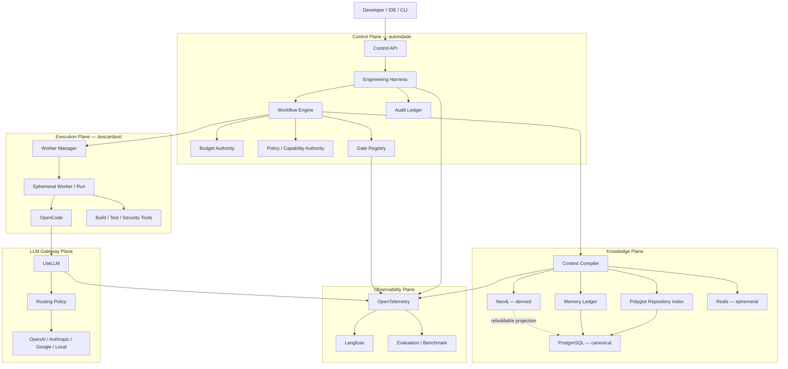
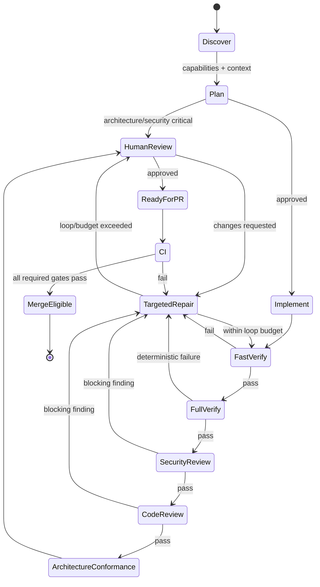

# Guia definitivo de evolução do AI Engineering Control Plane

## Resumo executivo

Esta revisão foi feita sobre o estado **actual** do `main` de `leandroclf/ai-engineering-control-plane`, já depois das sucessivas implementações dos guias anteriores. O diagnóstico mudou substancialmente: o projecto já não está na fase de “construir o Control Plane”; os elementos centrais existem e estão razoavelmente bem separados. Budget transaccional, Gate Registry, perfis multi-stack, API operacional, Memory Ledger, PostgreSQL canónico, Neo4j derivado, LiteLLM, isolamento Docker, OTel, Langfuse opcional, supply-chain pinning e transporte remoto por mTLS já estão implementados em graus diferentes. fileciteturn13file0L2-L2 fileciteturn32file0L2-L2 fileciteturn35file0L2-L2 fileciteturn38file0L2-L2 fileciteturn27file0L2-L2 fileciteturn17file0L2-L2

A arquitectura de base é, na minha avaliação, **correcta**. A regra mais importante está efectivamente a aparecer no código:

> **O LLM executa trabalho, mas não é a autoridade sobre workflow, orçamento, qualidade, autorização ou estado persistente.**

O runtime de produção cria um `BudgetAuthority` persistido em PostgreSQL; os handlers fazem reserva antes da inferência e settlement depois dela; o workflow permanece sob autoridade do Harness; o OpenCode é fortemente restringido por permissões; e o estado de memória/contexto é tratado fora das conversas do agente. fileciteturn11file0L2-L2 fileciteturn12file0L2-L2 fileciteturn14file0L2-L2 fileciteturn19file0L2-L2

O maior erro neste momento seria voltar a adicionar componentes — mais agentes, mais bases de dados, outro vector store, outro framework de agentes ou um “super-orchestrator”. **O próximo salto de qualidade deve vir de fechar a distância entre arquitectura declarada e invariantes comprovadas.**

A minha classificação actual é:

| Área | Estado actual | Alvo defensável | Prioridade |
|---|---:|---:|---|
| Autoridade do Harness | 9,5/10 | 9,5/10 | Manter |
| Workflow determinístico | 9/10 | 9,5/10 | P1 |
| Budget enforcement | 8,5/10 | 9,5/10 | **P0** |
| Isolamento do workspace | 8,5/10 | 9,5/10 | **P0** |
| Gate Registry | 9/10 | 9,5/10 | **P0** |
| Multi-stack de execução | 7/10 | 9/10 | **P0** |
| Context Compiler | 8/10 | 9,5/10 | **P1** |
| Memory Ledger | 9/10 | 9,5/10 | P1 |
| Neo4j / Knowledge Graph | 7,5/10 | 9/10 | P1 |
| LiteLLM / routing | 7,5/10 | 9,5/10 | **P0/P1** |
| Observabilidade OTel | 8,5/10 | 9,5/10 | P1 |
| Langfuse | 8/10 | 9/10 | P1 |
| API do Control Plane | 8,5/10 | 9,5/10 | **P0** |
| Supply chain | 9/10 | 9,5/10 | P1 |
| Persistência multi-máquina | 8,5/10 | 9,5/10 | P1 |
| CI/CD | 8/10 | 9,5/10 | **P0** |
| Benchmark/evals | 7/10 | 9/10 | **P1** |
| Segurança remota | 8,5/10 | 9,5/10 | P1 |
| **Maturidade global, minha avaliação** | **~8,5/10** | **~9,4/10** | |

Há, contudo, **seis lacunas estruturais que eu trataria como as mais importantes**.

Primeiro, o `main` aparece actualmente sem protecção de branch. Isto enfraquece toda a tese de “CI como autoridade final”: um conjunto excelente de gates não é uma garantia se um push directo pode contorná-lo. A própria documentação do GitHub permite requerer PR, reviews, status checks, bloqueio de force-push e de deleção precisamente para fechar essa fronteira. fileciteturn2file0L2-L2 citeturn3search0turn3search2

Segundo, o budget é transaccional e muito melhor do que na revisão anterior, mas a unidade `calls` continua essencialmente a representar uma **invocação lógica do agente**. Retry/fallback internos no LiteLLM podem significar várias tentativas físicas de provider. A reserva de custo também depende de um manifesto de preços separado da configuração efectiva dos modelos. Isto pode produzir drift entre orçamento administrativo e consumo económico real. fileciteturn11file0L2-L2 fileciteturn42file0L2-L2 fileciteturn41file0L2-L2 O LiteLLM suporta routing, retries/fallbacks e tracking centralizado de custos, pelo que devemos aproveitar a telemetria do gateway para reconciliar a chamada lógica do Harness com as tentativas físicas. citeturn1search0turn7search0

Terceiro, os adapters detectam Node, Gradle, Maven, Python e Go, mas a imagem principal do Harness não fornece todos esses toolchains. Em particular, o adapter Gradle executa `./gradlew` ou `gradle`, enquanto a imagem do Harness está centrada em Node/Python e ferramentas de segurança. Portanto, **“capability detectada” não significa ainda “capability executável neste worker”**. fileciteturn35file0L2-L2 fileciteturn58file0L2-L2 fileciteturn33file0L2-L2

Quarto, o multi-stack do plano de execução está mais avançado do que o multi-stack do plano de conhecimento: o directório de parsers de contexto contém actualmente apenas o parser JavaScript. Isto significa que um projecto Java, Go ou Python pode ser compilado/testado pelo Gate Registry, mas não beneficia ainda do mesmo symbol graph/context intelligence de JavaScript. fileciteturn31file0L2-L2

Quinto, existe um contrato `WorkerManager`, mas os seus métodos `create()` e `destroy()` são abstractos e lançam erro. O Compose continua a usar workspace/Harness long-lived. Para utilização remota ou multiutilizador, eu considero a execução **ephemeral-per-run** a próxima fronteira de isolamento. fileciteturn49file0L2-L2 O endurecimento actual — root filesystem read-only, `cap_drop: ALL`, `no-new-privileges`, ausência de Docker socket e redes internas — é bom e deve permanecer. fileciteturn17file0L2-L2 Docker documenta rootless mode e seccomp como mecanismos adicionais de redução da exposição do daemon/runtime. citeturn4search0turn4search1turn4search2

Sexto, o projecto possui uma API muito mais completa do que anteriormente, mas já encontrei **contract drift concreto**: o runtime aceita constraints como input/output tokens e iterações, enquanto o `CreateRunRequest` do OpenAPI expõe apenas `maxCostUsd` e `maxCalls`; adicionalmente, a semântica efectiva de idempotency é mais forte no runtime do que o schema comunica. fileciteturn38file0L2-L2 fileciteturn69file0L2-L2

A meta, portanto, não deve ser “perfeição”; isso seria uma premissa impossível de garantir em sistemas probabilísticos. A meta deve ser:

> **uma v1 defensável, reproduzível, mensurável, fail-closed e empiricamente demonstrada, em que qualquer decisão crítica possua autoridade determinística, provenance e evidência.**

A arquitectura final recomendada permanece:



## Auditoria aprofundada do estado actual

A revisão anterior já reconhecia que budget, Gate Registry e multi-stack tinham deixado de ser gaps absolutos. A nova revisão confirma isso e permite ser mais exigente: a questão agora é **se cada abstracção consegue provar a propriedade que o seu nome sugere**. O README actual também posiciona correctamente PostgreSQL como estado canónico e o restante plano de conhecimento como derivável/reconciliável. fileciteturn43file0L2-L2

| Domínio | O que já existe | Gap que ainda considero real | Decisão |
|---|---|---|---|
| Budget | Reservations, `FOR UPDATE`, settlement, eventos, TTL, drift | chamadas físicas de provider, preço/config drift, fallback mais caro | endurecer |
| Workspace | non-root, RO rootfs, drop caps, rede interna, attestation | worker long-lived, sem implementação real de `WorkerManager` | ephemeral worker |
| Gates | Registry tipado e preflight | binary disponível ≠ runtime/data/toolchain funcional | capability attestation |
| Multi-stack | Node/Gradle/Maven/Python/Go | workers sem toolchains equivalentes; context parser JS-only | worker profiles + parsers |
| Context | exact + lexical + vector + RRF + graph boost | lexical não BM25, vector eager, memory retrieval demasiado amplo | cascaded hybrid retrieval |
| Memory | scoped ledger, provenance, lifecycle, append-only events | ranking de memória e políticas de retenção/promote | endurecer lifecycle |
| Graph | repo/file/symbol/chunk/imports | JS-centric; hop distance simplificado; relações semânticas pobres | graph v2 |
| LiteLLM | aliases, retry, fallback, OTEL | fallback semântico `strong→fast`, diversidade entre providers reduzida | policy routing |
| OTel/Langfuse | redaction, file exporter, overlay Langfuse | fechar correlação física gateway→agent e quality scores | trace contract |
| CI | contratos, scanners, benchmarks, images pinned | `main` desprotegido; E2E de provider não determinístico | release governance |
| API | Runs/tasks/budget/context/audit/gates/etc. | OpenAPI drift | schema-first |
| Persistência | backup PostgreSQL + config, remote mTLS | restore drill automatizado e promoção multi-host | recovery SLO |

**Budget.** O `PostgresBudgetStore` já é uma implementação séria: bloqueia a linha do budget, reserva antecipadamente chamadas/tokens/custo, persiste reservas, converte reserva em utilização real, liberta reservas falhadas e produz eventos de drift. Isto é muito superior a um simples contador em memória. fileciteturn11file0L2-L2 O `BudgetAuthority` já é injectado pelo runtime de produção e usado pelos handlers antes da invocação OpenCode. fileciteturn12file0L2-L2 fileciteturn13file0L2-L2 fileciteturn14file0L2-L2

O problema restante é mais subtil. Os defaults continuam em 20 chamadas, 180k input tokens, 40k output tokens, USD 10 e duas iterações. fileciteturn76file0L2-L2 A estimativa calcula tokens do prompt/context/schema com uma margem conservadora e usa o maior custo conhecido entre deployments do alias. fileciteturn42file0L2-L2 Isto é bom; porém, os preços estão duplicados no `model-routing.json` e não são derivados automaticamente dos deployments efectivos. fileciteturn41file0L2-L2 O contrato correcto para v1 deve ser:

```text
Harness logical reservation
        │
        ▼
LiteLLM request_id
        │
        ├── provider attempt 1
        ├── retry attempt 2
        └── fallback attempt 3
        │
        ▼
physical usage reconciliation
        │
        ▼
Budget Ledger
```

Em termos de orçamento, eu passaria a distinguir:

| Medida | Significado |
|---|---|
| `logical_agent_calls` | chamadas vistas pelo Harness |
| `physical_llm_attempts` | requests efectivamente enviados a providers |
| `reserved_input_tokens` | limite reservado pré-chamada |
| `actual_input_tokens` | utilização reportada |
| `reserved_cost_usd` | pior caso conhecido |
| `actual_cost_usd` | consumo real do gateway |
| `reservation_drift_ratio` | `actual / reserved` |
| `fallback_cost_delta` | diferença causada por retry/fallback |

O LiteLLM é adequado para continuar como gateway porque normaliza providers, suporta retries/fallbacks e expõe tracking centralizado de spend/budgets. citeturn7search0 Mas eu evitaria que o LiteLLM se tornasse a autoridade do budget da tarefa: ele deve ser **segunda linha de defesa e fonte de consumo físico**; a autoridade continua no Harness.

**Workspace e workers.** O actual `WorkspaceAttestor` verifica path, UID não-root, ausência do Docker socket, ausência de provider secrets e rootfs não gravável. fileciteturn16file0L2-L2 O Compose reforça isto com networks internas, read-only, `cap_drop: ALL`, `no-new-privileges`, tmpfs e limites de CPU/memória/PIDs. fileciteturn17file0L2-L2 Isto já satisfaz um bom baseline local.

Mas o `WorkerManager` real ainda não existe:

```js
export class WorkerManager {
  async create(_spec) {
    throw new Error("WorkerManager.create must be implemented...");
  }

  async destroy(_runId) {
    throw new Error("WorkerManager.destroy must be implemented...");
  }
}
```

fileciteturn49file0L2-L2

Esta passa a ser uma das alterações de maior valor. Para utilização local pessoal, o worker long-lived é aceitável. Para remote/team mode, a minha recomendação é:

```text
run created
    ↓
issue ephemeral workload identity
    ↓
create isolated worker
    ↓
mount exact project worktree
    ↓
execute
    ↓
collect diff/evidence
    ↓
revoke identity
    ↓
destroy worker
```

Rootless Docker reduz a exposição ao executar daemon e containers dentro de user namespaces sem privilégios root; o seccomp default já bloqueia um conjunto de syscalls sensíveis e pode ser explicitamente versionado quando for necessário um perfil ainda mais restrito. citeturn4search0turn4search1

**Gate Registry e scanners.** O Gate Registry resolveu correctamente o problema anterior de gates declarados sem provider. fileciteturn32file0L2-L2 Contudo, a verificação de readiness dos scanners está demasiado próxima de "`binary --version` funciona". O Semgrep actualmente é chamado com `--config auto`, enquanto a rede do Harness/workspace é intencionalmente interna. A Semgrep documenta que `--config=auto` obtém as regras a partir do Registry. citeturn10search4turn10search7 A solução recomendada é simples: **não usar `auto` no gate determinístico offline**. O CI já possui regras vendorizadas; esse deve tornar-se o padrão local também. fileciteturn36file0L2-L2

Da mesma forma, Trivy suporta explicitamente pré-download da DB e os modos `--skip-db-update`, `--skip-java-db-update` e `--skip-check-update`, o que encaixa melhor no isolamento pretendido. citeturn2search8

Eu faria:

```text
scanner-data-updater
    │
    ├── semgrep rules bundle + hash
    ├── trivy DB + timestamp + hash
    └── optional Snyk online profile
             │
             ▼
     signed scanner manifest
             │
             ▼
        isolated worker
```

Snyk já tem um adapter de output no repositório, mas não o promoveria a requisito core. O CLI Snyk exige autenticação e os fluxos `monitor` enviam snapshots à plataforma; portanto, deve ficar num profile explicitamente online/SaaS, não dentro do baseline offline. fileciteturn68file0L2-L2 citeturn2search2turn2search12

**Multi-stack.** A detecção multi-project já compõe Node, Gradle, Maven, Python e Go. fileciteturn35file0L2-L2 O problema passa a ser a execução real. O adapter Gradle, por exemplo, chama wrapper ou binário Gradle e sonda tasks. fileciteturn58file0L2-L2 A imagem comum do Harness não deve simplesmente receber Java + Gradle + Maven + Go + Rust + .NET + tudo o que surgir. Isto criaria uma imagem enorme e uma supply chain desnecessariamente larga.

A arquitectura melhor é:

```text
WorkerProfileRegistry
    ├── node22
    ├── java21-gradle
    ├── java21-maven
    ├── python313
    ├── go1xx
    └── generic
```

Cada profile possui:

```json
{
  "id": "java21-gradle",
  "languages": ["java", "kotlin"],
  "toolchains": {
    "java": "21",
    "gradleWrapper": true
  },
  "scannerBundle": "security-v1",
  "imageDigest": "sha256:...",
  "networkPolicy": "isolated",
  "capabilities": [
    "build",
    "unit-tests",
    "integration-tests",
    "coverage"
  ]
}
```

Isso mantém o princípio **capability truth**:

> `AVAILABLE` só pode ser devolvido quando manifest + runtime probe + ferramenta necessária foram comprovados.

**Context Compiler.** Aqui existe trabalho tecnicamente interessante. O serviço combina exact-symbol search, lexical retrieval, embeddings, RRF, boost por symbol, graph e paths alterados, e depois aplica um budget categorizado. fileciteturn27file0L2-L2 O PostgreSQL já possui `tsvector` e `ts_rank`, que são mecanismos apropriados para um baseline lexical e podem ser combinados com factores de domínio. fileciteturn25file0L2-L2 citeturn8search5turn8search12

Os pontos a melhorar são:

```text
actual
query
  ├── exact
  ├── lexical
  ├── vector sempre
  └── graph sobretudo via exact symbols

target
query
  ↓
cheap deterministic cascade
  ├── exact symbol
  ├── changed files
  ├── lexical/BM25
  │
  └── enough confidence?
        ├── YES → skip embedding
        └── NO
             ↓
          vector
             ↓
       graph expansion
             ↓
       relevance fusion
             ↓
       token-aware pack
```

Isto é importante para economia de tokens e latência. Não existe razão para gerar embedding para uma query como:

```text
"alterar PaymentService.retryPolicy"
```

se `PaymentService.retryPolicy` já identifica deterministicamente o symbol e respectivo neighbourhood.

A actual fórmula usa RRF mais boosts, o que é uma boa decisão porque scores de lexical/vector não devem ser comparados directamente. A própria Neo4j recomenda, em hybrid search, rankear as fontes independentemente em vez de comparar scores vector/full-text crus. citeturn9search1 Eu preservaria essa propriedade.

**Memory Ledger.** A modelagem actual é forte: scopes, estado/versionamento, autoridade, confidence, source references, events append-only, validade e supersession já existem. fileciteturn26file0L2-L2 fileciteturn25file0L2-L2 Os scopes mais recentes incluem GLOBAL, ORGANIZATION, SOLUTION, PROJECT, REPOSITORY, AGENT, TASK, RUN e EXECUTION. fileciteturn65file0L2-L2

Eu não mudaria o modelo conceptual. Mudaria a recuperação:

```text
não:
todas as memories activas do scope
        ↓
context candidates

sim:
scope distance
+
authority
+
query lexical relevance
+
optional semantic relevance
+
freshness
+
source validity
        ↓
memory candidates
```

A hierarquia recomendada permanece:

```text
HUMAN / POLICY
      >
CI / deterministic tool
      >
SOURCE_CODE
      >
validated derived memory
      >
LLM_INFERENCE
```

E uma memória criada por LLM nunca deve promover-se autonomamente a `POLICY`.

**Neo4j.** A decisão de manter PostgreSQL canónico e Neo4j como projecção reconstruível é exactamente a que eu manteria. O modelo actual representa Repository → File → Symbol/Chunk e `IMPORTS`, mas a resolução de imports é fortemente JavaScript-oriented. fileciteturn30file0L2-L2 Há ainda um detalhe corrigível: a query de neighbourhood perde a distinção entre um e dois hops ao devolver essencialmente `0` ou `1`; Neo4j suporta `length(p)` para devolver o tamanho real do path. fileciteturn30file0L2-L2 citeturn0search3turn0search6

Não colocaria embeddings no Neo4j nesta fase apenas porque o Neo4j os suporta. A versão actualmente pinada no projecto já está numa geração em que Neo4j oferece vector indexes e hybrid search, mas a arquitectura actual já possui um vector plane funcional no PostgreSQL/context service. Duplicar esse índice sem benchmark seria complexidade sem evidência. fileciteturn60file0L2-L2 citeturn9search0

**LiteLLM.** A configuração actual tem aliases úteis, mas os aliases têm pouca diversidade de deployments e `coding-strong` faz fallback para `coding-fast`. fileciteturn40file0L2-L2 Eu considero essa política semanticamente incorrecta para operações que exigem nível “strong”: um fallback de disponibilidade não deveria silenciosamente alterar a classe de qualidade.

Faça:

```text
coding-strong
    ├── OpenAI strong
    ├── Anthropic strong
    └── Gemini strong
```

e mantenha:

```text
coding-fast
    ├── OpenAI fast
    ├── Anthropic fast
    └── Gemini fast
```

A selecção `strong → fast` só deveria ocorrer como **degradação explícita**, registada como policy decision e, para architecture/security/final review, provavelmente exigir aprovação humana.

Também implementaria **reviewer diversity**:

```text
implementer.provider = Anthropic
reviewer.excludeProvider = Anthropic

→ review por OpenAI/Gemini
```

Isto não garante correcção, mas reduz correlação de erro entre produtor e revisor.

**API e CI.** O HTTP server já expõe muito mais do que anteriormente: runs, stages, cancel/resume, audit, gates, findings, tasks, budgets, capabilities, workflows, policies, models e contexts. fileciteturn38file0L2-L2 O OpenAPI não está perfeitamente sincronizado com essas semânticas. fileciteturn69file0L2-L2 Recomendo transformar OpenAPI em contrato gerado/testado, em vez de um documento paralelo.

O CI também está substancialmente melhor: há architecture contracts, integration com PostgreSQL, scanners, benchmark regressions e actions pinadas por SHA. fileciteturn36file0L2-L2 O supply-chain validator proíbe `latest` nas imagens governadas e requer SHA para GitHub Actions, e `versions.env` fixa as principais imagens por digest. fileciteturn59file0L2-L2 fileciteturn60file0L2-L2

O problema prioritário é que o `main` não aparece protegido. fileciteturn2file0L2-L2

Eu tornaria obrigatórios, antes de qualquer merge:

```text
architecture-contracts
contracts
control-plane-integration
security-scanners
benchmark-regression
supply-chain
image-security
```

e configuraria GitHub para requerer PR, status checks e impedir force-push/delete. Essas protecções são mecanismos nativos do GitHub. citeturn3search0turn3search3

## Arquitectura alvo e princípios de v1

A v1 deve formalizar **cinco autoridades diferentes**, porque misturar estas autoridades é exactamente o que produz agentes não governados:

```text
WORKFLOW AUTHORITY       = Harness
BUDGET AUTHORITY         = Harness + PostgreSQL
QUALITY AUTHORITY        = deterministic gates + CI
KNOWLEDGE AUTHORITY      = sources + Memory Ledger provenance
FINAL RELEASE AUTHORITY  = human + protected CI process
```

O OpenCode permanece um executor. A configuração actual já segue a direcção correcta com permissões deny-by-default e agentes especializados; o OpenCode suporta `allow`, `ask` e `deny`, incluindo regras por agente e por comando. fileciteturn19file0L2-L2 fileciteturn57file0L2-L2 citeturn0search0turn0search1 Também suporta `baseURL` customizado para providers, pelo que LiteLLM continua a encaixar naturalmente como endpoint OpenAI-compatible. citeturn0search4

Eu formalizaria estas invariantes como **AICP v1 Safety Laws**:

```text
AICP-001
Um LLM nunca altera directamente o estado de workflow.

AICP-002
Nenhuma chamada LLM ocorre sem budget reservation.

AICP-003
Nenhuma reserva é considerada final sem settlement/reconciliation.

AICP-004
Nenhum worker recebe credenciais físicas dos providers.

AICP-005
Nenhum reviewer modifica código.

AICP-006
Nenhum finding obrigatório pode ser suprimido sem suppression válida,
expirável, auditável e independentemente aprovada.

AICP-007
Nenhum gate passa apenas porque o LLM afirma que passou.

AICP-008
Nenhuma capability é AVAILABLE apenas porque existe no manifesto.

AICP-009
Nenhuma memória LLM passa a POLICY sem autoridade externa.

AICP-010
Neo4j e Redis nunca são fonte canónica.

AICP-011
Nenhum run remoto partilha worker identity com outro run.

AICP-012
Nenhuma mudança chega a main sem PR + required checks.

AICP-013
Nenhuma branch protegida recebe git push automático por um agente.

AICP-014
Operações destrutivas requerem aprovação humana.

AICP-015
Prompts, source code, secrets e bodies sensíveis não entram
em telemetria por defeito.
```

A actual configuração OTel já elimina prompt, completion, source code, HTTP bodies, DB statements e stack traces antes de exportar. fileciteturn70file0L2-L2 Isto está alinhado com a preocupação do próprio OpenTelemetry: vários atributos GenAI podem conter conteúdo sensível e devem ser tratados como opt-in. citeturn8search8

O workflow que eu congelaria para v1 é:



Repare que o estado final não é:

```text
PRODUCTION_READY
```

É:

```text
MERGE_ELIGIBLE
```

Produção continua a depender do processo de delivery do projecto consumidor.

A arquitectura de memória/contexto deve seguir:

```mermaid
flowchart LR
    Q["Task Query"]
    META["Git diff / exact symbols / project profile"]

    Q --> DET["Deterministic Retrieval"]
    META --> DET

    DET --> EXACT["Exact symbols"]
    DET --> FTS["BM25/lexical"]
    DET --> CHANGED["Changed paths"]

    EXACT --> CONF{"Context sufficient?"}
    FTS --> CONF
    CHANGED --> CONF

    CONF -->|sim| GRAPH["Graph expansion"]
    CONF -->|não| EMB["Embedding"]
    EMB --> VECTOR["Vector candidates"]
    VECTOR --> GRAPH

    GRAPH --> MEM["Scoped relevant Memory"]
    MEM --> FUSE["Rank fusion"]
    FUSE --> PACK["Token-aware Context Compiler"]

    PACK --> CID["Deterministic context_id"]
    CID --> AGENT["Agent Invocation"]

    AGENT --> EVIDENCE["Usage / Findings / Decisions"]
    EVIDENCE --> LEDGER["Memory candidate / audit"]
    LEDGER --> PG["PostgreSQL canonical"]
    PG --> PROJECTION["Neo4j reconstruction"]
```



A consequência prática é importante: **o grafo não é a memória, embeddings não são a memória, Langfuse não é a memória e chat history não é a memória**.

A fonte correcta é:

```text
PostgreSQL Memory Ledger
+
source references
+
Git/source-of-truth
```

Neo4j responde relações. Redis acelera. Langfuse observa. OpenCode executa.

## Plano de migração faseado

Eu executaria a evolução numa sequência rígida. Não começaria Context v3 antes de fechar release governance, budget e capability truth, porque optimizar contexto sobre uma plataforma cujo CI pode ser contornado não aumenta a confiabilidade sistémica.

**Fase de release governance e contract truth.**

Primeiro proteja `main`. Actualmente a branch não aparece protegida. fileciteturn2file0L2-L2 GitHub permite exigir PRs, reviews e status checks e impedir force-push/delete. citeturn3search0

Configuração recomendada:

```text
target: main

Require a pull request before merging: YES
Approvals: >= 1
Dismiss stale approvals: YES
Require approval of most recent push: YES
Require conversation resolution: YES
Require status checks: YES
Require branches up to date: YES

Required checks:
  architecture-contracts
  contracts
  control-plane-integration
  security-scanners
  benchmark-regression
  supply-chain
  image-security

Allow force pushes: NO
Allow deletions: NO
Do not allow bypassing: YES
```

No repositório, adicione:

```text
.github/
├── CODEOWNERS
├── pull_request_template.md
└── workflows/
    ├── ci.yml
    ├── image-security.yml
    └── provider-smoke.yml
```

Depois elimine drift entre `http-server.mjs` e OpenAPI. O runtime actual é mais rico que o schema publicado. fileciteturn38file0L2-L2 fileciteturn69file0L2-L2

O request contract deveria ficar aproximadamente:

```yaml
CreateRunRequest:
  type: object
  additionalProperties: false
  required:
    - project
    - query
  properties:
    project:
      type: string
      minLength: 1
    repository:
      type: string
    query:
      type: string
      minLength: 1
    idempotencyKey:
      type: string
      minLength: 8
    exactSymbols:
      type: array
      items:
        type: string
    constraints:
      type: object
      additionalProperties: false
      properties:
        maxCostUsd:
          type: number
          exclusiveMinimum: 0
        maxCalls:
          type: integer
          minimum: 1
        maxInputTokens:
          type: integer
          minimum: 1
        maxOutputTokens:
          type: integer
          minimum: 1
        maxIterations:
          type: integer
          minimum: 0
```

Crie contract tests que iniciem o HTTP server e validem requests de cada exemplo do OpenAPI. O actual `architecture-contracts.mjs` usa várias verificações por leitura/string matching; é útil como smoke test, mas não substitui um teste comportamental do contrato. fileciteturn72file0L2-L2

**Fase de budget e routing economicamente correcto.**

Crie um único `ModelCatalog` canónico:

```yaml
schemaVersion: 1

aliases:
  coding-strong:
    class: strong
    deployments:
      - id: openai-strong
        provider: openai
        modelEnv: OPENAI_STRONG_MODEL
        pricing:
          inputPerMillionEnv: OPENAI_STRONG_INPUT_PRICE
          outputPerMillionEnv: OPENAI_STRONG_OUTPUT_PRICE
      - id: anthropic-strong
        provider: anthropic
        modelEnv: ANTHROPIC_STRONG_MODEL
        pricing:
          inputPerMillionEnv: ANTHROPIC_STRONG_INPUT_PRICE
          outputPerMillionEnv: ANTHROPIC_STRONG_OUTPUT_PRICE

  coding-fast:
    class: fast
    deployments:
      - id: openai-fast
        provider: openai
        modelEnv: OPENAI_FAST_MODEL
```

A partir dele gere:

```text
litellm/generated.config.yaml
harness/generated/model-routing.json
observability/generated/model-catalog.json
```

Assim desaparece a possibilidade de:

```text
LiteLLM usa Modelo X
Harness calcula preço de Modelo Y
Langfuse infere preço de Modelo Z
```

Langfuse consegue receber usage/cost ingerido e também inferir custos a partir do modelo; valores ingeridos têm precedência, o que reforça a recomendação de fazer LiteLLM/Harness transportar o custo real. citeturn1search7

Adicione correlação física:

```json
{
  "run_id": "...",
  "task_id": "...",
  "stage": "implement",
  "agent": "implementer",
  "logical_invocation_id": "...",
  "litellm_request_id": "...",
  "provider_attempt": 2,
  "provider": "anthropic",
  "model": "...",
  "fallback": true
}
```

E gates:

```text
reservation_drift_ratio > 1.00
    → warning + evidence

reservation_drift_ratio > 1.10
    → release regression

unknown pricing
    → BLOCK before invocation

alias without valid deployment
    → BLOCK

strong alias falls to fast
    → BLOCK unless degradation policy explicitly authorised
```

**Fase de capability truth e workers.**

Introduza:

```text
harness/src/workers/
├── worker-manager.mjs
├── docker-worker-manager.mjs
├── worker-profile-registry.mjs
├── worker-attestation.mjs
└── workload-identity-service.mjs

docker/workers/
├── node22/
│   └── Dockerfile
├── java21/
│   └── Dockerfile
├── python313/
│   └── Dockerfile
└── go/
    └── Dockerfile
```

Não monte Docker socket dentro do Harness. O worker manager deve ser um **deployment-side trusted service**, não uma capacidade entregue ao agente; a documentação Docker alerta que controlo sobre o daemon é altamente privilegiado. citeturn4search2

O contrato pode ser:

```ts
interface WorkerManager {
  create(spec: EphemeralWorkerSpec): Promise<WorkerHandle>;
  exec(runId: string, command: CommandSpec): Promise<ExecutionResult>;
  collectEvidence(runId: string): Promise<WorkerEvidence>;
  destroy(runId: string): Promise<void>;
}
```

`WorkerHandle`:

```json
{
  "runId": "uuid",
  "workerId": "opaque",
  "profile": "java21-gradle",
  "imageDigest": "sha256:...",
  "attestation": {
    "nonRoot": true,
    "readOnlyRoot": true,
    "dockerSocket": false,
    "providerSecrets": false,
    "networkPolicy": "internal-only"
  }
}
```

Depois faça `GateRegistry.preflight()` consultar o worker real:

```text
manifest says Java
        +
java --version succeeds
        +
./gradlew tasks succeeds
        +
scanner dataset healthy
        =
AVAILABLE
```

O scanner bundle deverá ser imutável:

```yaml
scannerBundle:
  version: security-2026-08-22
  semgrep:
    rulesPath: /security/semgrep
    rulesSha256: ...
  trivy:
    dbPath: /security/trivy
    dbUpdatedAt: ...
    maxAgeHours: 24
  gitleaks:
    configPath: /security/gitleaks.toml
    configSha256: ...
```

Para Trivy, o updater descarrega a DB; o worker executa com `--skip-db-update` sobre a cache aprovada. O Trivy suporta explicitamente esta separação. citeturn2search8

**Fase de Context Compiler e Knowledge Graph polyglot.**

Adicione parser registry:

```text
context/parsers/
├── parser-registry.mjs
├── javascript-parser.mjs
├── typescript-parser.mjs
├── java-parser.mjs
├── python-parser.mjs
└── go-parser.mjs
```

Contrato comum:

```ts
interface SourceParser {
  supports(path: string): boolean;

  parse(input: {
    path: string;
    content: string;
    repositoryId: string;
  }): {
    symbols: SymbolRecord[];
    imports: ImportRecord[];
    chunks: ChunkRecord[];
  };
}
```

Estrutura de symbol:

```json
{
  "symbolId": "stable-hash",
  "language": "java",
  "kind": "method",
  "qualifiedName": "com.acme.PaymentService.retry",
  "semanticContainer": "com.acme.PaymentService",
  "signatureHash": "...",
  "path": "src/main/java/...",
  "lineStart": 44,
  "lineEnd": 71
}
```

A ideia importante é **parser first, LLM never** para factos sintácticos:

```text
class/method/function/import
→ AST/parser/LSP

"qual responsabilidade de domínio?"
→ eventualmente LLM
```

Actualize Neo4j:

```cypher
(:Repository)-[:CONTAINS]->(:Module)
(:Module)-[:CONTAINS]->(:File)
(:File)-[:DECLARES]->(:Symbol)

(:Symbol)-[:CALLS]->(:Symbol)
(:Symbol)-[:IMPLEMENTS]->(:Symbol)
(:Symbol)-[:EXTENDS]->(:Symbol)

(:File)-[:IMPORTS]->(:File)
(:Module)-[:DEPENDS_ON]->(:Module)

(:Endpoint)-[:HANDLED_BY]->(:Symbol)
(:Symbol)-[:READS_FROM]->(:DataStore)
(:Symbol)-[:WRITES_TO]->(:DataStore)

(:Test)-[:TESTS]->(:Symbol)
(:ADR)-[:GOVERNS]->(:Module)
(:Finding)-[:AFFECTS]->(:Symbol)
```

Não tente inferir todas estas relações com LLM na primeira versão. Implemente inicialmente apenas relações determinísticas.

Corrija hop distance:

```cypher
MATCH p = (origin:Symbol)-[:CALLS|IMPORTS|DEPENDS_ON*1..2]-(related)
RETURN related, min(length(p)) AS distance
ORDER BY distance ASC
```

Neo4j suporta obter o tamanho real do path com `length(p)`. citeturn0search3

Depois implemente retrieval em cascata:

```python
exact = retrieve_exact(query, symbols)
lexical = retrieve_bm25(query)

confidence = deterministic_confidence(exact, lexical)

if confidence >= policy.semantic_skip_threshold:
    vector = []
else:
    vector = retrieve_vector(embed(query))

graph_seeds = select_graph_seeds(exact, lexical, vector)
graph = expand_graph(graph_seeds, max_hops=2)

memory = retrieve_relevant_memories(
    query=query,
    scopes=authorized_scopes,
)

ranked = fuse(exact, lexical, vector, graph, memory)
context = pack(ranked, token_budget)
```

Uma fórmula inicial de ranking que eu experimentaria é:

```text
score(d) =
    0.28 * RRF(BM25_rank(d))
  + 0.24 * RRF(vector_rank(d))
  + 0.20 * exact_symbol_boost(d)
  + 0.12 * graph_proximity(d)
  + 0.08 * changed_file_boost(d)
  + 0.05 * memory_authority(d)
  + 0.03 * freshness(d)
```

onde:

```text
RRF(rank) = 1 / (60 + rank)
```

e BM25:

```text
BM25(q,d) =
Σ IDF(qi) *
   tf(qi,d) * (k1 + 1)
   ───────────────────────────────────────────
   tf(qi,d) + k1 * (1 - b + b * |d| / avgdl)
```

Começaria com:

```text
k1 = 1.2
b  = 0.75
```

São defaults convencionais de BM25 em implementações como Elasticsearch/Lucene. citeturn8search0turn8search1

Mas **não substituiria imediatamente PostgreSQL `ts_rank` por Elasticsearch**. PostgreSQL já oferece FTS/ranking e permite combinar ranking lexical com factores específicos do domínio; adicionar Elasticsearch seria uma nova peça operacional sem evidência de necessidade. citeturn8search12 Faça primeiro BM25/application ranking ou continue com `ts_rank` e compare A/B.

A policy proposta:

```yaml
schemaVersion: 2

retrieval:
  exact:
    enabled: true
    maxCandidates: 30

  lexical:
    enabled: true
    engine: postgres
    algorithm: bm25
    maxCandidates: 50

  semantic:
    enabled: true
    mode: conditional
    semanticSkipThreshold: 0.82
    maxCandidates: 40

  graph:
    enabled: true
    maxHops: 2
    maxCandidates: 40
    seedSources:
      - exact
      - lexical
      - vector
      - changed-files

  memory:
    enabled: true
    requireQueryRelevance: true
    maxCandidates: 20

packing:
  algorithm: token-aware
  minimumEvidenceDiversity: 3

  quotas:
    exact: 0.24
    relevantCode: 0.30
    tests: 0.12
    architecture: 0.10
    memory: 0.07
    security: 0.07
    constraints: 0.10

identity:
  include:
    - retrievalPolicyVersion
    - embeddingModel
    - tokenizerVersion
    - indexSnapshot
    - graphSnapshot
    - artifactHashes
```

**Fase de observabilidade e benchmark científico.**

A actual arquitectura OTel já possui redaction e export local; existe overlay que envia traces redigidos para o endpoint OTLP nativo do Langfuse. fileciteturn70file0L2-L2 fileciteturn74file0L2-L2 fileciteturn75file0L2-L2 Langfuse suporta tracing hierárquico, token/cost tracking e integração OpenTelemetry. citeturn1search2turn1search7

Padronize a árvore:

```text
trace: aicp.run
│
├── span: aicp.stage.discover
├── span: aicp.context.compile
│   ├── retrieval.exact
│   ├── retrieval.lexical
│   ├── retrieval.vector
│   ├── retrieval.graph
│   └── context.pack
│
├── span: aicp.agent.invoke
│   └── span: gen_ai.chat
│       ├── provider.attempt
│       └── provider.fallback
│
├── span: aicp.gates.fast
├── span: aicp.gates.full
├── span: aicp.security.review
└── span: aicp.human.review
```

OpenTelemetry recomenda semantic conventions para manter nomenclatura interoperável, incluindo convenções GenAI para model/provider e token usage. citeturn8search2turn8search8turn8search14

Depois construa um benchmark **com tarefas reais**, não apenas fixtures:

```text
Dataset AICP-v1:
  10 bug fixes
  10 features
  5 refactorings
  5 security fixes

Cada task:
  baseline = OpenCode + LiteLLM sem Context Plane avançado
  candidate = full Control Plane

Repetições:
  >= 3 por configuração/model routing

Registar:
  pass/fail
  human acceptance
  defect count
  security findings
  tokens
  cost
  latency
  repair loops
  files changed
  context precision
```

Não promova uma optimização de Context/Routing apenas porque reduz tokens. A regra deve ser:

```text
promote candidate
iff
    quality >= baseline
AND cost <= baseline
AND no security regression
```

## Backlog de PRs, marcos e budgets

Eu dividiria a implementação em PRs pequenos o suficiente para review independente. Defino **S ≈ até um dia**, **M ≈ dois a quatro dias**, **L ≈ cinco a dez dias** para um engenheiro familiarizado com o projecto; são apenas classes de esforço, não compromissos de calendário.

| Ordem | PR | Prioridade | Esforço | Resultado |
|---:|---|---|---|---|
| 1 | `govern-main-and-contracts` | P0 | S/M | branch protection + OpenAPI parity |
| 2 | `budget-physical-reconciliation` | P0 | M | logical vs physical LLM accounting |
| 3 | `model-catalog-routing-policy` | P0 | M | config única, aliases fortes, pricing truth |
| 4 | `scanner-bundle-offline-readiness` | P0 | M | Semgrep/Trivy determinísticos offline |
| 5 | `worker-profile-registry` | P0 | L | capability truth por toolchain |
| 6 | `ephemeral-worker-manager` | P0/P1 | L | worker isolado por run |
| 7 | `polyglot-context-parsers` | P1 | L | JS/TS/Java/Python/Go |
| 8 | `graph-retrieval-v2` | P1 | M/L | graph seeds + hop distance + typed edges |
| 9 | `context-compiler-v3` | P1 | L | cascaded retrieval + BM25/RRF |
| 10 | `memory-relevance-and-retention` | P1 | M | scoped/relevant memory |
| 11 | `otel-langfuse-trace-contract` | P1 | M | hierarchy + physical attempt correlation |
| 12 | `ci-e2e-supply-chain` | P1 | M/L | mock gateway, image scans, SBOM evidence |
| 13 | `state-recovery-multihost` | P1 | M | backup/restore drill + remote contract |
| 14 | `aicp-v1-benchmark` | P1 | L | evidence para release |
| 15 | `v1-release-contract` | P0 final | M | release checklist e tag v1 |

**Critérios de aceitação e commits sugeridos:**

| PR | Critério de aceitação principal | Commit de exemplo |
|---|---|---|
| `govern-main-and-contracts` | OpenAPI e runtime sem drift; branch main protegida | `chore(governance): enforce protected main and API contract parity` |
| `budget-physical-reconciliation` | retry/fallback físico aparece no budget ledger | `feat(budget): reconcile physical provider attempts` |
| `model-catalog-routing-policy` | uma única fonte gera LiteLLM/Harness configs | `feat(routing): introduce canonical governed model catalog` |
| `scanner-bundle-offline-readiness` | full security gates passam sem provider egress | `feat(security): make scanner data deterministic and offline` |
| `worker-profile-registry` | Java/Go/Python/Node capabilities são provadas em runtime | `feat(workers): attest toolchain capabilities per profile` |
| `ephemeral-worker-manager` | create→run→destroy sem estado residual | `feat(runtime): execute governed runs in ephemeral workers` |
| `polyglot-context-parsers` | symbols/imports estáveis para cinco stacks | `feat(context): add polyglot deterministic parsers` |
| `graph-retrieval-v2` | graph retorna distância real e seeds múltiplos | `feat(graph): add typed neighbourhood retrieval` |
| `context-compiler-v3` | vector é condicional e benchmark não perde recall | `feat(context): implement cascaded hybrid retrieval` |
| `memory-relevance-and-retention` | memória irrelevante não entra no candidate set | `feat(memory): rank scoped memories by relevance and authority` |
| `otel-langfuse-trace-contract` | run→stage→agent→attempt correlacionável | `feat(observability): standardize hierarchical AICP traces` |
| `ci-e2e-supply-chain` | imagens + mock LLM E2E + evidence CI | `ci: verify end-to-end control plane and image supply chain` |
| `state-recovery-multihost` | restore em host limpo reproduz estado canónico | `feat(operations): automate encrypted multi-host recovery drill` |
| `aicp-v1-benchmark` | relatório baseline/candidate reproduzível | `test(evals): add reproducible AICP v1 benchmark suite` |
| `v1-release-contract` | todos os invariants comprovados | `chore(release): establish defensible AICP v1 contract` |

Os milestones que eu usaria são:

| Milestone | PRs | Gate de saída |
|---|---|---|
| **Governed Core** | 1–4 | main protegido, API/pricing/scanners governados |
| **Isolated Execution** | 5–6 | capability truth + ephemeral execution |
| **Polyglot Intelligence** | 7–10 | contexto/memória/grafo multi-stack |
| **Observable Evidence** | 11–12 | trace E2E + CI E2E |
| **Portable Operation** | 13 | restore multi-host comprovado |
| **Defensible v1** | 14–15 | benchmark + release evidence |

Para budgets, eu **não mudaria ainda os defaults actuais** antes de recolher dados. Hoje o projecto usa 20 calls, 180k input, 40k output, USD 10 e duas iterações. fileciteturn76file0L2-L2 Em vez disso, passaria a permitir policies por classe:

| Classe | Calls | Input | Output | Iterações | Custo |
|---|---:|---:|---:|---:|---:|
| `tiny` | 4 | 30k | 8k | 0 | USD 1 |
| `small` | 8 | 60k | 15k | 1 | USD 2,50 |
| `standard` | 20 | 180k | 40k | 2 | USD 10 |
| `large` | 30 | 300k | 60k | 3 | USD 20 |
| `architecture-only` | 6 | 80k | 15k | 0 | USD 5 |

Estes valores são **propostas de policy**, não SLOs empiricamente validados. O benchmark deve ajustá-los.

A escolha deve ocorrer por task classification:

```text
docs/small change → tiny
bug localizado     → small
feature normal     → standard
cross-module       → large + human approval
architecture       → architecture-only
```

Nunca permita que o próprio agente aumente o seu budget.

## Templates e contratos de implementação

O seguinte `AGENTS.md` é a baseline que eu usaria no repositório:

```markdown
# AI Engineering Control Plane — Agent Contract

## Authority

O Harness é a única autoridade sobre:
- workflow;
- budget;
- autorização;
- quality gates;
- lifecycle de runs.

Os agentes são executores não confiáveis.

## Fonte de verdade

A prioridade de evidência é:

1. política humana aprovada;
2. CI/gates determinísticos;
3. código-fonte e configuração versionados;
4. ferramentas determinísticas;
5. Memory Ledger com provenance;
6. inferência LLM.

Nunca transformar inferência em facto sem evidência.

## Alterações

Só o agente implementer pode editar código.

Architect, security-reviewer e code-reviewer:
- não editam;
- não fazem commit;
- não fazem push;
- não fazem merge;
- não suprimem findings.

## Git

Permitido:
- git status
- git diff
- git log

Proibido automaticamente:
- push para main/master/release/*
- force push
- reset --hard
- branch deletion
- history rewrite
- merge de PR
- tag de release

Push para feature branch apenas quando:
- pedido pelo workflow;
- testes locais passaram;
- branch não é protegida.

## Operações destrutivas

Requerem aprovação humana explícita:
- docker volume rm
- DROP DATABASE/SCHEMA/TABLE
- terraform destroy/apply de produção
- kubectl delete
- remoção de estado persistente
- rotação/revogação de credenciais
- force push
- branch/tag deletion

## Segurança

Nunca:
- ler ou revelar secrets sem autorização;
- colocar secrets em logs/prompts;
- enviar código para endpoints não aprovados;
- montar Docker socket;
- desactivar scanner para obter green;
- remover testes para obter green.

## Budget

Toda invocação LLM deve possuir:
- task_id;
- run_id;
- stage;
- reservation_id;
- model alias;
- token/cost upper bound.

Nenhuma chamada sem reservation.

## Quality

Uma tarefa nunca é declarada "done" apenas pelo agente.

Estados permitidos:
- IMPLEMENTED
- GATES_PASSED
- READY_FOR_HUMAN_REVIEW
- MERGE_ELIGIBLE

## Context

Usar apenas contexto fornecido pelo Context Compiler.

Não carregar todo o repositório quando retrieval direccionado é suficiente.

Preferência:
1. exact symbol;
2. changed files;
3. lexical;
4. graph;
5. vector;
6. memory.

## Repair loops

Reparações são direccionadas ao finding.

Não repetir todo o workflow.

Ao exceder loop/budget:
ESCALATE_TO_HUMAN.
```

OpenCode permite configuração por agente e regras granularizadas de `bash`, com precedence das regras específicas; isto encaixa no modelo deny-by-default que o projecto já utiliza. citeturn0search0turn0search5

Um `opencode.json` de referência:

```json
{
  "$schema": "https://opencode.ai/config.json",

  "provider": {
    "controlplane": {
      "npm": "@ai-sdk/openai-compatible",
      "name": "AICP LiteLLM Gateway",
      "options": {
        "baseURL": "{env:LITELLM_BASE_URL}",
        "apiKey": "{env:LITELLM_API_KEY}"
      },
      "models": {
        "coding-strong": {},
        "coding-fast": {},
        "architecture": {},
        "security": {},
        "review": {}
      }
    }
  },

  "permission": {
    "*": "deny",

    "read": {
      "*": "allow",
      "**/.env": "deny",
      "**/.env.*": "deny",
      "**/secrets/**": "deny"
    },

    "edit": "deny",

    "bash": {
      "*": "deny",
      "git status *": "allow",
      "git diff *": "allow",
      "git log *": "allow",

      "git commit *": "deny",
      "git push *": "deny",
      "git reset --hard *": "deny",

      "docker *": "deny",
      "kubectl *": "deny",
      "terraform *": "deny"
    },

    "external_directory": "deny",
    "webfetch": "deny",
    "websearch": "deny",
    "doom_loop": "deny"
  }
}
```

Custom `baseURL` é suportado oficialmente pelo OpenCode, pelo que o LiteLLM continua desacoplado do agente. citeturn0search4

Config LiteLLM proposta:

```yaml
model_list:

  - model_name: coding-strong
    litellm_params:
      model: os.environ/OPENAI_STRONG_MODEL
      api_key: os.environ/OPENAI_API_KEY
    model_info:
      provider_family: openai
      capability_class: strong

  - model_name: coding-strong
    litellm_params:
      model: os.environ/ANTHROPIC_STRONG_MODEL
      api_key: os.environ/ANTHROPIC_API_KEY
    model_info:
      provider_family: anthropic
      capability_class: strong

  - model_name: coding-strong
    litellm_params:
      model: os.environ/GEMINI_STRONG_MODEL
      api_key: os.environ/GEMINI_API_KEY
    model_info:
      provider_family: google
      capability_class: strong

  - model_name: coding-fast
    litellm_params:
      model: os.environ/OPENAI_FAST_MODEL
      api_key: os.environ/OPENAI_API_KEY

  - model_name: architecture
    litellm_params:
      model: os.environ/ARCHITECTURE_MODEL
      api_key: os.environ/ARCHITECTURE_API_KEY

  - model_name: security
    litellm_params:
      model: os.environ/SECURITY_MODEL
      api_key: os.environ/SECURITY_API_KEY

  - model_name: review
    litellm_params:
      model: os.environ/REVIEW_MODEL
      api_key: os.environ/REVIEW_API_KEY

router_settings:
  routing_strategy: simple-shuffle
  num_retries: 1

litellm_settings:
  callbacks:
    - otel

general_settings:
  master_key: os.environ/LITELLM_MASTER_KEY
  database_url: os.environ/LITELLM_DATABASE_URL
```

LiteLLM documenta o Proxy como gateway central com autenticação, routing/retry/fallback, spend tracking e virtual keys; mantenha essas funções no gateway, mas sem transferir a autoridade do workflow para ele. citeturn7search0

Memory Ledger PostgreSQL recomendado, compatível com o desenho já presente:

```sql
CREATE TYPE memory_authority AS ENUM (
  'HUMAN',
  'POLICY',
  'CI',
  'SOURCE_CODE',
  'TOOL',
  'LLM_INFERENCE'
);

CREATE TYPE memory_status AS ENUM (
  'CANDIDATE',
  'ACTIVE',
  'SUPERSEDED',
  'INVALIDATED',
  'EXPIRED'
);

CREATE TABLE memory_ledger (
    memory_id UUID PRIMARY KEY,

    scope_type TEXT NOT NULL,
    scope_key TEXT NOT NULL,
    canonical_scope_path TEXT NOT NULL,

    kind TEXT NOT NULL,
    status memory_status NOT NULL DEFAULT 'CANDIDATE',

    canonical_key TEXT NOT NULL,

    summary TEXT NOT NULL,
    payload JSONB NOT NULL,

    authority memory_authority NOT NULL,
    confidence NUMERIC(5,4),

    source_hash TEXT,
    source_commit TEXT,
    source_path TEXT,
    source_line_start INTEGER,
    source_line_end INTEGER,

    valid_from TIMESTAMPTZ NOT NULL DEFAULT now(),
    valid_until TIMESTAMPTZ,

    supersedes UUID REFERENCES memory_ledger(memory_id),

    created_by TEXT NOT NULL,
    created_at TIMESTAMPTZ NOT NULL DEFAULT now(),
    promoted_by TEXT,
    promoted_at TIMESTAMPTZ,

    policy_version TEXT NOT NULL,
    schema_version INTEGER NOT NULL DEFAULT 1
);

CREATE UNIQUE INDEX memory_active_key_uq
ON memory_ledger (
  canonical_scope_path,
  canonical_key
)
WHERE status = 'ACTIVE';

CREATE TABLE memory_events (
    event_id UUID PRIMARY KEY,
    memory_id UUID NOT NULL REFERENCES memory_ledger(memory_id),
    event_type TEXT NOT NULL,
    actor TEXT NOT NULL,
    details JSONB NOT NULL DEFAULT '{}',
    created_at TIMESTAMPTZ NOT NULL DEFAULT now()
);
```

O projecto já possui a maior parte destes conceitos, incluindo append-only events e scopes hierárquicos; a intenção aqui é servir como contrato de referência, não pedir uma reescrita desnecessária. fileciteturn25file0L2-L2 fileciteturn65file0L2-L2

Neo4j:

```cypher
CREATE CONSTRAINT repository_id IF NOT EXISTS
FOR (r:Repository)
REQUIRE r.id IS UNIQUE;

CREATE CONSTRAINT file_id IF NOT EXISTS
FOR (f:File)
REQUIRE f.id IS UNIQUE;

CREATE CONSTRAINT symbol_id IF NOT EXISTS
FOR (s:Symbol)
REQUIRE s.id IS UNIQUE;

CREATE INDEX symbol_qualified_name IF NOT EXISTS
FOR (s:Symbol)
ON (s.qualifiedName);
```

Modelo:

```text
Repository
 └─CONTAINS→ Module
     └─CONTAINS→ File
         ├─DECLARES→ Symbol
         └─HAS_CHUNK→ Chunk

Symbol ─CALLS────────→ Symbol
Symbol ─IMPLEMENTS───→ Symbol
Symbol ─EXTENDS──────→ Symbol

File ─IMPORTS────────→ File
Module ─DEPENDS_ON───→ Module

Test ─TESTS──────────→ Symbol
ADR ─GOVERNS─────────→ Module
Finding ─AFFECTS─────→ Symbol
```

O Harness API v1 deveria ser congelado com:

```text
GET  /health
GET  /ready

POST /v1/runs
GET  /v1/runs
GET  /v1/runs/{runId}
GET  /v1/runs/{runId}/stages
POST /v1/runs/{runId}:resume
POST /v1/runs/{runId}:cancel

GET  /v1/runs/{runId}/audit
GET  /v1/runs/{runId}/gates
GET  /v1/runs/{runId}/findings

GET  /v1/tasks/{taskId}
GET  /v1/tasks/{taskId}/budget
GET  /v1/tasks/{taskId}/budget/events
POST /v1/tasks/{taskId}/budget:cancel

GET  /v1/capabilities
GET  /v1/workflows
GET  /v1/policies
GET  /v1/models

GET  /v1/contexts/{contextId}

futuro:
POST /v1/runs/{runId}:approve
POST /v1/runs/{runId}:reject
GET  /v1/workers/{workerId}
GET  /v1/scanner-bundles
```

A maioria da primeira parte já existe no runtime. fileciteturn38file0L2-L2

Compose final conceptual:

```yaml
services:

  control-gateway:
    image: ${CONTROL_GATEWAY_IMAGE}
    read_only: true
    cap_drop: [ALL]
    security_opt:
      - no-new-privileges:true
    networks:
      - control-edge
      - control-internal

  harness:
    build: docker/harness
    read_only: true
    cap_drop: [ALL]
    security_opt:
      - no-new-privileges:true
    networks:
      - control-internal
      - data
    depends_on:
      postgres:
        condition: service_healthy

  worker-manager:
    image: ${WORKER_MANAGER_IMAGE}
    networks:
      - control-internal
    # Trusted deployment component.
    # Nunca acessível ao OpenCode.

  litellm:
    image: ${LITELLM_IMAGE}
    networks:
      - agent-internal
      - provider-egress
      - data
    secrets:
      - openai_key
      - anthropic_key
      - gemini_key

  memory-service:
    build: memory-service
    read_only: true
    networks:
      - control-internal
      - data

  postgres:
    image: ${POSTGRES_IMAGE}
    volumes:
      - ${AICP_STATE_DIR}/postgres:/var/lib/postgresql/data
    networks:
      - data

  neo4j:
    image: ${NEO4J_IMAGE}
    volumes:
      - ${AICP_STATE_DIR}/neo4j:/data
    networks:
      - data

  redis:
    image: ${REDIS_IMAGE}
    networks:
      - data

  otel-collector:
    image: ${OTEL_COLLECTOR_IMAGE}
    networks:
      - control-internal
      - observability

networks:
  control-edge: {}
  control-internal:
    internal: true
  agent-internal:
    internal: true
  data:
    internal: true
  observability:
    internal: true
  provider-egress: {}
```

A configuração actual já implementa grande parte deste isolamento. fileciteturn17file0L2-L2

Langfuse/OTel event contract:

```json
{
  "event_schema": "aicp.telemetry.v1",

  "trace": {
    "name": "aicp.run",
    "run_id": "uuid",
    "task_id": "uuid",
    "project_id": "stable-id"
  },

  "span": {
    "kind": "agent.invoke",
    "stage": "implement",
    "agent": "implementer",
    "attempt": 1
  },

  "model": {
    "alias": "coding-strong",
    "provider": "anthropic",
    "actual_model": "provider/model",
    "fallback": false
  },

  "usage": {
    "input_tokens": 9182,
    "output_tokens": 2041,
    "cached_input_tokens": 6220,
    "cost_usd": 0.182
  },

  "budget": {
    "reservation_id": "uuid",
    "reserved_input_tokens": 12000,
    "reserved_output_tokens": 4096,
    "reserved_cost_usd": 0.4,
    "drift_ratio": 0.455
  },

  "context": {
    "context_id": "ctx_sha256",
    "candidate_tokens": 43812,
    "selected_tokens": 9130,
    "dedup_saved_tokens": 4120,
    "vector_skipped": false,
    "graph_hits": 7,
    "memory_hits": 2
  },

  "quality": {
    "gate": null,
    "status": "pass",
    "blocking_findings": 0
  },

  "security": {
    "content_recorded": false,
    "redaction_policy": "aicp-redaction-v1"
  }
}
```

OpenTelemetry fornece convenções GenAI para provider/model e alerta que mensagens/queries podem conter dados sensíveis; portanto, continue a não transportar conteúdo bruto por defeito. citeturn8search8

## Operação, métricas, segurança e persistência

A estratégia actual de persistência está conceptualmente correcta. O script de backup faz dumps canónicos de `aicp_memory` e LiteLLM, guarda configuração OpenCode/recovery material, calcula checksums e cifra o pacote com GPG/AES256. fileciteturn64file0L2-L2 Neo4j pode continuar fora da fronteira de backup obrigatório **desde que permaneça comprovadamente reconstruível a partir de PostgreSQL + Git**.

A fronteira multi-máquina deve ser:

```text
                 CONTROL HOST
              ┌────────────────┐
              │ PostgreSQL     │
              │ Neo4j          │
              │ LiteLLM        │
              │ Harness API    │
              │ Memory API     │
              │ Langfuse       │
              └───────┬────────┘
                      │
                  mTLS + auth
         ┌────────────┼─────────────┐
         ▼            ▼             ▼
      Laptop A     Desktop B     Worker C
         │            │             │
      Git clone     Git clone     Git clone
         │            │             │
      disposable    disposable    disposable
      workspace     workspace     workspace
```

A configuração remote actual já força TLS 1.2/1.3, client certificates e não publica PostgreSQL/Redis/Neo4j; a ADR também exige token de autorização independente do certificado e define o acesso remoto por API, sem transportar volumes canónicos entre hosts. fileciteturn52file0L2-L2 fileciteturn53file0L2-L2 fileciteturn56file0L2-L2

**Checklist de migração multi-máquina:**

- [ ] escolher um host canónico para PostgreSQL;
- [ ] manter PostgreSQL, Neo4j e Redis sem exposição directa;
- [ ] expor apenas Control Gateway;
- [ ] usar VPN/private network + mTLS;
- [ ] certificado único por dispositivo/workload;
- [ ] token de aplicação independente do certificado;
- [ ] nunca copiar volume PostgreSQL entre máquinas em execução;
- [ ] versionar agents/skills/policies/configs em Git;
- [ ] gerar secrets localmente fora do Git;
- [ ] `backup.sh` antes de upgrades;
- [ ] checksums antes e depois do transporte;
- [ ] backup cifrado para destino externo;
- [ ] restore em ambiente isolado;
- [ ] reconciliar index PostgreSQL;
- [ ] reconstruir Neo4j;
- [ ] verificar migrations;
- [ ] executar context determinism test;
- [ ] executar run smoke test;
- [ ] registar `last_successful_restore_at`;
- [ ] testar recovery periodicamente.

Eu adicionaria tabelas operacionais:

```sql
CREATE TABLE operations.backup_runs (
    backup_id UUID PRIMARY KEY,
    started_at TIMESTAMPTZ NOT NULL,
    finished_at TIMESTAMPTZ,
    status TEXT NOT NULL,
    manifest_hash TEXT,
    destination_class TEXT,
    encrypted BOOLEAN NOT NULL,
    size_bytes BIGINT
);

CREATE TABLE operations.restore_drills (
    drill_id UUID PRIMARY KEY,
    backup_id UUID REFERENCES operations.backup_runs(backup_id),
    started_at TIMESTAMPTZ NOT NULL,
    finished_at TIMESTAMPTZ,
    status TEXT NOT NULL,
    postgres_verified BOOLEAN,
    graph_rebuilt BOOLEAN,
    context_verified BOOLEAN,
    smoke_run_verified BOOLEAN
);
```

A observabilidade actual já define métricas de cost, engineering efficiency, context efficiency, budget, gates/findings e platform health, com uma boa política de manter `task_id`, `run_id` e `context_id` fora de metric labels para evitar cardinalidade excessiva. fileciteturn63file0L2-L2

Eu formalizaria o dashboard v1:

| Dashboard | Métricas principais |
|---|---|
| Economics | cost/task, cost/accepted task, tokens/task, cache ratio |
| Context | selected/candidate ratio, dedup saving, vector skip, graph hit |
| Workflow | first-pass, repair loops, time-to-green, human escalations |
| Budget | rejections, drift, overshoot, stale reservations |
| Routing | provider success, fallback, quality/provider, cost/provider |
| Quality | gate failure, finding severity, escaped defects |
| Security | scanner readiness, suppressions, expired suppressions |
| Platform | API errors, latency, worker lifecycle, dependency health |
| Recovery | backup age, restore success, RPO/RTO observation |

As métricas mais importantes:

```text
context_efficiency =
selected_context_tokens / candidate_context_tokens

context_token_saving =
1 - selected_context_tokens / naive_context_tokens

cache_ratio =
cached_input_tokens / total_input_tokens

first_pass_rate =
tasks_without_repair / accepted_tasks

repair_amplification =
total_agent_calls / accepted_tasks

cost_per_accepted_task =
total_llm_cost / accepted_tasks

budget_drift =
actual_cost / reserved_cost

fallback_rate =
fallback_attempts / logical_invocations

deterministic_retrieval_rate =
tasks_without_vector_embedding / context_compilations

graph_usefulness =
selected_graph_candidates / graph_candidates

memory_precision =
selected_relevant_memories / retrieved_memories
```

Langfuse consegue apresentar token/cost por generation e agregá-los em dashboards, e o seu self-hosted OSS inclui tracing, token/cost tracking, evaluations e OpenTelemetry. citeturn1search2turn1search7

Queries SQL úteis no PostgreSQL canónico:

```sql
-- Consumo de budget por tarefa
SELECT
    task_id,
    used_calls,
    used_input_tokens,
    used_output_tokens,
    used_cost_usd,
    max_calls,
    max_input_tokens,
    max_output_tokens,
    max_cost_usd,
    used_cost_usd / NULLIF(max_cost_usd, 0) AS cost_utilization
FROM task_budgets
ORDER BY created_at DESC;
```

```sql
-- Drift das reservas
SELECT
    task_id,
    COUNT(*) AS reservations,
    AVG(actual_cost_usd / NULLIF(reserved_cost_usd, 0))
        AS avg_cost_drift
FROM budget_reservations
WHERE status = 'COMMITTED'
GROUP BY task_id
ORDER BY avg_cost_drift DESC;
```

```sql
-- Memórias activas por autoridade
SELECT
    authority,
    COUNT(*)
FROM memory.memories
WHERE status = 'ACTIVE'
GROUP BY authority
ORDER BY COUNT(*) DESC;
```

```sql
-- Memórias sem fonte válida devem tender a zero
SELECT
    COUNT(*) AS suspicious_memories
FROM memory.memories m
LEFT JOIN memory.memory_source_refs r
  ON r.memory_id = m.memory_id
WHERE m.status = 'ACTIVE'
  AND m.authority IN ('SOURCE_CODE', 'CI', 'TOOL')
  AND r.memory_id IS NULL;
```

Os nomes exactos de colunas devem ser adaptados às migrations efectivamente existentes; a estrutura é o contrato analítico pretendido.

**Segurança de release.** O checklist que eu tornaria obrigatório é:

| Controlo | Teste |
|---|---|
| Provider keys só no LiteLLM | negative secret propagation test |
| Docker socket ausente | architecture contract + runtime attestation |
| Rootfs read-only | write attempt negative test |
| Non-root | UID attestation |
| Capabilities | inspect/runtime attestation |
| Egress | worker não alcança Internet/provider directamente |
| Git | push/commit bloqueado a reviewers |
| Budget | unreserved invocation fails |
| Workflow | agent não consegue alterar state |
| Memory | LLM não promove-se a POLICY |
| Gate | false LLM “PASS” não influencia gate |
| Suppression | expired/unapproved suppression fails |
| Prompt injection | repo instruction não aumenta privilege |
| Scanner | stale/missing DB/rules fails closed |
| Supply chain | image sem digest falha CI |
| CI | direct merge/push a main impedido |
| Telemetry | secrets/source/prompt não aparecem no trace |
| Remote | cert sem bearer falha |
| Remote | bearer sem certificado falha |
| Worker | identidade expirada falha |
| Restore | backup adulterado falha checksum |

O projecto já tem políticas de suppression e threat-model tests, o que deve ser preservado. fileciteturn67file0L2-L2

Adicione especificamente estes testes:

```text
budget_fallback_physical_attempts_test
budget_unknown_price_fails_closed_test
budget_concurrent_reservations_test

worker_cross_run_access_denied_test
worker_provider_secret_absent_test
worker_destroy_removes_identity_test
worker_egress_denied_test

gradle_profile_capability_probe_test
go_profile_capability_probe_test
scanner_stale_db_test
semgrep_offline_bundle_test

context_vector_skip_exact_symbol_test
context_graph_hop_distance_test
context_memory_relevance_test
context_determinism_same_snapshot_test
context_polyglot_symbol_identity_test

llm_cannot_transition_workflow_test
llm_cannot_promote_policy_memory_test
reviewer_cannot_edit_test

otel_redaction_secret_canary_test
otel_run_stage_attempt_correlation_test

backup_checksum_tamper_test
restore_clean_host_test
```

Para supply chain, o projecto já faz pinning por SHA/digest. fileciteturn59file0L2-L2 O próximo passo é produzir SBOM das imagens próprias e fazer `trivy image` sobre as imagens efectivamente construídas, não apenas `trivy fs` sobre o source tree. Trivy suporta scanning de imagens e base de vulnerabilidades separadamente actualizável. citeturn2search8

Por fim, eu definiria o **release contract da v1** assim:

```text
AICP v1 = PASS somente se:

[ ] main protegido
[ ] required CI checks activos
[ ] OpenAPI == runtime
[ ] budget transaccional
[ ] physical attempt reconciliation
[ ] pricing catalog validado
[ ] strong aliases não degradam silenciosamente
[ ] scanner bundle offline reproduzível
[ ] Node worker validado
[ ] Java worker validado
[ ] Python worker validado
[ ] Go worker validado
[ ] ephemeral worker create/destroy
[ ] provider secrets ausentes do worker
[ ] JS/TS parser
[ ] Java parser
[ ] Python parser
[ ] Go parser
[ ] graph hop correcto
[ ] cascaded retrieval
[ ] vector skip medido
[ ] memory relevance implementada
[ ] OTel trace hierarchy
[ ] Langfuse correlation
[ ] image security scan
[ ] encrypted backup
[ ] clean-host restore drill
[ ] benchmark baseline vs candidate
[ ] nenhuma regressão crítica
[ ] documentação/ADR actualizada
```

O agente deverá usar esta checklist curta durante toda a execução:

- [ ] auditar antes de implementar;
- [ ] não duplicar funcionalidade existente;
- [ ] uma preocupação arquitectural por PR;
- [ ] reservar budget antes de qualquer LLM;
- [ ] reconciliar uso depois da chamada;
- [ ] nenhum segredo físico de provider no worker;
- [ ] nenhum reviewer edita;
- [ ] nenhum gate depende de autoavaliação LLM;
- [ ] nenhum push automático para branch protegida;
- [ ] destrutivo = aprovação humana;
- [ ] scanner data determinístico;
- [ ] capability comprovada em runtime;
- [ ] worker identity por run;
- [ ] context retrieval começa pelo determinístico;
- [ ] vector apenas quando necessário;
- [ ] memória filtrada por relevance + scope + authority;
- [ ] provenance preservada;
- [ ] PostgreSQL continua canónico;
- [ ] Neo4j continua reconstruível;
- [ ] telemetria sem source/prompt/secrets por defeito;
- [ ] testes negativos/fail-closed;
- [ ] benchmark com números reais;
- [ ] `main` só recebe alterações através de PR + required checks;
- [ ] sucesso final apenas com evidência.

A direcção final, depois desta revisão, é portanto mais estreita e mais madura do que nos guias anteriores. **Não recomendo acrescentar mais agentes, outro orchestrator framework, outro vector database nem migrar o estado canónico para Neo4j.** O maior retorno agora está em fechar `branch governance → physical budget → capability truth → ephemeral workers → polyglot context → cascaded retrieval → trace/evals → recovery`. O próprio OpenCode já oferece os mecanismos de provider customizado e permissões granulares necessários, LiteLLM já é adequado como gateway multi-provider e Langfuse/OTel já cobrem a camada de tracing/cost/evaluation; a diferenciação do projecto está no Harness, Context Compiler, Memory Ledger e governança entre essas peças, não em substituir essas dependências. citeturn0search0turn0search4turn7search0turn1search2

A implementação actual já ultrapassou a fase de protótipo arquitectural. O caminho recomendado para a próxima revisão é provar que ela é **operacionalmente verdadeira sob falha, concorrência, retry, fallback, projecto polyglot, host novo, worker comprometido e provider indisponível**. Quando esses casos estiverem cobertos e o benchmark demonstrar que o Context Plane reduz custo/tokens sem degradar a qualidade, haverá base técnica real para chamar esta versão de **AI Engineering Control Plane v1 defensável**.