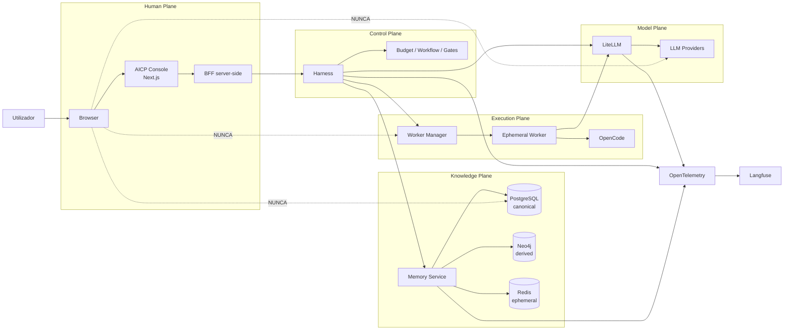
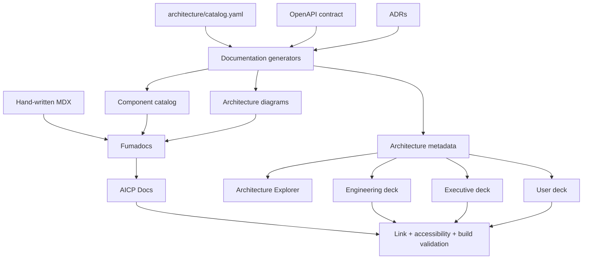
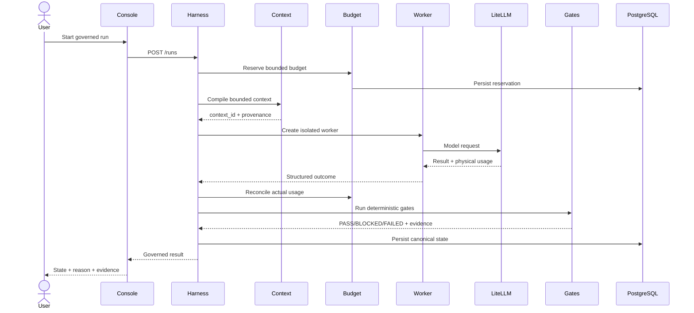
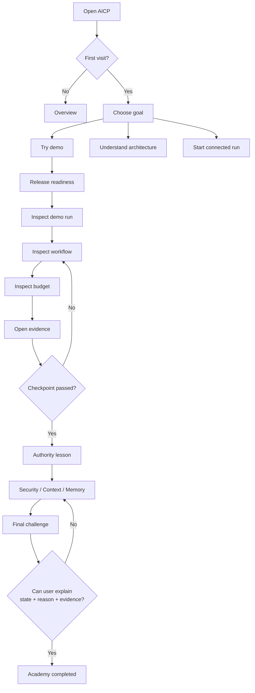

# Guia definitivo de evolução do AI Engineering Control Plane para uma experiência de referência

## Sumário executivo

A nova revisão foi feita sobre o `main` atualizado do repositório **`leandroclf/ai-engineering-control-plane`**, cujo HEAD consultado é o commit **`57215e77058c45a33fe7a61ee7a3089caaab377e`**, merge da PR `feat/aicp-console-experience` em **23 de agosto de 2026**. Esta iteração representa uma mudança material: o projeto já possui um **AICP Console**, camada BFF server-side, documentação integrada, catálogo arquitetural, Storybook, Playwright, Fumadocs, `next-intl`, React Flow, tutorial engine, apresentações e gates específicos de qualidade da interface no CI. fileciteturn61file0L2-L2

A recomendação desta revisão é diferente da do guia anterior: **não deve haver uma reescrita da UI nem troca do Next.js/Fumadocs por outro framework**. A base tecnológica escolhida é adequada. O trabalho agora deve concentrar-se em transformar a primeira implementação da Human Control Plane numa experiência realmente consistente, funcional, acessível, internacionalizada, mensurável e documentalmente excelente.

A arquitetura continua corretamente a preservar uma separação crucial: o AICP Console é uma interface humana, mas **não se torna autoridade**. O browser comunica com o BFF do Next.js; o BFF comunica com o Harness; o browser não recebe acesso direto a PostgreSQL, Neo4j, Redis, Docker, Worker Manager nem credenciais de providers. O Harness permanece a autoridade sobre workflow, budgets, gates e lifecycle, enquanto PostgreSQL permanece o estado canónico. fileciteturn29file0L2-L2

Essa decisão deve continuar absolutamente invariável.



O ponto forte da implementação atual é que a experiência já segue bons princípios: **truth-first, evidence-first, progressive disclosure, keyboard-first e fail-closed UX**; o próprio documento de princípios exige que estado não seja comunicado exclusivamente por cor, que haja foco visível, reduced motion, contraste, estados vazios e tratamento de conteúdo longo. fileciteturn30file0L2-L2

O maior problema já não é ausência de UI. É que alguns elementos da UI atual **parecem oferecer garantias, pesquisa, internacionalização, documentação ou tutorial mais completos do que a implementação efetivamente fornece**. Esse tipo de inconsistência é particularmente importante num produto cuja proposta é exatamente confiança, evidência e autoridade explícita.

Os principais achados desta revisão são:

| Área | Estado atual | Avaliação |
|---|---|---:|
| Arquitetura Human Control Plane | Muito boa | **4,7/5** |
| Arquitectura de informação | Boa | **4,0/5** |
| Navegação principal | Boa base, precisa de refinamento | **3,6/5** |
| Run experience | Boa estrutura, problemas semânticos importantes | **3,5/5** |
| Design system | Base funcional, ainda pequena | **3,2/5** |
| Documentação web | Fundações presentes, experiência incompleta | **2,8/5** |
| Diagramas/Architecture Explorer | Boa ideia, source-of-truth incorreta | **3,0/5** |
| Tutorial/Academy | Excelente conceito, implementação inicial | **2,0/5** |
| Acessibilidade | Boas intenções e alguma automação | **3,0/5** |
| Internacionalização | Scaffold apenas | **1,5/5** |
| Testes UX | Muito pequenos para a superfície atual | **2,3/5** |
| Performance UX | Não existe ainda baseline mensurável | **2,5/5** |
| CI da Console | Boa fundação | **4,0/5** |
| Potencial para referência GitHub | Muito alto | **4,7/5** |

Estas notas são uma **avaliação heurística desta revisão de código e contratos**, e não resultados de um estudo de usabilidade com utilizadores.

A decisão estratégica que recomendo é:

> **Congelar a macroarquitetura do produto, preservar Next.js + Fumadocs + BFF + Harness, e fazer uma “Reference Experience Hardening”: truth integrity, documentação canónica, i18n real, accessibility enforcement, tutorial funcional, UX observability, performance budgets e apresentação pública de excelência.**

Não adicionaria novas camadas de backend nem mais agentes durante este ciclo.

O objetivo da próxima implementação deve ser transformar:

```text
AICP Console v1
     ↓
funcional e demonstrável
```

em:

```text
AICP Reference Experience
     ↓
compreensível
navegável
confiável
acessível
internacionalizada
mensurável
documentada
testada
apresentável
extensível
```

## Avaliação atual e gaps críticos

A implementação atual está significativamente à frente daquilo que existia antes do guia anterior. O `compose.yaml` já contém um serviço `console` isolado, read-only, sem capabilities Linux adicionais, com `no-new-privileges`, limite de recursos e comunicação interna apenas com o Harness; a Console é exposta localmente em `127.0.0.1:3001`, mantendo a fronteira server-side pretendida. fileciteturn59file0L2-L2

O repositório também já transformou a Console numa workspace real. Os scripts root incluem build, dev, geração do API client, validação de drift OpenAPI, validação do catálogo arquitetural, validação documental, geração de apresentações e testes da interface. fileciteturn35file0L2-L2

O CI já possui um job `console-quality` que executa validação de API, catálogo de arquitetura, documentação, apresentações, build Next.js, lint, typecheck, Storybook, Playwright e E2E em Demo Mode. Isso é uma base muito boa para a próxima etapa. fileciteturn37file0L2-L2

### Diagnóstico por dimensão

**Navegação.** A estrutura global é sensata. Há agrupamentos claros entre `Operate`, `Governance`, `Knowledge` e `Verify & learn`, com Overview, Runs, Projects, Budgets, Workflows, Policies, Models, Context, Memory, Graph, Findings, Certification, Architecture, Learn e Docs. fileciteturn13file0L2-L2

O problema é que a implementação ainda é demasiado estática. A regra CSS prevê `aria-current="page"`, mas o layout não atribui esse estado ao link ativo. A navegação mobile comprime a sidebar e, em ecrãs menores, transforma o conjunto extenso de links num menu horizontal; isso dificilmente será a experiência ideal quando a quantidade de áreas crescer. fileciteturn13file0L2-L2 fileciteturn23file0L2-L2

A recomendação é tornar a IA **route-driven e declarativa**, com uma única estrutura de navegação usada por sidebar, mobile drawer, breadcrumbs, command palette e eventual pesquisa.

**Run experience.** Esta é provavelmente a parte mais forte visualmente, mas contém o gap semântico mais importante. A lista de runs apresenta status, projeto, task, stage, tokens, custo, duração e drill-down. fileciteturn48file0L2-L2

Porém, o mapeamento atual é:

```tsx
run.status === "BLOCKED"
  ? "blocked"
  : run.status === "HUMAN_REVIEW"
    ? "human-required"
    : "success"
```

Isso significa que um eventual `RUNNING`, `FAILED`, `CANCELLED` ou qualquer status não explicitamente tratado pode aparecer visualmente como **PASS/success**. O detalhe de run possui lógica equivalente. fileciteturn48file0L2-L2 fileciteturn50file0L2-L2

Isso é **P0**.

Uma Human Control Plane construída em torno de truth-first UX não pode utilizar fallback positivo.

A regra deve ser:

```text
known positive state      → success
known running state       → running
known blocked state       → blocked
known failed state        → failed
known cancelled state     → cancelled
known human state         → human-required
unknown/unrecognised      → neutral/unknown
```

Nunca:

```text
unknown → success
```

A mesma correção deve ser aplicada aos gates. Hoje, no detalhe do run, qualquer evidência diferente de `PASS` é transformada em `human-required`; um `FAILED`, portanto, não possui representação específica naquele trecho. fileciteturn50file0L2-L2

Crie um único módulo:

```text
packages/ui/src/status/
    domain-status.ts
    status-map.ts
    status-badge.tsx
    status-icon.tsx
```

e faça com que um status desconhecido provoque:

```text
UNKNOWN
```

visualmente explícito, com telemetria de contrato inesperado.

**Filtros da lista.** A página `Runs` exibe um `select` de status e um campo de pesquisa, mas o código atual não possui estado, manipulação, query params ou filtragem ligados a esses controlos. Portanto, na implementação consultada, eles são essencialmente elementos de apresentação. fileciteturn48file0L2-L2

Isto deve ser corrigido antes de adicionar novos filtros.

O padrão recomendado é URL-driven:

```text
/runs?status=BLOCKED&project=payments-api&q=retry&page=2
```

Assim filtros tornam-se:

```text
shareable
bookmarkable
back/forward-safe
testable
SSR-compatible
```

**Command Palette.** Já existe `Cmd/Ctrl+K`, o que é um excelente ponto de partida. Mas o componente é atualmente apenas uma lista fixa de seis links e não possui sequer um input de pesquisa. O botão chama-se "`⌘K Search`", portanto a microcopy promete pesquisa onde existe navegação rápida. Também não existe no código um focus trap explícito, foco inicial ou restauração de foco. fileciteturn24file0L2-L2

Existem duas opções corretas:

```text
A. renomear agora
   "Quick navigation"

ou

B. implementar realmente
   Command + Search Palette
```

Recomendo B.

A pesquisa deve indexar:

```text
routes
runs
projects
docs
academy modules
architecture components
policies
workflows
```

e mostrar agrupamentos.

**Design system.** O pacote `@aicp/ui` já oferece `StatusBadge`, `Card`, `MetricCard`, `ProgressMeter`, `Button`, `EmptyState`, `Skeleton`, `Definition`, `CodeBlock`, `EvidenceLink`, `Timeline`, `Table` e `Split`. Essa é uma boa base e não recomendo descartá-la. fileciteturn22file0L2-L2

Entretanto, ainda está praticamente concentrado num único ficheiro e o Storybook contém apenas uma story visível para `StatusBadge`, apesar da superfície muito maior do design system. fileciteturn47file0L2-L2

Antes de aumentar o número de páginas:

```text
packages/ui/
  src/
    primitives/
    feedback/
    data-display/
    navigation/
    forms/
    overlays/
    governance/
```

Cada componente deve possuir:

```text
component.tsx
component.test.tsx
component.stories.tsx
```

e, quando necessário:

```text
a11y scenarios
dark theme scenario
long-content scenario
empty scenario
error scenario
loading scenario
```

**Dark mode.** Existe implementação real através de `[data-theme="dark"]`, portanto o Theme Toggle não é apenas decorativo. fileciteturn60file0L2-L2

Contudo, vários backgrounds de status/notice continuam codificados diretamente em cores claras no CSS principal. Devem migrar para tokens semânticos para que dark mode deixe de ser apenas mudança das superfícies globais. fileciteturn23file0L2-L2

**Documentação web.** Este é um gap importante. O Fumadocs está integrado à aplicação, mas a experiência usa-o principalmente como fonte de MDX. O rendering atual envolve o artigo num `Card` genérico em vez de explorar `DocsLayout`, sidebar, table of contents, breadcrumbs e pesquisa documental. fileciteturn42file0L2-L2

Fumadocs já possui `DocsLayout` com árvore de páginas, sidebar/mobile navigation e integração com search, além de `DocsPage` com TOC, footer e breadcrumbs. citeturn5search1turn5search6

Mais crítico: o índice atual da Console cria links para:

```text
/docs/introduction
/docs/authority
/docs/governed-execution
/docs/release-certification
/docs/component-catalog
```

fileciteturn39file0L2-L2

Mas a coleção MDX consultada contém:

```text
authority.mdx
governed-execution.mdx
index.mdx
release-certification.mdx
meta.json
```

não contém `introduction.mdx` nem `component-catalog.mdx`. fileciteturn41file0L2-L2

E a própria rota dinâmica devolve “Documentation page unavailable” se o documento não for encontrado no source Fumadocs. fileciteturn42file0L2-L2 O loader confirma que a fonte da rota é exatamente a coleção Fumadocs gerada. fileciteturn65file0L2-L2

Isto é **P0: broken information architecture**.

**Documentação do repositório.** `docs/README.md` já aponta para visão de produto, personas, IA, UX principles, arquitetura atual, diagramas, component catalog, invariantes e checklist de acessibilidade, mas continua a carregar uma grande secção histórica sobre “Spec-Driven Development com OpenSpec — Pacote de Prompts”. fileciteturn10file0L2-L2

A informação histórica é útil, mas deve sair da landing documental principal e ficar em:

```text
docs/archive/
```

O utilizador novo precisa de uma única autoridade documental atual.

**Architecture Explorer.** A ideia é excelente: presets `executive`, `engineering` e `security`, React Flow, Minimap e visualização de trust boundaries. fileciteturn44file0L2-L2

Mas existe uma inconsistência importante: a página afirma que os metadados são provenientes do catálogo, enquanto o componente importa:

```tsx
demoArchitecture
```

de:

```text
@aicp/test-fixtures
```

fileciteturn45file0L2-L2

Ao mesmo tempo, já existe um verdadeiro `architecture/catalog.yaml` com purpose, why, benefits, authority, ownership, state, dependencies, interfaces, failureMode, securityBoundary e observability. fileciteturn56file0L2-L2

Isto viola o princípio de single source of truth.

A correção é **P0**:

```text
architecture/catalog.yaml
            │
            ├── generated docs
            ├── Architecture Explorer
            ├── Mermaid/C4
            ├── presentations
            └── architecture tests
```

`test-fixtures` pode continuar a existir para testes, mas a interface real nunca deve tratá-lo como arquitetura canónica.

**Academy/tutorial.** Existe já um excelente ponto de partida: um `TutorialManifest`, um `firstGovernedRun` com quatro etapas e dez módulos de Academy. fileciteturn16file0L2-L2

Todavia, o estado atual é um scaffold. Cada rota `/learn/[module]` mostra praticamente o mesmo conceito e o mesmo checkpoint, independentemente do módulo selecionado; o botão “Mark module understood” não possui comportamento no ficheiro consultado. fileciteturn19file0L2-L2

Além disso, o CTA da landing da Academy aponta para `/learn/getting-started`, enquanto `getting-started` não aparece no catálogo de módulos exposto no tutorial engine. fileciteturn18file0L2-L2 fileciteturn16file0L2-L2

Este deve tornar-se um dos principais produtos do repositório, não uma página secundária.

**Internacionalização.** É hoje principalmente um scaffold. A UI oferece `EN` e `PT-BR`, mas o `LocaleSwitcher` apenas altera `document.documentElement.lang` e grava localStorage; o `next-intl` está configurado para retornar sempre `"en"` e carregar apenas `en.json`. fileciteturn24file0L2-L2 fileciteturn27file0L2-L2

A pasta de mensagens consultada contém apenas `en.json`. fileciteturn26file0L2-L2

Além disso, o root continua fixo em:

```html
<html lang="en">
```

fileciteturn13file0L2-L2

Logo:

> o seletor de idioma atual deve ser considerado **não funcional como sistema de tradução**.

Para este projeto recomendo:

```text
pt-PT  → primeiro idioma suportado
en     → idioma internacional
```

Se houver necessidade real de Brasil:

```text
pt-BR
```

como terceiro locale, mas apenas quando houver traduções reais.

Next.js suporta routing/rendering por locale e `next-intl` é especificamente desenhado para App Router, Server Components e routing internacionalizado. citeturn2search2turn1search6

**Acessibilidade.** A direção está correta. Já existe checklist WCAG 2.2 AA e intenção explícita de combinar verificações automatizadas e manuais. fileciteturn32file0L2-L2

WCAG 2.2 é atualmente uma Recommendation do W3C e o próprio W3C recomenda a sua adoção como alvo atual de conformidade; existe inclusive tradução autorizada para português do Brasil. citeturn1search7turn1search2

Mas a automação atual é insuficiente para a superfície do produto: o E2E consultado possui apenas dois testes e o Storybook possui uma única story de componente. fileciteturn34file0L2-L2 fileciteturn47file0L2-L2

O build do Storybook também não equivale a um gate de acessibilidade. O Storybook oficial requer execução dos testes e `parameters.a11y.test = "error"` para que violações provoquem falha em CI. citeturn2search0

Playwright recomenda combinar axe automatizado, avaliação manual e inclusive testes com utilizadores, porque automação não consegue detectar todos os problemas WCAG. citeturn1search0

**Performance.** Não encontrei no código consultado um baseline de Web Vitals ou Lighthouse integrado à Console. O CI testa build e E2E, mas não possui ainda um performance gate. fileciteturn37file0L2-L2

Next.js já oferece `useReportWebVitals`, incluindo LCP, CLS, INP, TTFB e FCP, e recomenda manter esse boundary client reduzido. citeturn2search3 Lighthouse CI pode impedir regressões, manter budgets e anexar relatórios a PRs. citeturn8search0turn8search3

### Roadmap de gaps

| Prioridade | Gap | Porque importa | Resultado esperado |
|---|---|---|---|
| **P0** | Mapping de status fail-open | Pode mostrar estado não conhecido como sucesso | `unknown != PASS` |
| **P0** | Gate status mapping incorreto | Falha pode aparecer como human-required | Tipos exhaustivos |
| **P0** | Links quebrados em Docs | Quebra navegação básica | Link integrity 100% |
| **P0** | Architecture Explorer usa fixtures | Pode divergir do source of truth | Catalog-driven UI |
| **P0** | Locale switch é apenas aparente | UX promete i18n não existente | `pt-PT` + `en` reais |
| **P0** | Tutorial não é funcional | Academy aparenta maior maturidade | Progress + exercises |
| **P0** | Filtros Runs são aparentes | Controlo sem efeito degrada confiança | URL-driven filters |
| **P0** | A11y não é gate real | Princípio não está enforced | Axe/Storybook/Playwright |
| **P1** | Command palette não pesquisa | Microcopy promete mais do que entrega | Pesquisa federada |
| **P1** | Docs não usam full Fumadocs UX | Baixa navegabilidade | Sidebar/TOC/search |
| **P1** | Evidence links incompletos | Drill-down não fecha ciclo | Deep links verdadeiros |
| **P1** | `any` em Run Detail | Facilita drift de contrato | API types end-to-end |
| **P1** | Projetos hardcoded no New Run | Prod UX não reflete backend | API-driven choices |
| **P1** | Mobile navigation | Escalabilidade limitada | Drawer/responsive IA |
| **P1** | Design tokens parciais | Dark mode/consistência | Semantic tokens |
| **P1** | Storybook muito pequeno | Sem contrato visual real | Coverage do UI package |
| **P1** | Performance sem baseline | Regressões invisíveis | Web Vitals/Lighthouse |
| **P1** | UX sem telemetry | Decisões continuam intuitivas | Funnels/task metrics |
| **P2** | Visual regression | Bugs visuais podem passar | Screenshot diff |
| **P2** | Figma/design kit | Colaboração ainda code-first | Design asset |
| **P2** | Docs versioning | Necessário só após releases | Version lifecycle |
| **P2** | Mais idiomas | Valor apenas após EN/PT | locale expansion |
| **P2** | Public showcase/SEO | Importante quando UX estabilizar | GitHub reference site |

## Design e arquitetura da experiência recomendada

A decisão mais importante desta revisão é **não substituir a stack existente**.

O repositório já está estruturado em torno de Next.js, Fumadocs, React Flow, `next-intl`, Storybook, Playwright, npm workspaces e BFF. Migrar agora para Docusaurus, React Router/Remix, Chakra ou Material UI criaria risco e retrabalho sem resolver os gaps mais importantes, que são principalmente de produto e enforcement.

### Comparação de stack

| Opção | Pontos fortes | Limitações neste projeto | Decisão |
|---|---|---|---|
| **Next.js + Fumadocs** | Console + BFF + docs no mesmo runtime; SSR/RSC; docs/search/OpenAPI | Exige disciplina para não criar docs custom inferiores | **Manter** |
| Docusaurus | Excelente docs standalone, i18n e versionamento | Segunda aplicação e duplicação da shell | Não migrar |
| React Router Framework | SSR/SPA/SSG, routing tipado, code splitting | Migração sem benefício proporcional | Não migrar |
| Material UI | Suite ampla e pronta para produção | Material visual forte e grande mudança no design | Não adotar globalmente |
| Chakra UI | Accessible components e tokens | Reimplementaria design system já iniciado | Apenas inspiração |
| Custom UI atual | Identidade própria e baixo lock-in | Interações complexas terão custo de acessibilidade | **Preservar e endurecer** |
| shadcn + React Aria | Código local, primitives robustas | Pode criar dois paradigmas se adotado em massa | Adotar progressivamente |
| Tailwind | Excelente composição utilitária e integração Fumadocs | Migração total do CSS não traz ROI imediato | Introduzir gradualmente |

Docusaurus continua muito forte para sites de documentação que precisam de versões históricas explícitas, mas a própria documentação recomenda não versionar sem necessidade por causa da complexidade extra. citeturn3search1 Isso reforça que trocar uma Console já integrada em Next.js apenas para ganhar docs versionados seria prematuro.

React Router Framework oferece SSR, SSG, SPA, routing tipado e code splitting, mas essas capacidades não justificam migrar uma Console que já depende semanticamente do BFF Next.js. citeturn4search3

Material UI é uma biblioteca React extensa e pronta para produção; Chakra enfatiza componentes acessíveis e semantic tokens. Ambas são boas alternativas para um projeto que ainda não tivesse um sistema visual, mas este repositório já o iniciou. citeturn3search0turn3search4

Para componentes complexos novos, usaria **React Aria seletivamente**. Em julho de 2026, shadcn tornou React Aria uma base de primeira classe, permitindo instalar componentes mantendo código local no projeto. citeturn4search0 Isso é particularmente interessante para:

```text
Dialog
Combobox
Command palette
Menu
Select
Tooltip
Tabs
Popover
Listbox
Disclosure
```

Não migraria `Card`, `MetricCard` ou `StatusBadge` só para “usar shadcn”.

### Design system recomendado

O próximo `@aicp/ui` deveria ser semanticamente organizado:

```text
packages/ui/src/

tokens/
  color.css
  typography.css
  spacing.css
  elevation.css
  motion.css

primitives/
  button/
  link/
  input/
  select/
  textarea/
  dialog/
  popover/

navigation/
  sidebar/
  mobile-navigation/
  breadcrumbs/
  command-palette/

feedback/
  status-badge/
  alert/
  toast/
  empty-state/
  skeleton/

data-display/
  data-table/
  definition-list/
  metric-card/
  timeline/
  code-block/

governance/
  budget-meter/
  gate-result/
  evidence-row/
  authority-badge/
  provenance-card/
  release-readiness/

tutorial/
  tutorial-step/
  checkpoint/
  exercise/
  progress/
```

Os status devem usar três sinais simultaneamente:

```text
icon
+
text
+
color
```

Exemplo:

```text
✓ PASS
! BLOCKED
× FAILED
● RUNNING
👤 HUMAN REQUIRED
? UNKNOWN
```

Nunca cor isolada.

### Tokens semânticos

Em vez de:

```css
background: #fff4e5;
color: #984b00;
```

use:

```css
--status-success-fg
--status-success-bg
--status-warning-fg
--status-warning-bg
--status-blocked-fg
--status-blocked-bg
--status-failed-fg
--status-failed-bg

--surface-primary
--surface-secondary
--surface-elevated

--text-primary
--text-secondary
--text-muted

--border-default
--border-emphasis
--focus-ring
```

A preferência dark/light atual pode continuar baseada em `data-theme`. Tailwind também permite dark mode controlado exatamente por data attributes, portanto pode coexistir com o mecanismo atual se for introduzido. citeturn4search1

### Wireframe da Overview

```text
┌────────────────────────────────────────────────────────────────────┐
│ AICP                Search ⌘K       PT ▾    Theme     Harness ●   │
├──────────────┬─────────────────────────────────────────────────────┤
│              │                                                     │
│ OPERATE      │  Release readiness                                  │
│ Overview     │  Evidence-based readiness of this environment       │
│ Runs         │                                                     │
│ Projects     │  ┌───────────────────────────────────────────────┐  │
│              │  │ NOT YET V1 CERTIFIED                        │  │
│ GOVERN       │  │ 35 PASS     3 BLOCKED     0 FAILED           │  │
│ Budgets      │  └───────────────────────────────────────────────┘  │
│ Workflows    │                                                     │
│ Policies     │  What requires attention                            │
│ Models       │  ┌──────────────────┐ ┌─────────────────────────┐   │
│              │  │ Dynamic E2E     │ │ Benchmark evidence      │   │
│ KNOWLEDGE    │  │ BLOCKED         │ │ BLOCKED                 │   │
│ Context      │  └──────────────────┘ └─────────────────────────┘   │
│ Memory       │                                                     │
│ Graph        │  Recent governed work                               │
│              │  Status   Project   Task   Stage   Cost    Action   │
│ VERIFY       │  ...                                                │
│ Security     │                                                     │
│ Release      │                                                     │
│              │                                                     │
│ LEARN        │  [ Start governed run ] [ Explore demo ]           │
│ Academy      │                                                     │
│ Docs         │                                                     │
└──────────────┴─────────────────────────────────────────────────────┘
```

O indicador no canto superior direito deve deixar de dizer simplesmente:

```text
Console ready
```

porque isso pode ser confundido com saúde do sistema.

Ele deve ser:

```text
Console UI
● available
```

e, quando houver health check real:

```text
Harness
● healthy

ou

Harness
! unavailable
Read-only mode
```

A UI nunca deve inventar saúde.

### Wireframe do Run Detail

```text
┌───────────────────────────────────────────────────────────────────┐
│ Implement idempotent retry                             RUNNING ●  │
│ payments-api · run_01H...                                         │
├───────────────────────────────────────────────────────────────────┤
│ Discover ✓ Plan ✓ Implement ● Verify · Review · Human review ·    │
├──────────────────────────────┬────────────────────────────────────┤
│ Execution                    │ Budget                             │
│ Worker: isolated             │ Calls       3 / 10               │
│ Attempt: 2                   │ Input       18k / 50k             │
│ Model: coding-strong         │ Output       4k / 12k             │
│ Started: ...                 │ Cost       $0.42 / $2.00          │
├──────────────────────────────┼────────────────────────────────────┤
│ Gates                        │ Context                            │
│ ✓ build                      │ ctx_a98...                         │
│ ✓ unit-tests                 │ Policy v3                          │
│ × security                   │ Envelope 8,400 tokens              │
│   └ Open evidence            │ 12 artifacts                       │
├──────────────────────────────┴────────────────────────────────────┤
│ What needs attention                                              │
│ × Semgrep detected one required finding                          │
│                                                                   │
│ [Inspect finding] [Open audit] [Open Langfuse trace]             │
└───────────────────────────────────────────────────────────────────┘
```

A hierarquia deve ser:

```text
status
  ↓
reason
  ↓
evidence
  ↓
action
```

Não:

```text
metrics
metrics
metrics
metrics
```

### Referências competitivas

Não recomendo imitar a aparência dos concorrentes; recomendo aprender com as interações maduras.

LangSmith combina dashboards de alto nível com trace drill-down e métricas como errors/tokens. citeturn7search3turn7search14

Langfuse agrupa traces em sessions e permite métricas de custo, latência, qualidade e volume com breakdowns por model, release e outros atributos. citeturn7search0turn7search4

Phoenix orienta a experiência em torno de tracing, avaliação, datasets e experiments. citeturn7search1

O AICP deve manter a sua diferenciação:

```text
Langfuse / LangSmith / Phoenix
      observability of AI execution

AICP
      governance of engineering execution
      +
      evidence
      +
      human authority
      +
      budgets
      +
      context/memory governance
```

Portanto, **não replique Langfuse dentro da Console**. A própria IA atual já toma a decisão correta de manter observability detalhada como link contextual. fileciteturn28file0L2-L2

## Documentação, diagramas e tutorial interativo

A documentação deve agora tornar-se um **produto de primeira classe**.

A meta não é “ter muitos `.md`”.

É conseguir que três pessoas diferentes entrem no repositório e obtenham três percursos claros:

```text
Developer
   → instalar
   → executar demo
   → iniciar run
   → compreender evidence

Platform/Security Engineer
   → arquitectura
   → trust boundaries
   → recovery
   → policies
   → certification

Executive / Manager
   → problema
   → proposta de valor
   → estado
   → riscos
   → resultados
```

### Arquitetura documental recomendada

```text
docs/

README.md

getting-started/
  introduction.md
  prerequisites.md
  quickstart-demo.md
  quickstart-connected.md
  first-governed-run.md

concepts/
  authority-model.md
  governed-execution.md
  budgets.md
  context.md
  memory.md
  evidence.md
  release-certification.md

architecture/
  current.md
  system-context.md
  control-plane.md
  human-plane.md
  execution-plane.md
  knowledge-plane.md
  model-routing.md
  data.md
  observability.md
  diagrams/

security/
  threat-model.md
  trust-boundaries.md
  ui-invariants.md
  credential-model.md
  supply-chain.md
  fail-closed.md

operations/
  deployment.md
  compose.md
  backup.md
  restore.md
  recovery.md
  troubleshooting.md
  runbooks/

reference/
  component-catalog.md
  configuration.md
  environment.md
  api.md
  glossary.md
  status-model.md
  error-catalog.md

evaluations/
  methodology.md
  benchmark.md
  context-evaluation.md
  ux-evaluation.md
  accessibility.md
  performance.md

contributing/
  development.md
  ui-development.md
  architecture.md
  add-gate.md
  add-worker.md
  add-retriever.md
  documentation.md

product/
  vision.md
  personas.md
  information-architecture.md
  ux-principles.md
  terminology.md

archive/
  evolution/
  openspec/
```

O `docs/README.md` deve deixar de ser um inventário histórico e tornar-se:

```markdown
# AI Engineering Control Plane Documentation

## Start here

New user → Quickstart
Developer → First Governed Run
Platform Engineer → Architecture
Security Engineer → Threat Model
Contributor → Development Guide
Executive → Product Overview

## Current authority

Architecture: docs/architecture/current.md
Component catalog: architecture/catalog.yaml
API: harness/openapi.yaml
Release: ...
```

### Template normativo para documentação

Adote frontmatter uniforme:

```yaml
---
title: Context Compiler
description: Como o AICP seleciona contexto bounded e verificável.
audience:
  - developer
  - platform-engineer
status: current
owner: architecture
source_of_truth:
  - context/
  - architecture/catalog.yaml
last_reviewed: 2026-08-23
related:
  - /docs/concepts/context
  - /docs/architecture/knowledge-plane
---
```

Cada documento técnico deve responder sempre:

```text
What is it?
Why does it exist?
What problem does it solve?
Who owns authority?
What state does it own?
What does it NOT own?
What are its inputs?
What are its outputs?
What happens when it fails?
How is it observed?
How is it secured?
How do I test it?
Where is the source?
```

Isso é especialmente importante porque o `architecture/catalog.yaml` já modela grande parte dessas propriedades. fileciteturn56file0L2-L2

### Pipeline documental único



Fumadocs é especialmente apropriado aqui porque já fornece `DocsLayout`, tree-driven navigation e pesquisa, e possui integração OpenAPI que pode gerar endpoint documentation, request examples, response samples e TypeScript definitions. citeturn5search0turn5search1turn5search3

A recomendação é substituir a página documental custom atual por:

```text
Fumadocs RootProvider
      ↓
DocsLayout
      ↓
DocsPage
      ↓
DocsTitle
DocsDescription
DocsBody
TOC
Previous/Next
Edit on GitHub
Search
```

Não duplique estas funcionalidades manualmente.

### Diagramas obrigatórios

O repositório deve possuir, no mínimo:

```text
System Context
Human Control Plane
Control Plane
Execution Plane
Knowledge Plane
Model Plane
Data ownership
Trust boundaries
Run lifecycle
Budget lifecycle
Context retrieval
Memory lifecycle
Recovery flow
CI/release flow
```

O diagrama de execução pode ser:



### Architecture Explorer v2

O explorer deve deixar de usar fixtures e passar a consumir output gerado de `architecture/catalog.yaml`.

Schema v2 sugerido:

```yaml
components:
  - id: harness
    name: Harness
    plane: control

    purpose: ...
    why: ...

    authority:
      owns:
        - workflow
        - budget
        - gates
      does_not_own:
        - provider_credentials

    trust:
      boundary: trusted-control-plane
      data_sensitivity: restricted

    runtime:
      deployment: container
      failure_mode: fail-closed

    dependencies:
      - component: postgres
        relation: writes-canonical-state
      - component: worker-manager
        relation: controls

    observability:
      - otel
      - audit
```

O explorer deve permitir:

```text
Preset:
[Executive] [Engineering] [Security] [Data] [Runtime]

Filter:
Plane
Authority
Failure mode
Sensitivity

Select node:
Purpose
Why
Benefits
Owns
Does not own
Dependencies
Failure mode
Evidence
Docs
```

React Flow continua adequado para o explorer atual; não há razão para substituir a biblioteca.

### Tutorial interativo definitivo

A Academy deve passar de “conteúdo” para **guided learning system**.

Cada módulo deve possuir:

```typescript
type TutorialModule = {
  id: string
  title: string
  description: string
  audience: Persona[]
  estimatedMinutes: number

  prerequisites: string[]

  objectives: string[]

  lessons: Lesson[]

  exercises: Exercise[]

  checkpoints: Checkpoint[]

  completion: CompletionRule
}
```

Cada lesson:

```typescript
type Lesson = {
  id: string
  concept: string

  route?: string
  target?: string

  action?: {
    type: "navigate" | "inspect" | "filter" | "create-demo-run"
  }

  evidence?: string

  successCriteria: string[]
}
```

E não apenas:

```text
title + body
```

### Curriculum recomendado

| Módulo | Resultado |
|---|---|
| Foundations | Compreender o que é o AICP |
| Authority | Saber quem pode decidir o quê |
| First Governed Run | Executar e inspecionar um run |
| Evidence | Abrir evidência e justificar um PASS |
| Budgets | Compreender logical vs physical usage |
| Execution Plane | Identificar worker isolation |
| Context | Perceber seleção bounded |
| Memory | Compreender scopes e authority |
| Graph | Entender relações derivadas |
| Security | Interpretar fail-closed controls |
| Recovery | Executar conceptual recovery drill |
| Release | Compreender certification |
| Extension Lab | Adicionar um gate/retriever simples |
| Final Challenge | Investigar um run BLOCKED |

O onboarding deve ser:



### Tutorial checkpoints

Não use simplesmente:

```text
[Mark understood]
```

Use ações verificáveis.

Exemplo:

> **Checkpoint:** Qual componente decide se o workflow avança?

```text
○ OpenCode
○ LiteLLM
● Harness
○ AICP Console
```

Depois:

> **Exercise:** Abra o run bloqueado e encontre a evidência que explica o bloqueio.

O tutorial observa:

```text
route reached
evidence opened
correct control located
```

e conclui sem precisar de LLM.

Outro exercício:

> O orçamento mostra 42 000 input tokens consumidos e máximo de 50 000. Qual componente possui autoridade para bloquear a próxima chamada?

Resposta:

```text
Harness / Budget policy
```

### Estado do tutorial

Na ausência de user identity claramente estabelecida para a Console, não criaria já uma tabela canonical de progresso.

Inicialmente:

```text
localStorage
```

para:

```text
tutorial progress
dismissed hints
last module
```

É estado UX, não autoridade.

Depois, quando houver identidade de utilizador explícita:

```text
user preference service
```

pode sincronizá-lo.

### Materiais para apresentações

A estrutura `presentations/engineering`, `presentations/executive` e `presentations/users` já existe e os scripts root já constroem apresentações. fileciteturn57file0L2-L2 fileciteturn35file0L2-L2

Deve tornar-se um produto derivado do mesmo source.

**Executive deck:**

```text
Why AI engineering needs governance
Problem
AICP thesis
Authority model
Architecture in one picture
Risk reduction
Current certification
Evidence
Adoption path
Roadmap
```

**Engineering deck:**

```text
Architecture
Workflow
Execution
Budget
Context
Memory
Graph
Security
Observability
Recovery
CI
Extension model
```

**User deck:**

```text
What AICP does
How to start
How to read a run
How to understand status
How to inspect evidence
How to use the Academy
```

## Plano técnico de implementação e roadmap

A implementação seguinte não deve ser um commit gigante. Deve ser dividida em **workstreams/PRs independentes**, cada uma fechando um conjunto de invariantes.

### Estratégia Git

```bash
git checkout main
git pull --ff-only

git checkout -b feat/aicp-reference-experience
```

Durante o trabalho:

```bash
git status
git diff --stat
git diff

npm ci
```

Não permitir ao agente:

```bash
git push
git merge
git rebase --force
git reset --hard
```

O agente prepara a implementação e commits locais; a autoridade final continua humana.

### Baseline obrigatório antes de alterar

```bash
git rev-parse HEAD

npm ci

npm run validate:api-drift
npm run validate:architecture-catalog
npm run validate:docs
npm run build:console
npm --workspace @aicp/console run lint
npm --workspace @aicp/console run typecheck
npm --workspace @aicp/console run build-storybook

AICP_DEMO_MODE=true \
  npm --workspace @aicp/console run e2e
```

Registe os resultados em:

```text
.aicp/ui-evolution/baseline.json
```

### Docker Compose

O serviço `console` já existe no Compose atual e comunica server-side com `harness`; a Console é publicada em `127.0.0.1:3001`. fileciteturn59file0L2-L2

Fluxo recomendado:

```bash
docker compose config

docker compose build console

docker compose up -d console

docker compose ps

docker compose logs --tail=100 console
docker compose logs --tail=100 harness
```

Acesso:

```text
http://127.0.0.1:3001
```

Para demo:

```bash
AICP_DEMO_MODE=true docker compose up -d console
```

### Sequência técnica ideal

| Ordem | Workstream | Entregável |
|---:|---|---|
| A | Truth integrity | status types, no positive fallback |
| B | IA/navigation | route registry, responsive navigation |
| C | Docs | Fumadocs completo + link integrity |
| D | Architecture catalog | explorer e diagrams gerados |
| E | i18n | `pt-PT` + `en` |
| F | Design system | componentização + stories |
| G | Run UX | filters, real evidence links, typed data |
| H | Academy | tutorial engine funcional |
| I | Accessibility | enforced CI |
| J | UX telemetry | privacy-safe metrics |
| K | Performance | Web Vitals + Lighthouse |
| L | Presentations | regenerated from canonical content |
| M | GitHub polish | README/reference onboarding |

### Trabalho P0 em detalhe

**Truth integrity**

Crie:

```text
packages/ui/src/domain/status.ts
```

com união exaustiva:

```typescript
type RunStatus =
  | "PENDING"
  | "RUNNING"
  | "BLOCKED"
  | "FAILED"
  | "COMPLETED"
  | "CANCELLED"
  | "HUMAN_REVIEW"
```

e:

```typescript
function toPresentationStatus(
  status: RunStatus | string
): Status
```

Fallback:

```typescript
return "neutral"
```

Não:

```typescript
return "success"
```

Adicione testes para **todos os estados e estado desconhecido**.

**Docs integrity**

Corrija imediatamente `/docs/introduction` e `/docs/component-catalog`.

Depois faça `validate:docs` validar:

```text
markdown links
MDX links
console doc routes
anchors
generated component pages
broken references
missing docs
```

O validador atual apenas verifica ficheiros obrigatórios, H1 e `[TODO]`, portanto ainda não cobre link integrity. fileciteturn54file0L2-L2

**Architecture truth**

Remova:

```typescript
import { demoArchitecture } from "@aicp/test-fixtures"
```

do runtime de produção.

Use:

```text
architecture/catalog.yaml
  ↓
generator
  ↓
packages/architecture-catalog/generated/catalog.ts
```

Fixtures devem ser geradas do catálogo ou utilizadas exclusivamente em testes.

**i18n**

Estrutura:

```text
apps/console/messages/
  en.json
  pt-PT.json
```

Nunca traduza identifiers:

```text
PASS
BLOCKED
FAILED
Run ID
context_id
trace_id
```

sem uma decisão terminológica explícita.

Traduza interface e explicação.

Rotas sugeridas:

```text
/en/...
/pt-PT/...
```

ou locale por cookie/header se preferir evitar URLs localizadas na aplicação operacional. Para documentação pública, URLs localizadas são preferíveis. Next.js e `next-intl` suportam esse modelo. citeturn2search2turn1search6

### CI proposto

Acrescente ao `console-quality`:

```yaml
- name: Validate docs links
  run: npm run validate:docs

- name: Test UI components
  run: npm run test:ui

- name: Build Storybook
  run: npm --workspace @aicp/console run build-storybook

- name: Run Storybook accessibility tests
  run: npm --workspace @aicp/console run test:storybook:a11y

- name: Install Chromium
  run: npm --workspace @aicp/console exec -- playwright install --with-deps chromium

- name: Run Console E2E
  run: AICP_DEMO_MODE=true npm --workspace @aicp/console run e2e

- name: Run Console accessibility journeys
  run: AICP_DEMO_MODE=true npm --workspace @aicp/console run e2e:a11y

- name: Validate localization parity
  run: npm run validate:i18n

- name: Validate architecture source parity
  run: npm run validate:architecture-catalog

- name: Lighthouse CI
  run: npm run test:performance
```

Storybook oficialmente consegue transformar violações a11y em erro CI quando `parameters.a11y.test` é configurado como `error`. citeturn2search0

Lighthouse CI é adequado para transformar regressões de performance e tamanho de recursos em assertions de CI. citeturn8search0turn8search3

### Cobertura E2E mínima

Aumente de dois casos para jornadas reais:

```text
overview truth
release blocker drill-down
runs filter
runs search
new run demo
run detail
budget
evidence
blocked run
failed run
unknown status
architecture presets
architecture source parity
docs navigation
docs search
Academy progress
locale change
theme change
keyboard navigation
command palette
mobile navigation
error state
empty state
Harness unavailable
```

Não procure 100 testes E2E. Procure **jornadas de alto valor**.

### Sprints recomendadas

As horas seguintes são **estimativas de esforço de engenharia equivalente**, não previsão do tempo que um agente autónomo levará.

| Sprint de duas semanas | Escopo | Esforço estimado | Entregável |
|---|---|---:|---|
| **Sprint A** | P0 truth, status, docs links, architecture source | 55–75 h | UX deixa de poder mentir |
| **Sprint B** | IA, navigation, Runs, command palette, i18n | 65–90 h | Navegação/product UX madura |
| **Sprint C** | Docs Fumadocs, Academy, diagrams | 75–105 h | Documentation + learning product |
| **Sprint D** | Design system, Storybook, a11y | 60–90 h | UI system verificável |
| **Sprint E** | Analytics, performance, presentations, polish | 55–80 h | Reference release candidate |

Total indicativo:

```text
310–440 horas-equivalentes
```

para uma implementação realmente profunda.

A divisão de PRs recomendada:

```text
PR A — truth integrity + status domain
PR B — information architecture + navigation
PR C — docs + catalog single source
PR D — localization
PR E — Academy/tutorial
PR F — design system + accessibility
PR G — UX telemetry + performance
PR H — presentations + GitHub reference polish
```

Cada PR deve:

```text
pass existing backend tests
pass architecture contracts
pass security contracts
pass console quality
not relax release gates
not change Harness authority
```

## Métricas, acessibilidade, internacionalização e performance

O próximo salto de maturidade precisa ser mensurável.

Não devemos perguntar:

> “A UI parece boa?”

Devemos conseguir responder:

> “Quanto tempo um developer demora para encontrar por que um run foi bloqueado?”

### North-star UX

A métrica principal que eu escolheria é:

```text
Time To Evidence
```

Definição:

> tempo entre o utilizador abrir/ver um estado governado e conseguir abrir a evidência que explica esse estado.

Outra métrica extremamente útil:

```text
Time To Explain
```

Num teste de usabilidade, medir quanto tempo demora até alguém conseguir responder corretamente:

```text
What happened?
Why?
Who had authority?
What evidence proves it?
What happens next?
```

### Métricas recomendadas

| Métrica | O que mede | Meta inicial proposta |
|---|---|---:|
| Time to first action | clareza da landing | < 30 s |
| Time to evidence | evidence discoverability | < 45 s |
| Time to identify blocker | truth UX | < 45 s |
| First governed run completion | onboarding | > 80% |
| Demo completion | descoberta | > 85% |
| Academy module completion | aprendizagem | > 75% |
| Academy full completion | aprendizagem profunda | > 50% |
| Docs search success | findability | > 85% |
| Docs zero-results | qualidade index | < 10% |
| Runs filter success | operabilidade | > 95% |
| Error recovery | resiliência UX | > 90% |
| Keyboard core-journey success | acessibilidade | 100% |
| Unknown-status occurrence | contract drift | 0 esperado |
| Broken internal links | documentação | 0 |
| A11y automated critical | accessibility | 0 |
| Client JS regression | performance | budgeted |
| LCP p75 | loading UX | ≤ 2,5 s |
| INP p75 | interaction UX | ≤ 200 ms |
| CLS p75 | visual stability | ≤ 0,1 |

O threshold de LCP de 2,5 s, INP de 200 ms e CLS de 0,1 correspondem aos valores “good” usados nas orientações atuais de Core Web Vitals do Google. citeturn9search3turn10view0turn9search6

### Event model

Nunca envie prompts, source code, context content ou evidence raw para analytics.

Eventos:

```text
ui_page_view
ui_navigation
ui_command_opened
ui_command_selected

run_list_filtered
run_search_performed
run_opened
run_creation_started
run_creation_completed

gate_opened
evidence_opened
finding_opened
trace_deep_link_opened

docs_search
docs_result_opened
docs_zero_results

tutorial_started
tutorial_step_completed
tutorial_checkpoint_passed
tutorial_checkpoint_failed
tutorial_completed

architecture_preset_changed
architecture_component_opened

locale_changed
theme_changed
```

Properties permitidas:

```text
route
status category
component id
module id
locale
interaction method
duration bucket
```

Properties proibidas:

```text
prompt
task content
source code
secret
credential
raw evidence
memory content
LLM response
```

### Analytics e heatmaps

Num Control Plane desta natureza, **não recomendo session replay ou heatmaps completos por defeito**.

O risco de capturar:

```text
task descriptions
repository names
findings
run evidence
operational identifiers
```

é maior do que o benefício inicial.

Comece com **event analytics privacy-safe**.

Um candidato open-source é Umami, que suporta self-hosting, custom events, funnels/journeys e se posiciona como privacy-first. citeturn6search1turn6search7

OpenPanel é outra opção open-source/self-hostable e oferece funnels, cohorts, session history/replay e privacy controls. citeturn6search0

Minha recomendação:

```text
Production AICP
    → event analytics only

Demo/public showcase
    → optional richer behaviour analytics

Raw session replay
    → disabled by default
```

### Web Vitals

Implemente:

```tsx
"use client"

import { useReportWebVitals } from "next/web-vitals"

export function WebVitalsReporter() {
  useReportWebVitals((metric) => {
    sendSanitizedMetric({
      name: metric.name,
      value: metric.value,
      route: window.location.pathname
    })
  })

  return null
}
```

Next.js fornece oficialmente `useReportWebVitals` para reportar estas métricas. citeturn2search3

### Performance budgets

Sugestão inicial:

```json
{
  "console": {
    "initialJsKb": 220,
    "totalJsKb": 400,
    "imageKb": 500
  }
}
```

Não transforme estes números em dogma. Registe primeiro baseline real e depois ajuste budgets para impedir regressão.

React Flow deve ser lazy-loaded apenas em `/architecture`.

Elementos de Docs/search devem ser carregados apenas onde necessários.

A Console operacional não deve carregar Academy ou Architecture Explorer no bundle inicial.

### Accessibility definition of done

O alvo deve ser:

```text
WCAG 2.2 AA
```

O W3C recomenda WCAG 2.2 como alvo atual e adicionou critérios particularmente relevantes para aplicações complexas, incluindo foco não obscurecido, dragging alternatives, target size e accessible authentication. citeturn1search7turn1search8

Checklist:

| Área | Critério |
|---|---|
| Keyboard | jornada completa sem rato |
| Focus | sempre visível |
| Dialogs | focus trap + restore |
| Heading hierarchy | sem saltos arbitrários |
| Landmarks | header/nav/main/aside coerentes |
| Status | nunca só por cor |
| Contrast | AA |
| Forms | label + description + errors |
| Errors | programaticamente associados |
| Tables | caption/headers |
| Live updates | `aria-live` quando necessário |
| Progress | semantic progress |
| Mobile | reflow sem perda funcional |
| Zoom | 200% funcional |
| Motion | `prefers-reduced-motion` |
| Targets | tamanho de interação adequado |
| Architecture graph | alternativa textual |
| Charts | tabela/resumo alternativo |
| Tutorial | acessível por teclado |
| Command palette | dialog semantics completas |

A implementação atual já trata reduced motion e `focus-visible`, o que deve ser preservado. fileciteturn23file0L2-L2

Automação:

```text
Storybook
  ↓
axe per component

Playwright
  ↓
axe per core page

Playwright
  ↓
keyboard journeys

Manual
  ↓
NVDA/VoiceOver
zoom
contrast
screen reader ordering
```

Playwright salienta explicitamente que automated accessibility testing não substitui avaliação manual. citeturn1search0

### Internacionalização

A política recomendada é:

```text
Default editorial language:
pt-PT

International language:
en
```

Mas identifiers técnicos permanecem estáveis.

Glossário:

| EN | pt-PT recomendado |
|---|---|
| Run | Execução / Run, decidir uma norma |
| Governed run | Execução governada |
| Evidence | Evidência |
| Finding | Finding / ocorrência, definir |
| Gate | Gate / controlo, definir |
| Workflow | Workflow |
| Budget | Orçamento |
| Context | Contexto |
| Memory | Memória |
| Release readiness | Prontidão da release |
| Human review | Revisão humana |
| Blocked | Bloqueado |
| Failed | Falhou |
| Running | Em execução |

Não misture arbitrariamente:

```text
PT-BR UI
+
English docs
+
Portuguese error
```

como hoje ocorre em alguns pontos, por exemplo o `New Run` usa UI maioritariamente inglesa e erro em português. fileciteturn51file0L2-L2

### Microcopy recomendada

Atual:

> `Console ready`

Melhor:

> `Console UI disponível`

ou dinamicamente:

> `Harness saudável`

Atual:

> `Documentation page unavailable`

Melhor:

> `Esta página não existe na versão atual da documentação.`

> `Voltar ao índice da documentação`

Atual:

> `Mark module understood`

Melhor:

> `Concluir checkpoint`

e só habilitar quando o checkpoint for verificado.

Para ausência de dados:

Não:

> `0 tokens`

quando não houve observação.

Use:

> `Não observado`

Isso está alinhado com o princípio já usado em partes do Run Detail. fileciteturn50file0L2-L2

Para estado inesperado:

> `Estado desconhecido`

> `O Harness devolveu um estado que esta versão da Console não reconhece.`

Não:

> `PASS`

### Fontes prioritárias para a implementação

| Tema | Fonte prioritária |
|---|---|
| Accessibility | W3C WCAG 2.2 citeturn1search7 |
| A11y automation | Playwright oficial citeturn1search0 |
| Component a11y | Storybook oficial citeturn2search0 |
| Visual regression | Storybook/Chromatic oficial citeturn2search1 |
| Next.js i18n | Next.js oficial citeturn2search2 |
| i18n implementation | next-intl oficial citeturn1search6 |
| Docs layout | Fumadocs oficial citeturn5search1 |
| Docs search | Fumadocs oficial citeturn5search3 |
| API docs | Fumadocs OpenAPI citeturn5search0 |
| UI primitives | React Aria/shadcn official citeturn4search0 |
| Performance telemetry | Next.js Web Vitals citeturn2search3 |
| Performance CI | Lighthouse CI citeturn8search0 |
| AI observability UX | Langfuse citeturn7search4 |
| Trace/dashboard UX | LangSmith citeturn7search3 |
| Evaluation UX | Phoenix citeturn7search1 |

## Prompt final para enviar ao agente implementador

Copie o prompt abaixo juntamente com este guia. O agente deverá ter acesso ao repositório e ao guia completo.

```text
Você é o agente principal responsável por executar a próxima evolução do
AI Engineering Control Plane.

REPOSITÓRIO
https://github.com/leandroclf/ai-engineering-control-plane

IMPORTANTE
Você possui acesso ao guia completo "Guia definitivo de evolução do AI
Engineering Control Plane para uma experiência de referência".

Esse guia é a especificação de produto e arquitetura desta implementação.

Sua missão não é produzir outro plano.

Sua missão é ANALISAR O ESTADO REAL DO REPOSITÓRIO E IMPLEMENTAR O GUIA
POR COMPLETO, com qualidade de produção, preservando as invariantes
arquiteturais e de segurança já existentes.

============================================================
MISSÃO
============================================================

Transformar a implementação atual do AICP Console numa "AICP Reference
Experience":

- truth-first;
- evidence-first;
- acessível;
- internacionalizada;
- navegável;
- documentada;
- mensurável;
- performante;
- testada;
- segura;
- demonstrável;
- adequada para utilizadores, engenheiros e apresentação executiva.

A implementação final deve aproximar o repositório de uma referência
pública no GitHub para AI Engineering governada.

============================================================
REGRA FUNDAMENTAL
============================================================

A UI NUNCA É AUTORIDADE.

Preserve obrigatoriamente:

1. Harness owns workflow state.
2. Harness owns authorization.
3. Harness owns budgets.
4. Harness owns gate decisions.
5. Harness owns termination.
6. PostgreSQL remains canonical state.
7. Neo4j remains rebuildable/derived.
8. Redis remains ephemeral.
9. Provider credentials remain behind LiteLLM.
10. Browser never receives provider credentials.
11. Browser never receives Worker Manager credentials.
12. Browser never talks directly to PostgreSQL, Neo4j or Redis.
13. Browser never receives raw source unless an explicit future policy
    allows it.
14. Console communicates through its server-side BFF.
15. Existing fail-closed controls must not be weakened.
16. Existing release blockers must not be converted to PASS merely
    because UI functionality was added.

If uma alteração exigir violar qualquer uma destas regras:

STOP THAT CHANGE.

Registre a incompatibilidade em documentação e prossiga com a alternativa
segura.

============================================================
ANTES DE ALTERAR CÓDIGO
============================================================

Leia:

README.md
AGENTS.md
docs/README.md
docs/architecture/current.md
docs/product/*
docs/security/*
docs/validation/*
architecture/catalog.yaml
harness/openapi*
apps/console/**
packages/ui/**
packages/tutorial-engine/**
packages/architecture-catalog/**
.github/workflows/ci.yml
compose.yaml

Leia também o guia fornecido integralmente.

Depois capture:

git rev-parse HEAD
git status
git diff

Não presuma que o commit HEAD ainda é o mesmo mencionado no guia.

O estado atual do repositório é sempre a fonte factual superior ao
snapshot descrito no guia.

Quando guia e implementação divergirem:

1. investigue;
2. determine se o gap já foi corretamente resolvido;
3. não reimplemente funcionalidade equivalente;
4. documente a decisão;
5. prossiga.

============================================================
BASELINE
============================================================

Antes de modificar:

npm ci

npm run validate:api-drift
npm run validate:architecture-catalog
npm run validate:docs
npm run build:console
npm --workspace @aicp/console run lint
npm --workspace @aicp/console run typecheck
npm --workspace @aicp/console run build-storybook

AICP_DEMO_MODE=true \
  npm --workspace @aicp/console run e2e

Execute também todos os contratos de arquitetura e segurança exigidos
pelo projeto.

Registre baseline em artefato local apropriado.

Não esconda uma falha já existente.

============================================================
ORDEM DE IMPLEMENTAÇÃO
============================================================

Execute por workstreams nesta ordem.

WORKSTREAM A — TRUTH INTEGRITY

Centralize todos os domain statuses.

Eliminar qualquer regra:

unknown -> success

Implementar mapping exhaustivo:

PENDING
RUNNING
BLOCKED
FAILED
COMPLETED
CANCELLED
HUMAN_REVIEW
UNKNOWN

Aplicar a:

- Overview
- Runs list
- Run detail
- gates
- findings
- release certification
- timeline
- badges
- metrics quando apropriado

Status desconhecido deve aparecer UNKNOWN/neutral e emitir informação
diagnóstica segura.

Nunca promover valor desconhecido para PASS.

Adicionar testes de todos os estados.

WORKSTREAM B — INFORMATION ARCHITECTURE

Criar configuração única de navegação.

Essa configuração deve alimentar:

- sidebar;
- mobile navigation;
- breadcrumbs;
- command palette;
- search metadata.

Adicionar active route corretamente com aria-current.

Melhorar mobile navigation.

Não renderizar quinze links comprimidos como substituto de navegação
mobile adequada.

WORKSTREAM C — RUN EXPERIENCE

Tornar filtros funcionais e URL-driven.

Exemplo:

/runs?status=BLOCKED&project=x&q=retry&page=2

Implementar:

- search;
- status filter;
- project filter quando suportado;
- pagination quando backend suportar;
- clear filters;
- empty result;
- loading state;
- error state.

Usar tipos gerados da API.

Remover any evitável.

Corrigir EvidenceLink para deep-links reais.

Se não houver deep-link real disponível:

mostrar "link não disponível"

e não criar href falso.

Corrigir ligação ao Langfuse para usar URL real quando disponível.

Se não disponível:

mostrar estado explícito.

New Run deve obter projetos reais da API/fixture mode.

Não hardcode projects como comportamento de produção.

WORKSTREAM D — DOCUMENTATION EXPERIENCE

Corrigir imediatamente todas as rotas quebradas.

Migrar experiência docs para Fumadocs completo:

RootProvider
DocsLayout
DocsPage
DocsTitle
DocsDescription
DocsBody
TOC
breadcrumbs
previous/next
search
GitHub source link

Criar as categorias:

getting-started
concepts
architecture
security
operations
reference
evaluations
contributing
product
archive

Mover material histórico para archive quando apropriado.

Não apagar material histórico útil.

Criar link checker real que cubra:

- Markdown;
- MDX;
- console docs routes;
- anchors;
- generated pages.

Zero broken internal links.

Integrar API documentation derivada do OpenAPI quando tecnicamente
compatível.

Não permitir execução insegura de API playground contra endpoints
arbitrários.

WORKSTREAM E — ARCHITECTURE SINGLE SOURCE

architecture/catalog.yaml deve tornar-se a fonte única dos metadados
arquiteturais estruturados.

Architecture Explorer de produção NÃO pode importar demoArchitecture
de test-fixtures.

Gerar representação TypeScript do catálogo.

Gerar:

- Component Catalog;
- Architecture Explorer dataset;
- Mermaid data quando aplicável;
- presentation metadata.

Fixtures podem existir exclusivamente para testes.

Adicionar teste que detecte drift.

Expandir o catálogo somente onde houver componentes arquiteturalmente
relevantes reais.

Não inventar componentes.

WORKSTREAM F — DESIGN SYSTEM

Preservar @aicp/ui.

Não executar uma reescrita estética desnecessária.

Refatorar gradualmente para:

tokens
primitives
navigation
feedback
data-display
governance
tutorial

Introduzir semantic tokens.

Completar dark mode.

Usar React Aria/shadcn ARIA apenas para novos componentes interativos
complexos onde isso reduza risco de implementação manual:

Dialog
Combobox
Menu
Popover
Tabs
Select
Command palette

Não migrar Card/Badge/etc sem benefício concreto.

Criar stories para TODOS os componentes públicos relevantes.

Cada componente crítico deve ter estados:

default
loading
empty
error
long-content
dark
keyboard/a11y quando aplicável.

WORKSTREAM G — COMMAND PALETTE

Transformar o atual pseudo-search numa Command/Search Palette real.

Suportar:

routes
docs
academy
architecture components

e, quando APIs permitirem com segurança:

runs
projects

Implementar:

Ctrl+K e Cmd+K
Escape
focus trap
initial focus
focus restore
keyboard result navigation
empty query
no results

Não enviar conteúdo sensível para serviços externos de search.

WORKSTREAM H — INTERNATIONALIZATION

Implementar i18n real.

Idiomas obrigatórios:

pt-PT
en

Não exibir PT-BR enquanto não houver bundle pt-BR completo.

next-intl deve carregar locale real.

<html lang> deve refletir locale real.

Migrar strings core da Console para message catalogs.

Adicionar validator de parity entre locales.

Nenhuma key pode existir apenas num locale sem justificação explícita.

Criar glossário terminológico.

Não traduzir identifiers técnicos de forma que prejudique troubleshooting.

WORKSTREAM I — AICP ACADEMY

Transformar tutorial-engine num mecanismo funcional.

Cada módulo deve possuir conteúdo próprio.

Implementar:

prerequisites
objectives
lessons
steps
exercises
checkpoints
completion rule
estimated duration

Criar módulos:

Foundations
Authority Model
First Governed Run
Evidence
Budgets
Execution Plane
Context
Memory
Graph
Security
Recovery
Release Certification
Extension Lab
Final Challenge

Remover botão sem comportamento "Mark module understood".

Checkpoint só completa quando a condição correspondente for satisfeita.

Demo mode deve permitir completar Academy sem provider credentials.

Progresso pode inicialmente ser local UX state.

Não criar uma nova autoridade server-side para tutorial state.

Criar guided tour:

Release readiness
→ Run
→ Workflow
→ Budget
→ Evidence

Todo target do tutorial deve possuir data attribute estável.

Não acoplar tutorial a seletores CSS frágeis.

WORKSTREAM J — ACCESSIBILITY

Target: WCAG 2.2 AA.

Adicionar:

Storybook a11y
parameters.a11y.test = "error"
component accessibility tests
Playwright + axe
keyboard journey tests

Testar:

navigation
command palette
runs filters
new run
run detail
docs
architecture
academy
theme
locale

Corrigir:

focus visibility
focus trap
focus restoration
headings
landmarks
labels
descriptions
error association
status semantics
tables
zoom/reflow
reduced motion
target sizes
screen reader ordering

Architecture graph precisa de alternativa textual.

Charts precisam de alternativa textual/tabular.

Nenhum status depende apenas de cor.

Automação não substitui checklist manual.

Atualizar docs/validation/ui-accessibility-checklist.md com evidência real.

WORKSTREAM K — PERFORMANCE

Adicionar useReportWebVitals.

Registrar somente métricas sanitizadas.

Adicionar Lighthouse CI.

Criar baseline antes de thresholds rígidos.

Depois definir budgets.

Target de campo desejado:

LCP p75 <= 2.5s
INP p75 <= 200ms
CLS p75 <= 0.1

Lazy-load React Flow.

Não carregar Academy/Architecture bundles na landing desnecessariamente.

Medir client-side JS.

Impedir regressões materiais no CI.

WORKSTREAM L — UX OBSERVABILITY

Implementar event model privacy-safe.

Eventos mínimos:

ui_page_view
ui_navigation
ui_command_opened
run_list_filtered
run_search_performed
run_opened
run_creation_started
run_creation_completed
gate_opened
evidence_opened
docs_search
docs_zero_results
tutorial_started
tutorial_step_completed
tutorial_checkpoint_passed
tutorial_completed
architecture_preset_changed
locale_changed

PROIBIDO enviar:

prompts
task contents
source code
raw evidence
secrets
credentials
memory contents
LLM responses

Não ativar session replay/heatmaps em produção por default.

Se analytics externa não estiver configurada:

app deve funcionar normalmente.

Analytics não pode ser autoridade nem dependência operacional.

WORKSTREAM M — PRESENTATIONS AND GITHUB REFERENCE

Atualizar:

README.md
docs/README.md
docs/architecture/current.md

Criar/atualizar material:

executive
engineering
users

Apresentações devem ser derivadas tanto quanto possível da fonte
arquitetural canónica.

README principal deve responder rapidamente:

What?
Why?
How?
Architecture?
Quickstart?
Demo?
Security?
Current certification?
Docs?
Contributing?

Adicionar screenshots atualizadas geradas de forma reprodutível.

Nunca falsificar PASS para screenshot bonita.

============================================================
DOCUMENTOS OBRIGATÓRIOS
============================================================

Garantir alta qualidade em:

docs/README.md

docs/architecture/current.md

docs/architecture/*
docs/security/*
docs/operations/*
docs/evaluations/*
docs/reference/*
docs/getting-started/*
docs/contributing/*

Cada componente principal deve documentar:

What
Why
Benefits
Authority
Owns
Does not own
State
Inputs
Outputs
Failure mode
Security boundary
Observability
Testing
Source

============================================================
TESTES OBRIGATÓRIOS
============================================================

No final devem passar, quando aplicáveis:

npm test
npm run test:python
npm run test:integration
npm run test:architecture
npm run test:adversarial
npm run test:budget-adversarial
npm run test:multistack
npm run test:acceptance
npm run test:security

npm run validate:api-drift
npm run validate:architecture-catalog
npm run validate:docs
npm run validate:supply-chain

npm run build:console
npm --workspace @aicp/console run lint
npm --workspace @aicp/console run typecheck
npm --workspace @aicp/console run build-storybook

AICP_DEMO_MODE=true \
  npm --workspace @aicp/console run e2e

Além dos novos:

test:storybook:a11y
e2e:a11y
validate:i18n
test:performance

Não remova ou relaxe testes existentes para conseguir verde.

============================================================
FAIL-CLOSED RULES
============================================================

A implementação deve falhar fechada quando:

- status é desconhecido;
- gate evidence é inconsistente;
- architecture catalog é inválido;
- docs link está quebrado;
- locale bundle está incompleto;
- API client diverge do OpenAPI;
- accessibility critical violation é detectada;
- security boundary é violada;
- browser bundle contém credential configuration proibida.

Falha de analytics NÃO bloqueia operação.

Falha de tutorial NÃO altera Harness state.

Falha de UI NUNCA altera um gate para PASS.

============================================================
TOKEN / CONTEXT BUDGET
============================================================

Trabalhe context-first.

Não carregue todo o repositório repetidamente.

Preferência:

1. git diff / git status
2. exact file lookup
3. symbols/search
4. architecture catalog
5. related tests
6. docs
7. broader semantic context apenas quando necessário

Budget lógico recomendado por workstream:

input context <= 80k tokens
generated output <= 20k tokens

Não é necessário consumir o budget inteiro.

Max loops de implementação por workstream: 3.

Max repair loops para o mesmo erro: 2.

Se o mesmo problema sobreviver a 2 repairs:

pare;
investigue a causa raiz;
não continue a repetir a mesma abordagem.

Não permita loops agente→agente ilimitados.

Preferir ferramentas determinísticas a LLM para:

search
formatting
schema generation
link validation
type generation
tests
lint
diagram generation

============================================================
CHANGE BUDGET
============================================================

Não altere backend/control-plane sem necessidade de UI contratual.

Não altere:

Harness workflow semantics
budget semantics
credential boundaries
execution plane isolation
release certification semantics

a menos que um bug factual seja demonstrado.

Se encontrar bug backend durante este trabalho:

1. documentar;
2. adicionar regression test;
3. corrigir apenas se necessário para cumprir contrato existente;
4. não redesenhar a arquitetura.

============================================================
COMMITS
============================================================

Faça commits locais semanticamente separados.

Sugestão:

feat(console): enforce exhaustive presentation states
feat(console): improve information architecture
feat(docs): build canonical documentation experience
feat(architecture): drive explorer from catalog
feat(i18n): add pt-PT and en localization
feat(academy): implement interactive tutorial engine
test(ui): enforce accessibility journeys
perf(console): add web vitals and budgets
docs: publish reference experience material

NÃO faça push.

NÃO merge.

NÃO deploy.

NÃO force push.

Autoridade final é humana.

============================================================
CRITÉRIOS PASS
============================================================

PASS somente se:

[ ] estado desconhecido nunca aparece como success/PASS
[ ] FAILED aparece como FAILED
[ ] RUNNING aparece como RUNNING
[ ] BLOCKED aparece como BLOCKED
[ ] nenhuma rota Docs interna está quebrada
[ ] Architecture Explorer usa catalog canonical
[ ] runtime production não usa demoArchitecture como source of truth
[ ] Runs filters realmente funcionam
[ ] filtros sobrevivem refresh/back/share via URL
[ ] command palette realmente pesquisa
[ ] keyboard navigation funciona
[ ] pt-PT é tradução real
[ ] en é tradução real
[ ] locale switch altera conteúdo
[ ] Academy possui conteúdo específico por módulo
[ ] checkpoints são verificáveis
[ ] tutorial progress funciona
[ ] Docs têm sidebar/TOC/search/navigation adequados
[ ] API/client drift continua validado
[ ] Storybook cobre design system crítico
[ ] a11y automation falha CI quando necessário
[ ] core journeys possuem Playwright coverage
[ ] Architecture graph possui alternativa acessível
[ ] Web Vitals são medidos
[ ] performance possui baseline/budget
[ ] analytics não captura informação sensível
[ ] demo continua sem provider credentials
[ ] Console continua não sendo autoridade
[ ] backend existing tests continuam verdes
[ ] security/adversarial tests continuam verdes
[ ] release blockers reais continuam honestos
[ ] documentação atual corresponde à implementação
[ ] apresentações correspondem à implementação
[ ] README permite um novo developer começar rapidamente

============================================================
CRITÉRIOS FAIL
============================================================

FAIL se qualquer um acontecer:

[ ] teste removido apenas para fazer CI passar
[ ] gate relaxado
[ ] UNKNOWN convertido para success
[ ] Browser recebe provider credential
[ ] Browser recebe worker-manager credential
[ ] browser comunica diretamente com DB
[ ] Console passa a decidir workflow
[ ] Console passa a decidir gate
[ ] Console passa a decidir budget
[ ] fixture passa a ser fonte canonical em produção
[ ] i18n é apenas troca de <html lang>
[ ] tutorial apresenta botão falso sem comportamento
[ ] docs possuem links quebrados conhecidos
[ ] arquitetura documentada diverge do catálogo
[ ] analytics captura prompt/source/evidence raw
[ ] accessibility é declarada PASS apenas com build
[ ] release blocker real é escondido
[ ] implementação depende de provider key no Demo Mode
[ ] CI/backend security é enfraquecido
[ ] agente faz push/merge/deploy

============================================================
FINAL REVIEW
============================================================

Ao concluir:

1. execute todos os testes relevantes;
2. execute git status;
3. execute git diff --stat;
4. procure TODO/FIXME introduzidos;
5. valide links;
6. valide locale parity;
7. valide architecture catalog;
8. valide API drift;
9. valide Storybook;
10. valide accessibility;
11. valide E2E;
12. valide performance;
13. valide docs;
14. valide presentations;
15. valide que nenhum secret entrou no browser bundle.

Faça uma revisão adversarial final da própria implementação.

Pergunte:

"Esta UI consegue apresentar como PASS algo que o Harness não provou?"

Se SIM:
FAIL e corrija.

Pergunte:

"Alguma informação apresentada como canonical vem de fixture?"

Se SIM:
FAIL e corrija.

Pergunte:

"O utilizador consegue descobrir em poucas interações:
o que aconteceu, porquê, quem tinha autoridade e qual evidência sustenta o estado?"

Se NÃO:
a UX ainda não terminou.

============================================================
RELATÓRIO FINAL DO AGENTE
============================================================

Entregue ao final:

HEAD inicial
HEAD final local
files changed
commits locais

workstreams concluídos

gaps encontrados
gaps corrigidos
gaps conscientemente não corrigidos e motivo

tests:
PASS / FAIL / NOT RUN

accessibility:
automated
manual outstanding

performance:
baseline
budgets

docs:
pages
link validation

i18n:
locale coverage

tutorial:
modules/checkpoints

security:
invariants preserved

release:
current real status

Nunca declare algo como validado sem evidência.

Objetivo final:

A implementação deve parecer e comportar-se como uma ferramenta séria
de engenharia, mas continuar fiel ao princípio central do projeto:

LLMs execute work.
Harness governs work.
Evidence explains work.
Humans retain final authority.
```