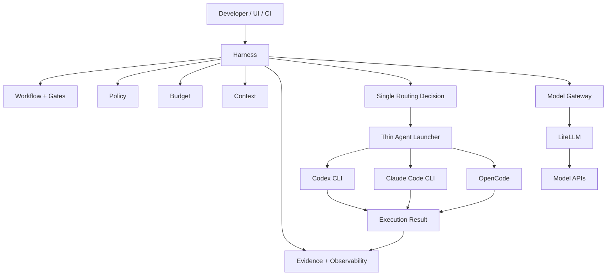
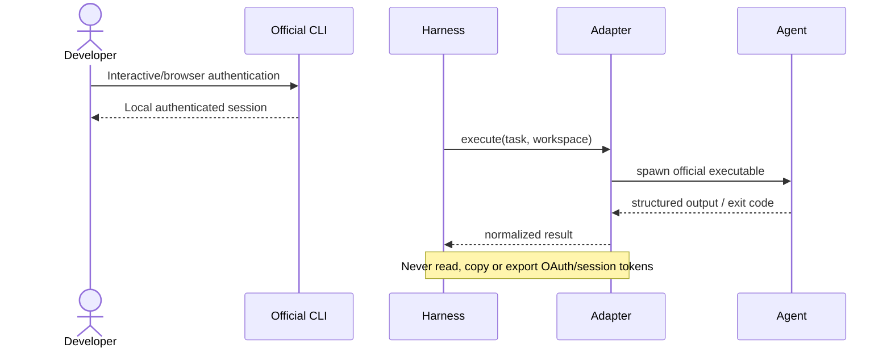
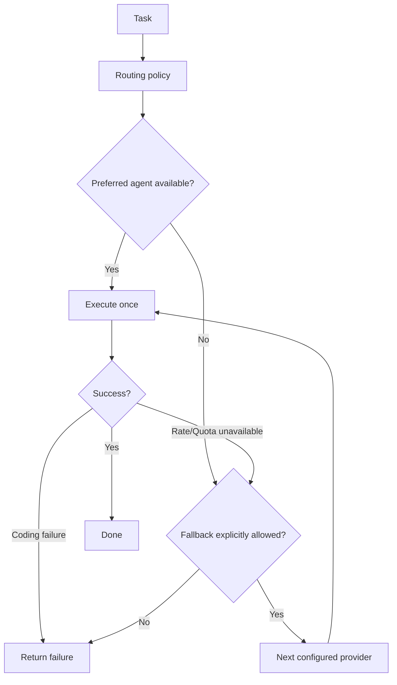
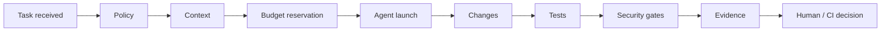
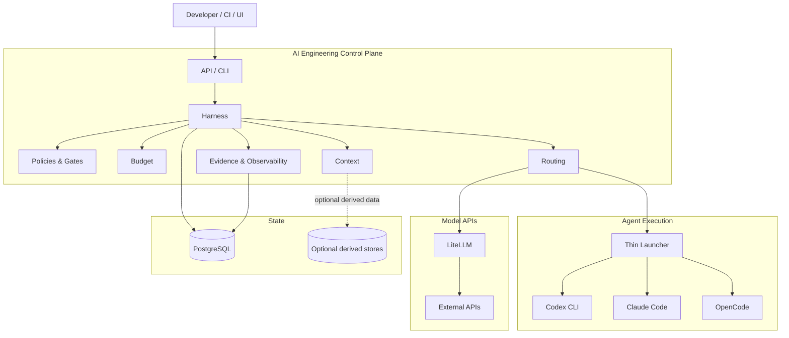

# Revisão profunda do AI Engineering Control Plane: plano de des-overengineering, simplificação e evolução segura

## Diagnóstico executivo e inventário verificado

A revisão foi feita sobre o `main` actualmente exposto pelo GitHub. O HEAD verificado é **`c3126201893882a72796f45ae29d207896254617`**, mergeado em **24 de Agosto de 2026**, através do PR #9, com a mensagem **“Feat/agent provider layer”**. A árvore correspondente é `6cce1e9b8cda326806ad7978a92d48629fb0208a`. Ou seja: esta análise já contempla a implementação recente da camada de Agent Providers que motivou a discussão sobre Codex CLI, Claude Code e risco de overengineering. fileciteturn5file0L2-L2

A conclusão principal é mais forte do que na revisão anterior:

> **Sim: a implementação actual já apresenta sinais concretos de overengineering estrutural, sobretudo no Harness e na nova Provider Layer. O projecto não precisa de mais uma grande fase de arquitectura. Precisa agora de consolidação, redução de superfícies, eliminação de autoridades duplicadas, provas adversariais e benchmarks.**

Isso **não significa que o projecto esteja mal concebido**. Pelo contrário: há vários elementos de excelente engenharia. O problema é que a densidade de abstrações começou a ultrapassar a quantidade de comportamento que precisa realmente de ser abstraída.

O sinal mais evidente está em `harness/src`. Neste momento, o Harness está subdividido, entre outros, em:

`adapters`, `agents`, `budget`, `capabilities`, `cli`, `credentials`, `evaluation`, `execution`, `gates`, `governance`, `memory`, `policy`, `providers`, `recovery`, `routing`, `runtime` e outras áreas. fileciteturn8file0L2-L2

Separadamente, a nova `harness/src/providers/` já possui a sua própria mini-plataforma:

- `agent-provider-dispatcher.mjs`;
- `agent-routing-policy.mjs`;
- `provider-contract.mjs`;
- `provider-errors.mjs`;
- `provider-execution-store.mjs`;
- `provider-health.mjs`;
- `provider-layer.mjs`;
- `provider-quota-authority.mjs`;
- `provider-registry.mjs`;
- `provider-usage.mjs`;
- `adapters/`;
- `host/`;
- `parsers/`.

fileciteturn9file0L2-L2

O detalhe mais relevante não é apenas a quantidade de ficheiros. A nova Provider Layer já contém, por exemplo, um `provider-contract.mjs` com aproximadamente **9,5 KB** e um `provider-quota-authority.mjs` com aproximadamente **12,3 KB**, além de dispatcher, routing policy, execution store, health, registry, usage e façade próprios. fileciteturn9file0L2-L2

Isto é particularmente significativo porque o Harness **já possui áreas independentes de `budget`, `execution`, `routing`, `governance`, `policy`, `credentials`, `capabilities` e `recovery`**. fileciteturn8file0L2-L2 A inferência arquitectural é, portanto, bastante forte: há risco real de a Provider Layer estar a criar **segundas autoridades** para conceitos que já pertencem ao Harness.

### O princípio que deve governar a próxima evolução

A arquitectura-alvo não deve ser:

```text
Harness
  ↓
Provider Layer
  ↓
Dispatcher
  ↓
Routing Policy
  ↓
Quota Authority
  ↓
Execution Store
  ↓
Provider Contract
  ↓
Adapter
  ↓
Host Runtime
  ↓
Parser
  ↓
Codex / Claude
```

A arquitectura-alvo deve aproximar-se muito mais disto:



A regra é:

> **O Harness governa. O agente executa. O adapter traduz. Nenhum adapter governa.**

Isto implica que Codex e Claude **não devem ganhar um subsistema inteiro dentro do Control Plane**. Cada adapter deve ser suficientemente fino para responder essencialmente a quatro perguntas:

```text
está instalado?
está autenticado?
como o executo?
qual foi o resultado?
```

O resto pertence às autoridades já existentes.

### O que esta revisão conseguiu e o que deve ser validado pelo agente

A estrutura actual, HEAD e Provider Layer foram inspeccionados directamente através da API do repositório. A raiz confirma ainda `apps/`, `architecture/`, `compose/`, `context/`, `docker/`, `docs/`, `graph/`, `harness/` e um `compose.yaml` considerável, actualmente com cerca de **19 KB**. fileciteturn4file0L2-L2 O Harness principal está organizado em `config`, `policies`, `schemas`, `src` e `workflows`. fileciteturn7file0L2-L2

Há, porém, uma limitação importante nesta rodada: o ambiente de execução não conseguiu clonar o repositório por DNS, portanto **não executei localmente a suite de testes nem o Compose**. O prompt final abaixo obriga o agente, que terá checkout local, a fazer precisamente essa validação antes de apagar qualquer componente.

Também há um ponto de governance a rever: a API da branch apresenta `protected: true`, mas os campos de protection devolvidos nesse endpoint mostram enforcement/checks desactivados. Isto pode ser consequência de rulesets modernos não representados integralmente nessa parte da API; portanto, **não assumiria que `main` está desprotegida**, mas exigiria auditoria de rulesets/required checks antes da próxima release. fileciteturn5file0L2-L2

### Checklist exacta de artefactos a confrontar

| Área | Artefactos obrigatórios | O que procurar | Critério |
|---|---|---|---|
| HEAD | `main`, PR #9, commits desde última revisão | arquitectura introduzida e regressões | cada nova abstracção tem consumidor real |
| Harness | `harness/src/**` | responsabilidades duplicadas | uma autoridade por conceito |
| Provider Layer | `harness/src/providers/**` | façade, dispatcher, routing, quota, storage duplicados | adapter fino |
| Routing | `harness/src/routing/**` + `providers/agent-routing-policy.mjs` | duas políticas de routing | consolidar numa só |
| Budget | `harness/src/budget/**` + `provider-quota-authority.mjs` | quota vs budget duplicados | budget é autoridade |
| Execution | `harness/src/execution/**` + `provider-execution-store.mjs` | estado duplicado | execução tem um store |
| Policy | `harness/src/policy/**`, `harness/policies/**`, `governance/**`, `gates/**`, `capabilities/**` | semântica sobreposta | fronteiras documentadas |
| Credentials | `harness/src/credentials/**`, adapters | OAuth/token handling | zero token extraction |
| Memory | `harness/src/memory/**` | valor empírico vs complexidade | desactivar se não houver evidência |
| Context | `context/**`, Context Compiler e integração | trabalho duplicado pelos agentes | manter apenas controlo útil |
| Graph | `graph/**` | dependência real do Neo4j/graph | profile opcional se benefício não provado |
| UI | `apps/**` | duplicação de APIs/estado/governance | UI é projection, não autoridade |
| Compose | `compose.yaml`, `compose/**` | número de serviços obrigatórios | mínimo default |
| Containers | `docker/**` | socket, mounts, secrets, users | least privilege |
| Config | `.env.example`, `harness/config/**` | configs abandonadas | configuração mínima |
| Schemas | `harness/schemas/**` | schemas sem consumidores | remover contratos mortos |
| Workflow | `harness/workflows/**` | state machine duplicada | Harness é autoridade |
| CI | `.github/workflows/**` | jobs redundantes e gates ausentes | fast path + security |
| Docs | `README.md`, `docs/**`, `architecture/**`, `AGENTS.md` | autoridades documentais contraditórias | uma arquitectura normativa |
| Tests | todos `*.test.*`, fixtures e evals | testes de implementação vs contrato | privilegiar invariantes |
| Compose health | serviços, healthchecks e profiles | infraestrutura opcional no happy path | startup simples |
| Recovery | `recovery/**` | mecanismos nunca exercitados | recovery drill real |
| Benchmarks | `evaluation/**` + workloads existentes | fixtures apresentadas como evidência | paired runs reais |
| Git governance | branch rules, CODEOWNERS, Dependabot, release workflow | bypass de CI/release | merge sempre governado |

A branch actual incorpora especificamente a Agent Provider Layer através do PR #9, portanto esta deve ser a primeira zona auditada, e não uma nova feature acrescentada sobre ela. fileciteturn5file0L2-L2

## Decisões KEEP / SIMPLIFY / DEFER / DELETE

Abaixo está a decisão arquitectural que eu recomendo. `DELETE` significa **eliminar a responsabilidade ou façade**, não necessariamente apagar imediatamente o ficheiro sem verificar dependências.

| Componente | Decisão | Justificação | Risco da mudança | Esforço |
|---|---|---|---|---|
| Harness como autoridade | **KEEP** | É o diferenciador central do projecto | Baixo | S |
| Workflow/state machine | **KEEP** | Agente não deve determinar o próprio estado | Médio | M |
| Gates determinísticos | **KEEP** | Boundary crítica de segurança/qualidade | Baixo | S |
| Policy | **KEEP + SIMPLIFY** | Necessária, mas deve haver uma única autoridade | Médio | M |
| Governance | **SIMPLIFY** | Pode sobrepor Policy/Gates | Médio | M |
| Capabilities | **KEEP** | Útil para limitar execução | Médio | S |
| Budget authority | **KEEP** | Limites/reconciliation são funções de controlo | Alto | M |
| Provider quota authority separada | **DELETE/MERGE** | Provider não precisa de segunda autoridade financeira | Alto | M |
| `agent-provider-dispatcher` | **SIMPLIFY/MERGE** | Pode ser reduzido ao launcher + registry | Médio | S |
| `agent-routing-policy` | **DELETE/MERGE** | Já existe `harness/src/routing` | Médio | M |
| `provider-layer` façade | **DELETE** | Layer sobre layer sem benefício claro | Baixo | S |
| `provider-contract` complexo | **SIMPLIFY** | Contrato deve representar apenas capacidades necessárias | Médio | M |
| `provider-errors` | **SIMPLIFY** | Pequena taxonomia comum é suficiente | Baixo | S |
| `provider-health` | **MERGE** | `probe()`/`health()` pode viver no launcher/adapter | Baixo | S |
| `provider-execution-store` | **DELETE/MERGE** | Estado de execução pertence a execution/run store | Alto | M |
| `provider-usage` | **MERGE** | Telemetria pertence à observabilidade | Baixo | S |
| `provider-registry` | **KEEP, fino** | Útil para resolver `codex`, `claude`, `opencode` | Baixo | S |
| `providers/adapters` | **KEEP, muito fino** | Interface correcta para CLIs diferentes | Médio | M |
| `providers/host` | **SIMPLIFY** | Um launcher seguro é suficiente | Alto | M |
| `providers/parsers` | **KEEP apenas se necessário** | Codex/Claude têm outputs distintos | Baixo | S |
| Codex CLI adapter | **KEEP** | Valor concreto: execução por CLI oficial | Médio | M |
| Claude Code adapter | **KEEP** | Mesmo motivo | Médio | M |
| OpenCode adapter | **KEEP** | Já é parte natural do ecossistema actual | Baixo | S |
| Agent SDK abstraction universal | **DEFER** | Não há prova de que três CLIs justifiquem framework | Baixo | — |
| Dynamic plugin framework | **DEFER** | Generalização prematura | Baixo | — |
| Autonomous smart router | **DEFER** | Routing heurístico simples chega primeiro | Médio | — |
| ML-based routing | **DELETE da roadmap actual** | Sem dados suficientes | Baixo | — |
| LiteLLM | **KEEP condicional** | Bom apenas para chamadas HTTP multi-modelo | Médio | S |
| Misturar LiteLLM e CLI adapters | **DELETE** | Paradigmas diferentes | Médio | S |
| Context Compiler | **KEEP + MEASURE** | Diferenciador potencial, mas deve provar ROI | Médio | M |
| Graph projection | **DEFER/OPTIONAL** | Deve provar vantagem sobre retrieval simples | Médio | M |
| Neo4j obrigatório | **DELETE do default** | Só justifica custo operacional se benchmark provar valor | Médio | M |
| Redis obrigatório | **SIMPLIFY/OPTIONAL** | Só manter se requisito concreto exigir | Médio | M |
| PostgreSQL canónico | **KEEP** | Uma fonte durável reduz ambiguidade | Alto | S |
| Memory sofisticada | **DEFER** | Alto risco de complexidade e poisoning | Médio | M |
| Recovery | **KEEP** | Necessário para invariantes críticas | Médio | M |
| Evals | **KEEP e promover** | Devem decidir o que permanece na arquitectura | Baixo | M |
| Observability | **KEEP + SIMPLIFY** | Precisamos medir, não construir outra observability platform | Baixo | M |
| Ephemeral workers | **KEEP** | Isolation boundary valiosa | Alto | M |
| Worker orchestration complexa | **SIMPLIFY** | Não recriar Kubernetes/scheduler | Alto | L |
| UI | **KEEP** | Essencial à utilização e demonstração | Baixo | M |
| UI como control authority | **DELETE** | Backend/Harness deve continuar autoritativo | Alto | S |
| Tutorial separado como nova app | **DELETE** | Deve reutilizar a UI/docs | Baixo | S |
| Mermaid | **KEEP** | GitHub renderiza diagramas sem plataforma dedicada | Baixo | S |
| Headroom como dependência | **DEFER** | Primeiro experimentar técnicas/benchmark | Baixo | M |
| Framework interno de plugins | **DEFER** | Só depois de ≥3 integrações realmente divergentes | Baixo | — |

A conclusão específica sobre a Provider Layer é importante. Hoje `provider-contract`, `provider-quota-authority`, `provider-layer`, `provider-registry`, `provider-usage`, `provider-health`, `provider-execution-store`, dispatcher e routing coexistem no mesmo subdomínio. fileciteturn9file0L2-L2 Quando o nível acima já contém budget, routing, execution e governance, a melhor evolução não é adicionar mais uma abstracção: é **reintegrar responsabilidades nos donos naturais**. fileciteturn8file0L2-L2

### Architecture fitness rule

A meta para o final desta implementação deve ser:

```text
antes:
provider feature -> ~12 concepts/classes/modules

depois:
provider feature ->
    registry
    launcher
    codex adapter
    claude adapter
    opencode adapter
    small shared result contract
```

Não imponho a remoção literal de um número específico de ficheiros; imponho a remoção de **autoridades duplicadas**.

## Implementação de simplificação e Agent Adapter Layer

### Estrutura-alvo

A nova Provider Layer deve convergir, idealmente, para algo semelhante a:

```text
harness/src/providers/
├── provider-registry.mjs
├── agent-launcher.mjs
├── agent-result.mjs
└── adapters/
    ├── codex-cli.mjs
    ├── claude-code-cli.mjs
    └── opencode-cli.mjs
```

Se `provider-contract.mjs` for realmente útil, pode continuar, mas deve ser radicalmente reduzido para um contrato de execução, não tornar-se uma API universal de agentes.

Algo conceptualmente deste género:

```js
/**
 * @typedef {Object} AgentExecutionRequest
 * @property {"codex"|"claude"|"opencode"} provider
 * @property {string} workspace
 * @property {string} task
 * @property {number} timeoutMs
 * @property {string} runId
 */

/**
 * @typedef {Object} AgentExecutionResult
 * @property {number} exitCode
 * @property {"succeeded"|"failed"|"timeout"|"unavailable"} status
 * @property {string} stdout
 * @property {string} stderr
 * @property {number} durationMs
 * @property {Object} usage
 */
```

Nada de:

```js
ProviderCapabilityGraph
ProviderAutonomousDecision
ProviderQuotaOrchestrator
ProviderSessionAuthority
ProviderWorkflowState
```

Esses conceitos pertencem a outras autoridades ou ainda não precisam de existir.

### Runtime launcher mínimo

O launcher deve ser deliberadamente aborrecido:

```js
import { spawn } from "node:child_process";
import { realpath } from "node:fs/promises";
import path from "node:path";

export async function launchAgent({
  command,
  args,
  workspace,
  workspaceRoot,
  stdin,
  timeoutMs,
  env = {},
}) {
  const root = await realpath(workspaceRoot);
  const cwd = await realpath(workspace);

  if (cwd !== root && !cwd.startsWith(`${root}${path.sep}`)) {
    throw new Error("WORKSPACE_OUTSIDE_ALLOWED_ROOT");
  }

  return new Promise((resolve, reject) => {
    const child = spawn(command, args, {
      cwd,
      shell: false,
      stdio: ["pipe", "pipe", "pipe"],
      env: buildSafeEnvironment(env),
    });

    let stdout = "";
    let stderr = "";

    const timer = setTimeout(() => {
      child.kill("SIGTERM");
    }, timeoutMs);

    child.stdout.on("data", data => {
      stdout += redact(String(data));
    });

    child.stderr.on("data", data => {
      stderr += redact(String(data));
    });

    child.on("error", reject);

    child.on("close", exitCode => {
      clearTimeout(timer);

      resolve({
        exitCode,
        stdout,
        stderr,
      });
    });

    child.stdin.end(stdin);
  });
}
```

O exemplo é deliberadamente incompleto: o agente deve reutilizar as funções de workspace validation, redaction, cancellation e evidence que já existem no repositório em vez de duplicá-las.

As regras não negociáveis são:

```text
shell: false
validated cwd
fixed executable
fixed/validated arguments
environment allowlist
timeout
output limit
redaction
no inherited provider secrets
no OAuth token inspection
no arbitrary executable from user input
no shell interpolation
no implicit network credential forwarding
```

### Codex e Claude: fronteira de autenticação

O modelo correcto é:



O Control Plane **não deve implementar OAuth da OpenAI ou Anthropic para estes adapters**.

Não deve fazer:

```text
read Codex auth store
extract access_token
refresh token itself
copy credential into worker
convert OAuth credential into HTTP provider
proxy that credential for other users
```

Deve fazer:

```text
codex installed?
codex authenticated according to supported CLI behaviour?
execute official binary

claude installed?
claude authenticated according to supported CLI behaviour?
execute official binary
```

O login browser é um **bootstrap out-of-band** executado pelo utilizador.

No servidor/CI:

```text
subscription-backed CLI adapter = disabled by default
API-backed provider = supported production path
```

Isto é simultaneamente mais simples e mais seguro.

Há também uma distinção jurídica/operacional importante: **não devemos assumir que uma assinatura individual mensal equivale a autorização para transformar o CLI num backend multi-tenant**. A próxima implementação deve, portanto, tratar CLI autenticado por subscrição como capacidade local/do utilizador, até uma verificação explícita dos termos oficiais aplicáveis ao cenário de deployment.

Essa política não depende de interpretar juridicamente os termos:

```yaml
agentProviders:
  codex:
    mode: local_cli
    multiTenant: false

  claude:
    mode: local_cli
    multiTenant: false
```

> Esta revisão não revalidou no browser, em 25 de Agosto de 2026, os textos actuais dos termos da OpenAI/Anthropic. Por isso, o agente **não deve codificar nenhuma suposição jurídica sobre reutilização de subscrições**. A integração deve permanecer dentro das interfaces documentadas das CLIs e uma revisão dos termos oficiais deve ser um gate antes de habilitar qualquer uso partilhado.

### Quota e fallback sem criar outro scheduler

Eliminar a ideia de um sofisticado `ProviderQuotaAuthority` não significa abandonar quotas.

O fluxo mínimo deve ser:



A distinção é crucial:

**não fazer fallback em qualquer erro.**

Fallback automático apenas para uma taxonomia pequena:

```text
PROVIDER_UNAVAILABLE
AUTH_REQUIRED
RATE_LIMITED
QUOTA_EXHAUSTED
TRANSIENT_PROVIDER_ERROR
```

Não fazer fallback por defeito para:

```text
TEST_FAILURE
POLICY_DENIED
BUDGET_EXHAUSTED
INVALID_TASK
WORKSPACE_VIOLATION
AGENT_CHANGED_CODE_INCORRECTLY
SECURITY_GATE_FAILURE
```

Isto impede que:

```text
Codex falhou os testes
       ↓
Claude tenta
       ↓
OpenCode tenta
       ↓
LLM API tenta
       ↓
4x custo + comportamento imprevisível
```

se torne o comportamento normal.

Configuração mínima:

```yaml
routing:
  coding:
    primary: codex
    fallback:
      - claude
      - opencode
    max_provider_attempts: 2

fallback:
  allowed_reasons:
    - provider_unavailable
    - rate_limited
    - quota_exhausted
```

O **budget continua a ser decidido pelo módulo de budget**, não pela Provider Layer.

### Comparação de providers para experimentação

Como os free tiers e respectivos limites são informação extremamente volátil, o quadro seguinte deve ser tratado como **shortlist para validação oficial no momento da implementação**, e não como promessa de quota gratuita em Agosto de 2026.

| Provider/canal | Tipo | Candidato para custo zero/baixo | Integração recomendada | Prioridade |
|---|---|---:|---|---|
| Gemini API / AI Studio | HTTP model API | Validar free tier actual | LiteLLM/direct gateway | **Alta** |
| GroqCloud | HTTP inference | Validar free developer quota | LiteLLM | **Alta** |
| OpenRouter free models | Aggregator | Validar modelos `free` e limites | LiteLLM | **Alta** |
| GitHub Models | Dev/model inference | Validar quota actual | adapter HTTP/LiteLLM se suportado | Média |
| Cerebras inference | HTTP inference | Validar developer/free offering | LiteLLM/direct | Média |
| Cloudflare Workers AI | Edge inference | Validar free allocation | HTTP | Média |
| Codex CLI | Coding agent | **Subscrição, não “API grátis”** | thin CLI adapter | **Alta** |
| Claude Code | Coding agent | **Subscrição, não “API grátis”** | thin CLI adapter | **Alta** |
| OpenCode | Coding agent/client | depende dos providers configurados | thin CLI adapter | **Alta** |
| OpenAI API | Model API | não assumir gratuitidade | LiteLLM | Alta para produção |
| Anthropic API | Model API | não assumir gratuitidade | LiteLLM | Alta para produção |

A ordem que eu implementaria é:

```text
Agent execution
    Codex CLI
    Claude Code CLI
    OpenCode

Model inference
    LiteLLM
        Gemini
        Groq
        OpenRouter

somente depois:
    outros providers
```

Não criar dez integrações apenas porque existem.

O gate para um quarto provider deve exigir evidência de que os três primeiros não cobrem um caso concreto.

## Validação adversarial, testes, métricas e benchmarks

A melhor coisa que o agente pode fazer depois da poda não é desenvolver mais arquitectura. É **tentar derrotar a arquitectura que sobrou**.

### Suite adversarial obrigatória

Criaria:

```text
harness/test/adversarial/
├── authority.test.mjs
├── budget.test.mjs
├── credentials.test.mjs
├── workspace.test.mjs
├── capabilities.test.mjs
├── concurrency.test.mjs
├── memory.test.mjs
├── recovery.test.mjs
├── api-contract.test.mjs
└── hostile-repository.test.mjs
```

E mapearia exactamente os 20 ataques discutidos anteriormente:

| # | Ataque | Teste automatizado | PASS |
|---|---|---|---|
| 1 | Agente altera workflow state | `authority: agent cannot mutate workflow state` | mutation rejeitada |
| 2 | Agente aprova o próprio gate | `authority: self approval denied` | gate permanece pending/failed |
| 3 | Ultrapassa budget | `budget: hard limit cannot be exceeded` | execução impedida |
| 4 | Obtém provider credential | `credentials: worker cannot read host credentials` | segredo inacessível |
| 5 | Escapa do workspace | `workspace: parent traversal denied` | path bloqueado |
| 6 | Executa command fora das capabilities | `capabilities: undeclared command denied` | execução bloqueada |
| 7 | Symlink/path traversal | `workspace: symlink escape denied` | canonical path rejeitado |
| 8 | Race em reservations | `budget: concurrent reservation atomic` | nunca overspend |
| 9 | Retry/fallback sem reconciliation | `budget: fallback reconciles previous attempt` | ledger consistente |
| 10 | Crash reservation→settlement | `budget: crash recovery reconciliation` | reservation recuperável |
| 11 | Prompt injection em README/código | `policy: repository content cannot change authority` | policy inalterada |
| 12 | Poisoned memory ganha autoridade | `memory: untrusted memory never becomes policy` | sem escalation |
| 13 | Context Compiler vaza fonte | `context: provenance-only storage redacts source` | raw content ausente |
| 14 | Worker morto deixa resíduos | `worker: crash cleanup removes ephemeral resources` | zero secrets/worktree órfãos |
| 15 | Scanner indisponível aprova | `gates: scanner outage fails closed` | gate não aprovado |
| 16 | CI contornada | meta-test/ruleset check | merge sem checks impossível |
| 17 | Restore adulterado | `recovery: tampered snapshot rejected` | integrity failure |
| 18 | API aceita estado/campo ilegal | `api: unknown fields/state transitions rejected` | 4xx deterministic |
| 19 | Runs concorrentes interferem | `isolation: concurrent runs cannot cross-read/write` | isolamento total |
| 20 | Repo hostil compromete Control Plane | `hostile-repository: control plane survives malicious fixture` | host intacto |

O teste #20 deve incluir fixtures como:

```text
repository/
├── README.md                 # prompt injection
├── .env                     # fake secrets
├── evil -> /etc             # symlink
├── package.json             # hostile scripts
├── AGENTS.md                 # tries to override policy
└── nested/
    └── ../../                # traversal inputs
```

E nenhuma instrução desse repositório pode tornar-se autoridade de Harness.

### Testes que devem desaparecer

Testes fortemente acoplados a classes/façades eliminadas devem ser apagados **se apenas testarem a existência da abstracção**.

Exemplo:

```text
provider-layer-instantiates-dispatcher.test
dispatcher-forwards-to-routing-policy.test
routing-policy-forwards-to-registry.test
registry-forwards-to-adapter.test
```

é menos valioso do que:

```text
codex coding request executes through governed launcher
rate limit triggers one approved fallback
policy denial never triggers fallback
credentials never reach worker
budget remains consistent after failed provider
```

A regra:

> Testar contratos e invariantes, não a quantidade de camadas.

### Teste mínimo dos CLI adapters

```text
Codex:
  binary missing
  auth missing
  success
  non-zero exit
  malformed output
  timeout
  output overflow
  interrupted run
  quota/rate error
  redaction

Claude:
  os mesmos casos

Both:
  no shell injection
  no arbitrary cwd
  no secret inheritance
  no OAuth store access
```

Usar fake executables nos unit tests:

```sh
test/fixtures/bin/fake-codex
test/fixtures/bin/fake-claude
```

Assim a CI não precisa de contas OpenAI/Anthropic.

### Benchmark pareado

O desenho experimental deve comparar:

```text
A = CLI directamente
B = CLI através do Control Plane
```

e, quando relevante:

```text
C = Control Plane + Context Compiler
```

Cada workload deve ser executado com condições equivalentes.

Eu usaria inicialmente **20 workloads**:

| Família | Quantidade | Exemplos |
|---|---:|---|
| bug fix | 5 | lógica, regressão, null/edge case |
| feature | 5 | endpoint, CLI feature, small integration |
| refactor | 4 | extraction, dependency simplification |
| security | 3 | traversal, secret handling, unsafe subprocess |
| context-heavy | 3 | mudança distribuída por múltiplos ficheiros |

Para cada workload:

```text
3 runs direct
3 runs control
```

Total:

```text
20 × 3 × 2 = 120 runs
```

Não é suficiente para publicação científica, mas já é bastante melhor do que optimizar a arquitectura por intuição.

### Métricas obrigatórias

```text
task_success
tests_passed
security_gates_passed
wall_clock_ms
time_to_first_useful_change
agent_turns
provider_attempts
fallback_count
input_tokens, quando disponíveis
output_tokens, quando disponíveis
estimated_cost
context_bytes
context_files
control_plane_overhead_ms
worker_startup_ms
budget_reserved
budget_settled
budget_reconciliation_delta
failed_runs_recovered
orphan_resources
```

E, particularmente para o combate ao overengineering:

```text
runtime_modules
runtime_services
provider_layer_LOC
total_control_plane_LOC
configuration_keys
required_environment_variables
number_of_datastores
cold_start_services
dependency_count
```

### Acceptance baseline

Primeiro medir `main@c312620`; depois aplicar a simplificação.

Não inventar números históricos.

O baseline válido é:

```text
baseline/current-main/<date>/<sha>.json
```

A simplificação deve cumprir:

| Métrica | Critério |
|---|---|
| adversarial suite | **20/20 PASS** |
| existing tests | **100% PASS** |
| task success | nenhuma regressão material |
| security gates | nenhuma regressão |
| provider fallback | determinístico |
| budget reconciliation | delta = 0 |
| credential leaks | 0 |
| orphan workers | 0 |
| default Compose services | não aumentar |
| Provider Layer LOC | reduzir materialmente, alvo ≥25% |
| configuration surface | não aumentar |
| persistent datastores | não aumentar |
| p95 runtime | sem regressão >10% causada pelo Harness |
| direct vs Harness | overhead medido e documentado |

O alvo de 25%/10% é **um gate interno recomendado**, não um padrão externo.

### Comandos de validação

O agente deve começar pelos comandos **que já existem no CI**, e não inventar um novo toolchain.

Depois:

```bash
git fetch origin
git checkout main
git pull --ff-only
git rev-parse HEAD
git status --short
```

Criar baseline:

```bash
git checkout -b refactor/thin-agent-provider-layer
```

Inventário:

```bash
find harness/src/providers -type f -print | sort
find harness/src -type f -name '*.mjs' | wc -l
find harness/src/providers -type f -name '*.mjs' -print0 | xargs -0 wc -l
docker compose config --services
```

Testar Compose:

```bash
docker compose config --quiet
docker compose up -d
docker compose ps
```

Após smoke tests:

```bash
docker compose down --remove-orphans
```

Para projectos com Node Test Runner e testes `.test.mjs`, se isso corresponder ao CI actual:

```bash
find harness -type f -name '*.test.mjs' -print0 \
  | xargs -0 node --test
```

Mas a prioridade é:

> **copiar exactamente as commands existentes em `.github/workflows/**` para a validation matrix.**

Nunca alterar CI apenas para fazer uma implementação quebrada passar.

## UI/UX, documentação e experiência de adopção

A simplificação deve melhorar também a percepção externa do projecto.

Não recomendo nesta fase mudar React/Next/Vite/etc. apenas porque existe uma framework mais moderna. Como `apps/` já existe na raiz do projecto, fileciteturn4file0L2-L2 a regra é:

> **preservar a stack de UI existente, excepto se houver uma limitação demonstrável.**

Uma migração de framework agora seria precisamente o tipo de overengineering que queremos evitar.

### Modelo mental da UI

A UI deve expor cinco conceitos, e não a estrutura interna de 30 módulos:

```text
Overview
Runs
Agents & Models
Evaluations
System
```

Navegação proposta:

```text
/
├── Overview
│   ├── health
│   ├── active runs
│   ├── recent runs
│   └── cost/usage
│
├── Runs
│   └── Run detail
│       ├── timeline
│       ├── context
│       ├── agent
│       ├── gates
│       ├── evidence
│       └── result
│
├── Providers
│   ├── Codex
│   ├── Claude
│   ├── OpenCode
│   └── Model APIs
│
├── Evaluations
│   ├── workloads
│   ├── benchmark
│   └── regressions
│
└── System
    ├── policies
    ├── workers
    ├── infrastructure
    └── diagnostics
```

Não expor ao utilizador:

```text
provider dispatcher
provider execution store
quota authority
provider layer
host parser
internal routing policy
```

Esses são detalhes de implementação. Se o utilizador precisa compreendê-los para usar a ferramenta, a arquitectura já está a vazar para o UX.

### Visualização ideal de um Run



A UI pode representar isto como timeline:

```text
✓ Task received          10:32:11
✓ Policy approved        10:32:11
✓ Context compiled       10:32:12
✓ Budget reserved        10:32:12
✓ Codex launched         10:32:13
✓ Patch produced         10:34:17
✓ Tests                  10:35:05
✓ Security               10:35:21
● Awaiting review
```

É muito mais útil que expor dezenas de subsistemas.

### Reorganização definitiva de `docs/`

O projecto já possui `docs/` e também `architecture/` na raiz. fileciteturn4file0L2-L2 Isso merece consolidação para impedir duas autoridades documentais.

Estrutura proposta:

```text
docs/
├── README.md
├── getting-started/
│   ├── quickstart.md
│   ├── installation.md
│   └── first-run.md
│
├── architecture/
│   ├── current.md
│   ├── principles.md
│   ├── security-boundaries.md
│   └── decisions/
│       ├── ADR-template.md
│       ├── ADR-thin-agent-adapters.md
│       └── ADR-single-authority.md
│
├── concepts/
│   ├── harness.md
│   ├── context.md
│   ├── agents.md
│   ├── models.md
│   ├── policies.md
│   ├── budgets.md
│   ├── gates.md
│   └── evidence.md
│
├── operations/
│   ├── configuration.md
│   ├── observability.md
│   ├── recovery.md
│   ├── troubleshooting.md
│   └── security.md
│
├── evaluations/
│   ├── methodology.md
│   ├── workloads.md
│   ├── baseline.md
│   └── adversarial-certification.md
│
├── tutorials/
│   ├── interactive-tour.md
│   ├── codex.md
│   ├── claude-code.md
│   └── provider-fallback.md
│
├── presentations/
│   ├── engineering.md
│   ├── users.md
│   └── executive.md
│
└── archive/
    └── evolution/
```

A pasta raiz `architecture/` deve ser migrada para `docs/architecture/` ou tornada um link/README apontando para a autoridade canónica.

**Uma arquitectura, uma fonte normativa.**

### Diagrama arquitectural canónico

O `docs/architecture/current.md` deve conter:



### Tutorial interactivo

Não construir uma segunda aplicação.

A própria UI deve oferecer:

```text
Start interactive tour
```

Etapas:

| Etapa | Ensina |
|---|---|
| Welcome | problema que o Control Plane resolve |
| Architecture | quem tem autoridade |
| New Run | criar primeira execução |
| Context | o que o agente recebe |
| Provider | Codex/Claude/OpenCode |
| Policy | porque agente não controla governance |
| Budget | limites |
| Worker | isolamento |
| Evidence | o que foi produzido |
| Gates | testes/security |
| Failure | como recovery/fallback funciona |
| Benchmark | comparar com execução directa |
| Finish | onde configurar e explorar |

A implementação deve reutilizar metadados já existentes:

```js
const tutorialSteps = [
  {
    id: "run",
    route: "/runs/new",
    target: "[data-tour='new-run']",
    doc: "docs/tutorials/interactive-tour.md#new-run"
  }
];
```

Sem criar um “tutorial engine” genérico.

### Materiais de apresentação

**Engineering deck**

```text
Why the project exists
Threat model
Authority boundaries
Architecture
Context
Execution isolation
Agent adapters
Budget
Evals
Adversarial tests
Benchmarks
Operations
Trade-offs
```

**User deck**

```text
Problem
Create a run
Select/auto-select agent
Follow execution
Understand gates
Review evidence
Troubleshoot
```

**Executive deck**

```text
Problem
Risk of unmanaged AI coding
Control Plane approach
Business value
Risk reduction
Developer productivity
Evidence and governance
Costs
Current maturity
Roadmap
```

Cada componente documentado deve responder a cinco perguntas:

```text
Why does it exist?
What problem does it solve?
Why isn't the agent responsible?
What happens if we remove it?
How do we prove that it works?
```

Esta última pergunta é fundamental para transformar o GitHub de “arquitectura impressionante” em **referência de engenharia reproduzível**.

## Roadmap, rollback e regras anti-overengineering

### Roadmap recomendado

| Prioridade | Milestone | Entrega | PASS | Esforço |
|---|---|---|---|---|
| **P0** | Freeze architecture | não acrescentar novos subsistemas | nenhuma nova layer sem ADR/gate | S |
| **P0** | Baseline | medir `c312620` | baseline versionado | M |
| **P0** | Provider audit | mapear todas responsabilidades | mapa completo | S |
| **P0** | Thin adapters | Codex/Claude/OpenCode mínimos | integration tests green | M |
| **P0** | Single routing authority | remover routing duplicado | uma única decision path | M |
| **P0** | Single budget authority | absorver quota duplicada | reconciliation 100% | M |
| **P0** | Execution store consolidation | remover provider store duplicado | state consistente | M |
| **P0** | Credential boundary | zero OAuth extraction | secret tests PASS | M |
| **P0** | Adversarial suite | 20 ataques | **20/20 PASS** | L |
| **P0** | Compose audit | retirar opcional do default | menor/equal service count | M |
| **P1** | Paired benchmark | direct vs control | resultados reproduzíveis | L |
| **P1** | Context ROI | medir compiler/graph | KEEP/DELETE baseado em dados | M |
| **P1** | Graph decision | default/optional/remove | ADR + benchmark | M |
| **P1** | Memory decision | prove usefulness | benchmark + poisoning PASS | M |
| **P1** | Docs authority | reorganizar docs | sem docs concorrentes | M |
| **P1** | UX simplification | cinco top-level concepts | usability smoke test | M |
| **P1** | Interactive tutorial | walkthrough end-to-end | novice completes first run | M |
| **P1** | Presentation pack | 3 audiences | engineering/user/executive docs | S |
| **P2** | Free API experiments | 2–3 providers | measured usefulness | M |
| **P2** | Headroom experiment | isolated A/B only | evidence before dependency | M |
| **P2** | Advanced routing | apenas se necessário | data demonstrates need | L |
| **P2** | New platform capabilities | gated | ADR approved | variável |

### Milestone de saída

Eu consideraria esta fase concluída apenas se:

```text
PASS:
[ ] Existing CI green
[ ] 20/20 adversarial tests
[ ] Codex adapter green
[ ] Claude adapter green
[ ] OpenCode unchanged/green
[ ] Zero OAuth/token exfiltration
[ ] Single routing authority
[ ] Single budget authority
[ ] Single execution state authority
[ ] No new persistent database
[ ] No new default Compose service
[ ] Provider module materially smaller
[ ] Direct-vs-Control baseline generated
[ ] Documentation canonicalized
[ ] Architecture Mermaid reflects code
[ ] Rollback tested

FAIL:
[ ] any security invariant breaks
[ ] adapter requires reading OAuth tokens
[ ] policy moves into provider
[ ] fallback bypasses budget
[ ] agent can influence its own approval
[ ] simplification reduces task success materially
[ ] CI is weakened to make refactor pass
```

### Regras explícitas contra overengineering

Estas regras devem entrar em `AGENTS.md` ou documento equivalente — o repositório já possui `AGENTS.md` na raiz. fileciteturn4file0L2-L2

**Regra da necessidade actual**

> Não adicionar uma abstracção para uma necessidade apenas prevista.

**Regra dos três casos**

> Não generalizar uma integração até existirem pelo menos três casos reais com comportamento comum comprovado.

**Regra da autoridade única**

> Workflow, policy, budget, execution state, credentials e approval devem ter exactamente uma autoridade.

**Regra do adapter fino**

> Adapter traduz protocolo; não toma decisões de negócio.

**Regra da remoção**

> Toda proposta deve explicar o que pode ser removido em troca.

**Regra do benchmark**

> Performance/custo/context improvements requerem antes/depois mensurável.

**Regra da reversibilidade**

> Features experimentais devem ser removíveis sem migration estrutural.

**Regra do default mínimo**

> Uma dependência opcional não entra no `docker compose up` default.

**Regra do LLM não-autoridade**

> Conteúdo produzido ou interpretado por LLM não substitui gate determinístico.

**Regra da dependência**

> Não adoptar framework/dependency se uma pequena implementação local resolver o caso sem criar dívida relevante.

**Regra da UI**

> UI projecta estado; não cria uma segunda state machine.

**Regra da documentação**

> Só existe uma arquitectura normativa actual. Documentos antigos são arquivo histórico.

### Decision gate obrigatório para qualquer nova componente

Adicionar algo como `docs/architecture/component-decision-template.md`:

```markdown
# Component Decision

## Problem

Que problema observado existe hoje?

## Evidence

Que logs, benchmarks, incidents ou workloads demonstram o problema?

## Existing solution

Porque a implementação actual não resolve?

## Simplest alternative

Qual é a solução mais simples?

## Proposed component

O que exactamente será adicionado?

## New runtime concepts

- processes:
- services:
- databases:
- queues:
- configuration:
- dependencies:

## Authority

Que autoridade esta componente possui?

Existe já outra componente com a mesma autoridade?

## Measurable benefit

Qual métrica deve melhorar?

Baseline:
Target:

## Removal strategy

Como remover esta componente posteriormente?

## Failure modes

O que acontece quando fica indisponível?

## Decision

KEEP / EXPERIMENT / REJECT
```

Gate final:

```text
No evidence?
    REJECT

Existing component can solve it?
    REJECT

Creates duplicate authority?
    REJECT

Cannot be measured?
    EXPERIMENT ONLY

Cannot be removed cleanly?
    REJECT

Adds persistent infrastructure?
    REQUIRE STRONG EVIDENCE

Passes all?
    IMPLEMENT MINIMAL VERSION
```

### Estratégia de rollback

Nunca fazer a poda num commit monolítico.

Sequência:

```text
commit A — characterization tests
commit B — shared launcher
commit C — migrate Codex
commit D — migrate Claude
commit E — migrate OpenCode
commit F — consolidate routing
commit G — consolidate quota/budget
commit H — consolidate execution store
commit I — remove dead provider layers
commit J — compose simplification
commit K — adversarial suite
commit L — docs/UI
```

Assim:

```bash
git revert <commit>
```

permanece uma estratégia realista.

Antes de cada remoção:

```bash
git grep "provider-layer"
git grep "agent-provider-dispatcher"
git grep "provider-quota-authority"
git grep "provider-execution-store"
```

Depois da remoção:

```bash
git grep "provider-layer" || true
```

Nenhum import órfão.

### Checklist da PR

```text
Architecture
[ ] Removes more conceptual complexity than it adds
[ ] No duplicate authority
[ ] No speculative framework
[ ] ADR explains decisions

Security
[ ] No credentials committed
[ ] No OAuth/session token read
[ ] No shell:true
[ ] Workspace canonicalized
[ ] Environment allowlisted
[ ] Output redacted
[ ] Timeout/kill works
[ ] Policy denial cannot fallback

Budget
[ ] Reservation atomic
[ ] Settlement idempotent
[ ] Retry reconciled
[ ] Fallback reconciled

Tests
[ ] Existing tests green
[ ] Adapter tests
[ ] Integration tests
[ ] 20 adversarial cases
[ ] Failure injection
[ ] Concurrent execution

Compose
[ ] config valid
[ ] no unnecessary service
[ ] optional stores behind profiles
[ ] no Docker socket exposed
[ ] healthchecks correct

Docs
[ ] architecture/current updated
[ ] ADR
[ ] migration guide
[ ] tutorial
[ ] diagrams
[ ] README links correct

Benchmark
[ ] before captured
[ ] after captured
[ ] comparison attached
[ ] no material task-success regression
```
