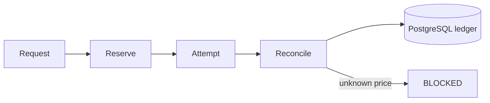

# Budget Reservation and Reconciliation
Purpose: distinguish logical calls from physical provider attempts.

```mermaid
flowchart LR
  Request --> Reserve
  Reserve --> Attempt
  Attempt --> Reconcile
  Reconcile --> Ledger[(PostgreSQL ledger)]
  Reconcile -->|unknown price| Blocked[BLOCKED]
```
Textual equivalent: no known price means no permitted call and no silent PASS.
