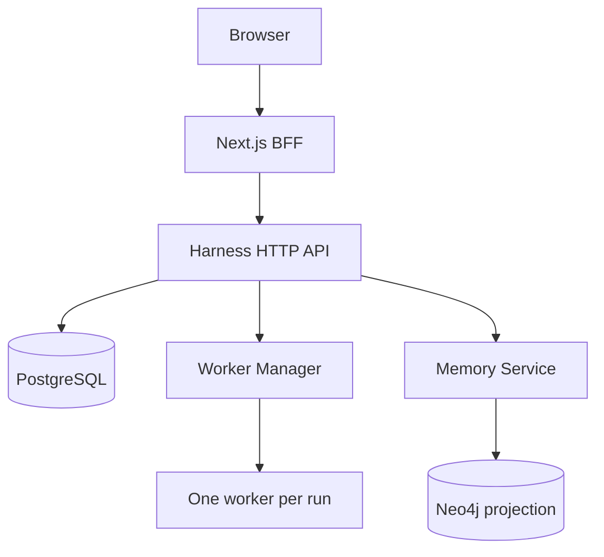

# Container Architecture
Purpose: show the main runtime containers and trust boundaries.

Textual equivalent: browser access terminates at server-side BFF; only trusted services reach data and worker boundaries.
