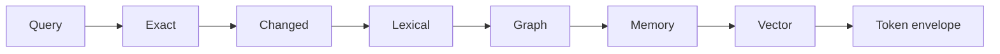

# Context Retrieval Cascade
Purpose: show deterministic evidence selection.

Textual equivalent: exact symbols and changed files are preferred; vector retrieval is conditional and all provenance is retained.
