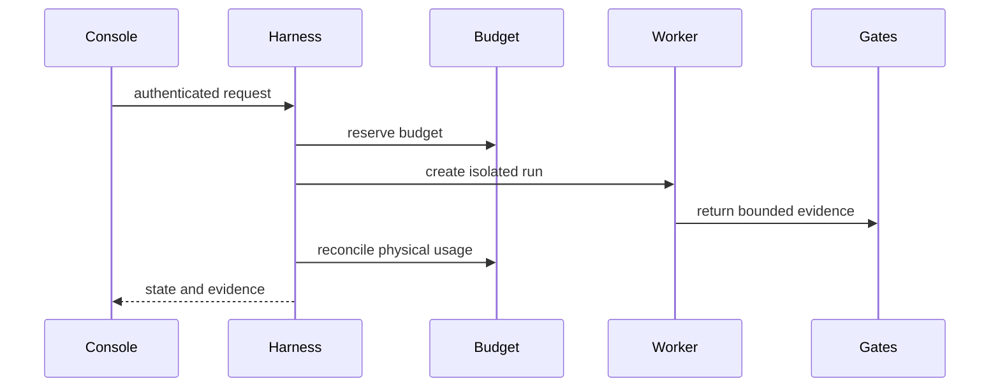

# Governed Run Sequence
Purpose: make authority and lifecycle explicit.

```mermaid
sequenceDiagram
  participant C as Console
  participant H as Harness
  participant B as Budget
  participant W as Worker
  participant G as Gates
  C->>H: authenticated request
  H->>B: reserve budget
  H->>W: create isolated run
  W->>G: return bounded evidence
  H->>B: reconcile physical usage
  H-->>C: state and evidence
```
Textual equivalent: every call is reserved, executed in the correct plane, reconciled and exposed with evidence.
