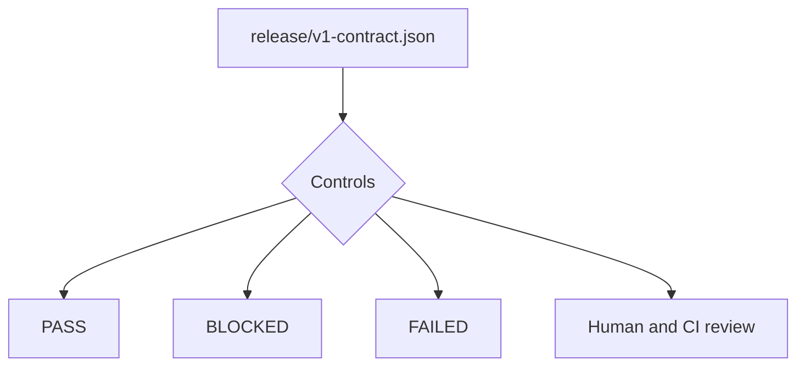

# Release Certification
Purpose: explain why readiness is not a vanity score.

```mermaid
flowchart TB
  Contract[release/v1-contract.json] --> Controls{Controls}
  Controls --> Pass[PASS]
  Controls --> Blocked[BLOCKED]
  Controls --> Failed[FAILED]
  Controls --> Human[Human and CI review]
```
Textual equivalent: the Console presents the contract; it never changes a control from BLOCKED to PASS.
