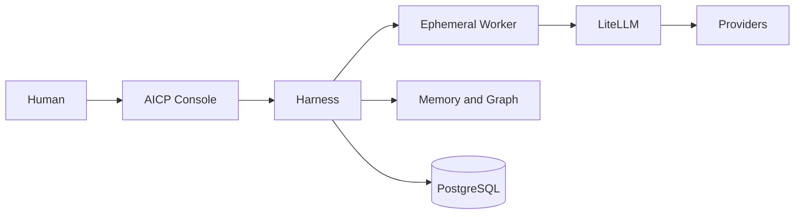

# System Context
Purpose: explain AICP to every audience.

Textual equivalent: a human uses the Console; the Console calls the Harness; the Harness governs workers, knowledge and canonical state; workers call providers only through LiteLLM.
