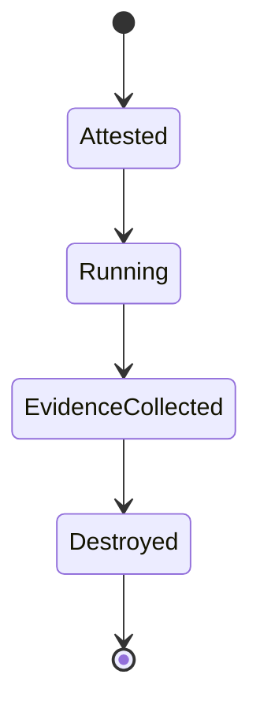

# Worker Lifecycle
Purpose: explain isolation and cleanup.

```mermaid
stateDiagram-v2
  [*] --> Attested
  Attested --> Running
  Running --> EvidenceCollected
  EvidenceCollected --> Destroyed
  Destroyed --> [*]
```
Textual equivalent: an attested worker has one run-scoped worktree and credential, returns evidence, then is destroyed and revoked.
