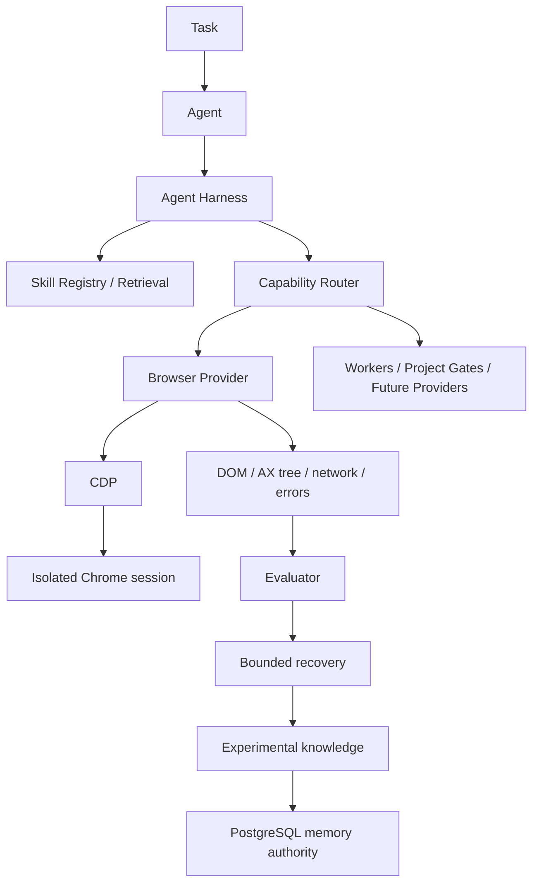

# Arquitetura alvo: Agent Harness adaptativo

## Decisão

O Browser Harness é um provider de capability. Agentes não recebem CDP, Playwright,
AWS SDK ou credenciais; eles enviam intenções ao Harness, que seleciona um provider,
aplica a política de autonomia e devolve observações estruturadas.

O primeiro slice usa interfaces em processo para manter determinismo e testabilidade.
O transporte CDP é injetado no provider; uma implementação de processo/worker pode
ser conectada sem mudar agentes ou skills.

| Área | Antes | Depois | Benefício |
|---|---|---|---|
| Browser | integração específica | Capability Provider | desacoplamento |
| Skills | sem lifecycle uniforme | experimental → validated → promoted | melhoria governada |
| Falhas | retry sem conhecimento | recovery bounded + padrão experimental | reuso sem autopromoção |
| Memória | contexto de execução | episódio, semântica e procedimento sob autoridade | reutilização auditável |
| Agents | acesso implícito a ferramentas | coordenação pelo Harness | previsibilidade e segurança |

## Estado e segurança

- PostgreSQL/memory-service continua sendo a autoridade persistente; o registry em
  memória é um índice de execução, não uma nova fonte canônica.
- Sessions carregam `sessionId`, `profileId`, `agentId` e `projectId`; perfis devem
  ser montados por um worker isolado e nunca conter secrets persistidos.
- Recovery produz apenas conhecimento `EXPERIMENTAL`; promoção exige evidência e uma
  autoridade distinta do agente.
- Nível 3 sempre exige aprovação humana. Providers podem negar capabilities por
  capability e o router falha fechado.
