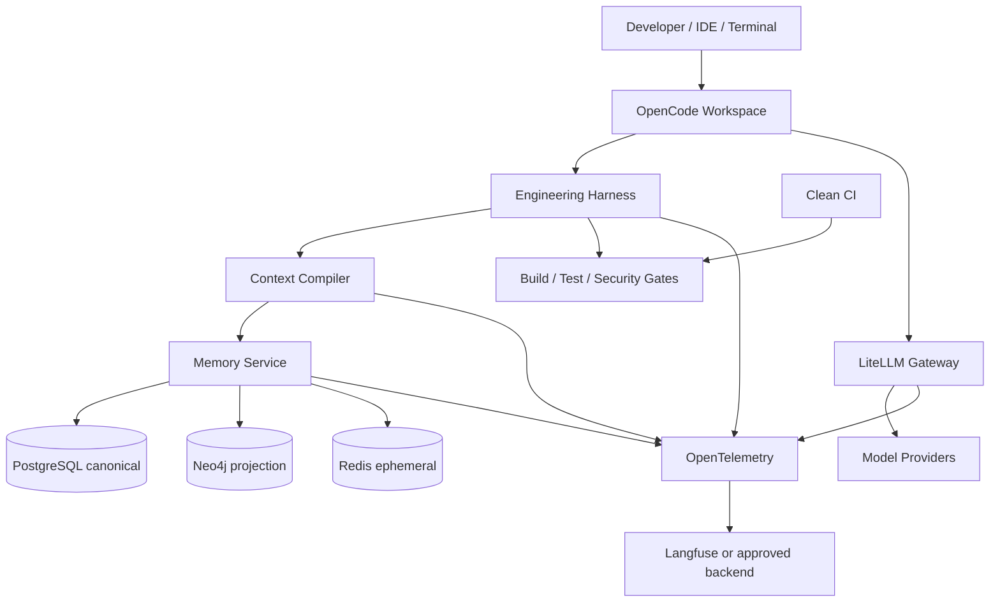

# Design: Bootstrap do AI Engineering Control Plane

## Context

O projeto parte de uma visão completa, mas ainda não possui implementação. A
arquitetura precisa produzir valor em um host local antes de depender de
GraphRAG, observabilidade self-hosted ou estado remoto. O desenho abaixo fixa
fronteiras e sequência; versões e integrações externas ainda devem passar pelos
spikes definidos em `tasks.md`.

## Goals and Constraints

### Goals

- Repositório executável com bootstrap verificável.
- Autoridade e lifecycle controlados por software determinístico.
- Componentes substituíveis por contratos versionados.
- Segurança e observabilidade incorporadas desde a primeira fase.
- Evolução incremental sem reescrever o perfil core.

### Constraints

- Agentes não recebem Docker socket, provider keys, push, merge ou deploy.
- CI e Git preservam autoridade final sobre código.
- PostgreSQL preserva estado canônico; projeções devem ser reconstruíveis.
- Perfis locais devem respeitar recursos de workstation.
- Dependências externas e scanners pagos precisam de modo opt-in/fail policy.
- Não há calendário/equipe definidos; planejamento usa dependências, não
  sprints.

## Proposed Architecture

### Deployment profiles

- `core`: workspace, Harness, LiteLLM, Memory Service, PostgreSQL, Neo4j and
  Redis. Context/index features may be enabled incrementally, but service
  contracts remain stable.
- `observability-full`: vendor-pinned Langfuse web/worker, dedicated stores,
  ClickHouse and blob storage.
- `remote`: workspace local; gateway, state and telemetry accessed over
  authenticated TLS/VPN endpoints.

## Technical Decisions

### Decision 1: Harness as workflow authority

Decision: implement a versioned state machine that invokes OpenCode through its
SDK and validates structured outputs with JSON Schema.

Rationale: prompts cannot reliably own retries, budgets, permissions and final
state.

Trade-offs: requires explicit adapters and schemas, but makes behavior testable
without relying on model interpretation.

Consequences: the conversational orchestrator is a UI, not the controller.

### Decision 2: Canonical and derived state separation

Decision: PostgreSQL stores workflows, memory projection/ledger and durable
metadata; Neo4j stores a reconstructible relation projection; Redis stores
locks/cache only.

Rationale: recovery and audit require one durable authority.

Trade-offs: graph rebuild costs time, but removes graph backup as a correctness
dependency.

### Decision 3: Deterministic-first context

Decision: compile context in order of task artifacts, exact symbols, Git
affinity, graph, scoped memory, lexical retrieval and semantic fallback.

Rationale: exact evidence is cheaper and more authoritative than embedding
similarity.

Trade-offs: requires indexers/parsers and ranking telemetry before advanced
semantic retrieval pays off.

### Decision 4: Capability aliases at model boundary

Decision: expose aliases such as `coding-fast`, `coding-strong`, `architecture`,
`security`, `review`, `summarizer` and `embedding` through LiteLLM.

Rationale: agents should not depend on provider IDs or credentials.

Trade-offs: operators must maintain and validate alias mappings and budgets.

### Decision 5: Core and observability separation

Decision: make the complete Langfuse stack a separate profile/deployment.

Rationale: its CPU, memory and storage requirements exceed a practical minimum
developer environment.

Trade-offs: local core can operate with reduced or remote telemetry.

### Decision 6: REST-first internal APIs

Decision: begin with versioned REST and JSON schemas; introduce gRPC only from
measured inter-service demand.

Rationale: curlability and simpler diagnostics reduce Foundation risk.

Trade-offs: REST may become less efficient for high-volume index operations.

### Decision 7: Security deny baseline

Decision: explicitly deny privileged/destructive commands and treat repository
content as untrusted data.

Rationale: OpenCode/tool defaults are not an adequate platform security policy.

Trade-offs: some developer operations require human action or CI integration.

## Alternatives Considered

### LLM orchestrator instead of Harness

Why not chosen: cannot provide deterministic state, budgets or repeatable gates.

### Single super-container

Why not chosen: couples upgrades, expands privileges and prevents independent
health, scaling and profiles.

### Vector database as primary retrieval

Why not chosen: semantic similarity does not preserve authority, identity or
impact relationships.

### Neo4j as canonical memory

Why not chosen: ledger lifecycle, transactional state and disaster recovery are
clearer in PostgreSQL.

### Full observability in mandatory local profile

Why not chosen: prevents adoption on ordinary developer hardware.

### Semantic response cache for agent calls

Why not chosen: similar multi-turn prompts can replay stale actions and amplify
loops.

## Affected Components

| Component | Change | Reason |
|---|---|---|
| Root/Compose | Add profiles, networks, secrets and health checks | Reproducible runtime |
| Workspace | Build minimal OpenCode runtime and permissions | Safe interactive cockpit |
| LiteLLM | Add alias config, key isolation and budgets | Provider control boundary |
| Harness | Add state machine, schemas, adapters and policies | Deterministic governance |
| Memory Service | Add REST API, ledger, scopes and lifecycle | Durable knowledge |
| Context | Add incremental index, graph projection and compiler | Bounded context |
| Security | Add scanner adapters and suppression policy | Evidence-based gates |
| Observability | Add OTel and optional Langfuse deployment | Cost/quality measurement |
| Scripts | Add bootstrap, doctor, smoke, backup, restore and index | Operability |
| CI | Mirror gates in clean checkout | Final reproducibility |
| Docs | Add quick start, architecture, threat model and runbook | Human/agent usability |

## Main Flows

### Flow 1: New-host bootstrap

1. Operator validates host prerequisites and copies the environment template.
2. Bootstrap creates missing local directories/secrets without replacing valid
   state.
3. Configuration renderer validates aliases and emits non-secret config.
4. Compose validates, builds and starts stores before dependent services.
5. Database migrations run once through a controlled migration command.
6. Doctor verifies dependencies, readiness and versions.
7. Smoke verifies model aliases, permission denials and basic workflow.

### Flow 2: Governed engineering task

1. User submits task and repository identity.
2. Harness creates task/run and resolves workflow/policy versions.
3. Context Compiler builds a scoped package within budget.
4. Harness invokes authorized agent and validates structured output.
5. Implementation changes are evaluated by fast then full deterministic gates.
6. New findings trigger targeted repair while progress and budgets remain.
7. Independent security/code/architecture reviews consume normalized evidence.
8. Harness emits `READY_FOR_HUMAN_REVIEW` only after mandatory passes.
9. CI repeats deterministic evidence from a clean checkout.

### Flow 3: Incremental context synchronization

1. Indexer resolves repository, commit, worktree and parser/schema versions.
2. Git blob OIDs or SHA-256 identify changed content.
3. Changed files are parsed into symbols and semantic chunks.
4. Graph delta handles additions, changes, renames and deletions.
5. Embeddings are generated only for changed semantic chunk keys.
6. Sync metrics and provenance are persisted.

### Flow 4: Memory lifecycle

1. Agent/tool proposes candidate memory in execution scope.
2. Service validates payload, authority, source refs and secret policy.
3. Authorized event promotes, supersedes, invalidates or expires memory.
4. Ledger appends the event and updates current projection transactionally.
5. Context retrieval includes only active, valid, authorized scope chain entries.

### Flow 5: Backup/restore

1. Operator creates a consistent dump of canonical databases and required
   gateway cryptographic configuration.
2. Backup is encrypted and checked according to environment policy.
3. Restore loads canonical state into a compatible clean environment.
4. Indexer rebuilds graph and disposable caches.
5. Doctor, smoke and logical isolation tests verify recovery.

## Error Flows

### Bootstrap configuration failure

Stop before service startup, report missing variable/path and never print secret
content.

### Required tool unavailable

Classify as gate error. Required evidence cannot be converted to pass; optional
tools follow explicit degraded policy.

### Provider failure

Retry/fallback only for configured classes and within budget. Record resolution;
otherwise block the current stage with actionable error.

### No-progress repair

Compare finding and diff fingerprints. Stop at threshold and preserve evidence
for human review.

### Stale memory or graph

Invalidate memory when source/version policy changes. Reject stale projection
versions and require sync/rebuild before returning authoritative context.

### Telemetry unavailable

Buffer or degrade only according to policy. Observability failure may not alter
gate evidence or leak payloads through emergency logs.

## API / Contract Design

Initial namespaces:

- `aicp.memory.v1`
- `aicp.context.v1`
- `aicp.harness.v1`

Minimum HTTP resources:

- `GET /health` for process liveness without dependency claims.
- `GET /ready` for mandatory dependency readiness.
- `/v1/memories` plus explicit promote/invalidate/supersede actions.
- `POST /v1/context:compile`.
- repository sync/rebuild endpoints.
- run/finding/gate ingestion and query endpoints.

All mutating contracts require request IDs, schema versions, actor identity and
classified errors. Idempotency keys are required for retryable create/action
operations before remote/multi-host rollout.

Structured artifact schemas include:

- agent result;
- normalized finding;
- gate result;
- context package and provenance;
- workflow/policy configuration;
- suppression record.

## Data Model and Persistence

PostgreSQL domains:

- `control`: tasks, runs, stages, transitions, budgets, gates and artifacts.
- `memory`: scopes, memories, source refs and append-only events.
- `index`: repository/file revisions, parser/schema versions and sync runs.

Important invariants:

- one current active version per scope/canonical key;
- lifecycle changes append an event in the same transaction as projection
  mutation;
- source-dependent memory carries source hash and provenance;
- tenant/scope access is enforced server-side;
- raw secrets are rejected/redacted before persistence;
- graph nodes include repository identity and index schema version.

Migrations are ordered, checksummed and applied by an explicit migration role.
Production uses separate roles/databases and, where required, separate
instances to reduce blast radius.

## Authentication and Authorization

- Local core begins with network isolation and service-specific credentials.
- Workspace receives only gateway virtual key and narrowly scoped service token.
- Agent permission policy is explicit per role and command pattern.
- Remote profile requires authenticated TLS/VPN plus service/user identity.
- Memory and run APIs authorize both operation and scope.
- Human/CI approval is required for suppressions, publish, merge and deploy.

The exact remote identity provider remains an ADR required before Phase 4.

## Security and Privacy

- Docker `data` network is internal; host ports bind to loopback unless remote
  exposure is explicitly configured.
- Containers run non-root where practical, drop capabilities and use
  `no-new-privileges`.
- Secrets use files/secret manager; `.env.runtime` is local, ignored and mode
  `0600` during MVP.
- Provider keys remain gateway-only; virtual key privileges and budgets are
  limited.
- Repository text never overrides policy authority.
- Scanner output is normalized and redacted before storage/telemetry.
- Source code/full prompts are excluded from traces by default.
- Dependencies/images are pinned, scanned and updated deliberately.
- A threat model must cover host boundary, workspace escape, SSRF, prompt
  injection, secret exfiltration, cross-scope access and supply chain.

## Observability

### Logs

- Structured logs with task/run/stage/request IDs and classified errors.
- No tokens, credentials, raw findings or source payloads by default.

### Metrics

- Bootstrap/health, stage duration, gate status, findings and no-progress stops.
- Model calls/tokens/cost/fallback and latency.
- Context exact/graph/vector hits, token utilization and cache reuse.
- Index lag/delta and memory promotion/invalidation/staleness.

### Tracing

- One task trace with spans for context, agents, model, tools, scanners, loops
  and gates using shared correlation attributes.

### Alerts

- Required service unavailable, repeated gate errors, budget anomalies, stale
  index, backup failure, restore drill failure and suspected secret exposure.

## Testing Strategy

- Unit: state transitions, budget math, ranking, lifecycle and adapters.
- Integration: stores, gateway aliases, migrations, API authz and OTel export.
- Contract: JSON schemas, REST, workflow/policy and normalized scanner outputs.
- E2E: clean bootstrap, governed sample task, fixture blocking and restore.
- Performance: index no-op/delta, context token limit and workflow overhead.
- Security: permission denials, prompt injection, cross-scope memory, secret
  redaction and container/network baseline.
- Failure injection: provider/store/scanner/telemetry unavailable, timeout and
  repeated finding/diff.

## Migration Strategy

Greenfield implementation uses four promotion gates:

1. Foundation proves reproducible core and security boundary.
2. Harness proves deterministic workflow and fixture detection.
3. Context/Memory proves isolation, invalidation, incremental index and rebuild.
4. Control Plane proves telemetry, restore, CI parity and multi-host.

Each phase may introduce new schema migrations but must preserve the previous
phase's acceptance suite.

## Rollback Plan

- Pin each release by Git tag and image digests.
- Keep schema migration compatibility or documented forward-fix when rollback
  is unsafe.
- Disable optional profiles/features independently.
- Restore canonical database backup and matching gateway cryptographic state.
- Rebuild Neo4j and caches from canonical inputs.
- Re-run doctor, smoke and prior phase acceptance before declaring recovery.

## Compatibility

- Model providers remain replaceable behind aliases.
- Scanner adapters isolate vendor-specific formats.
- Schema and policy versions are recorded with runs/artifacts.
- REST evolution is additive within v1; breaking changes require a new version.
- Remote deployment reuses the same logical contracts as local core.

## Operational Considerations

- Publish minimum/recommended CPU, RAM and disk profiles.
- Detect unsupported Compose and unsafe file permissions early.
- Make generated config disposable and regenerate from templates.
- Separate canonical backup from optional Langfuse backup procedures.
- Provide quick start under five minutes after prerequisites and configuration.
- Maintain architecture, threat model, runbook, memory model and ADR index.

## Remaining Risks

| Risk | Impact | Mitigation | Owner/Decision |
|---|---|---|---|
| SDK/version mismatch | High | Compatibility spike and contract tests | Platform |
| Production identity undefined | Critical for remote | ADR before Phase 4 | Security |
| Scanner licensing/data transfer | High | Opt-in profiles and data policy | Security/Legal |
| Context relevance uncalibrated | Medium | Dataset and retrieval telemetry | AI Platform |
| Database growth/retention | High | Retention policy and capacity tests | Operations |
| Image supply-chain drift | High | Digests, SBOM and controlled updates | Platform |

## Open Questions

- Confirm exact implementation languages after SDK spikes.
- Select CI, registry, secret manager and remote identity provider.
- Select first language parsers and paid scanner policy.
- Define SLOs only after Foundation baselines are measured.
